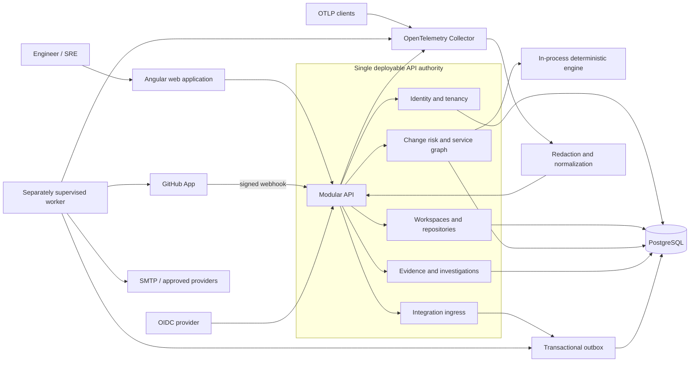

# DeployGuard AI implementation plan

Status: In progress
Last reviewed: 2026-08-03
Owners: Primary maintainer and verified contributors

This is the source of truth for the next implementation cycle. Read this file
before changing the runtime architecture, evaluation claims, persistence model,
or deployment topology.

## 1. Executive decision

DeployGuard should not begin with a big-bang rewrite or a service-per-feature
architecture.

The approved direction is:

1. Keep Angular 22 as the web application.
2. Keep the current FastAPI backend as the only production authority while the
   P0 correctness and operational gaps are closed.
3. Organize the backend as a modular monolith with one separately supervised
   worker process for durable jobs and external side effects.
4. Use PostgreSQL as the production system of record. SQLite remains limited
   to local development and focused tests.
5. Evaluate .NET 10 through a contract- and benchmark-gated spike. Do not give
   the spike production write access.
6. If the .NET gate passes, migrate to one C# backend codebase: ASP.NET Core API,
   .NET Worker, and in-process deterministic C# engines. Do not retain a Python
   production sidecar without a real Python-only data or ML dependency.
7. Do not split bounded contexts into microservices until a measured scaling,
   availability, compliance, or team-ownership constraint requires independent
   deployment.

This separates two questions that must not be confused:

- **Best action now:** make the existing system truthful, durable, tenant-safe,
  and measurable before rewriting it.
- **Best strategic backend candidate:** .NET 10 is the leading candidate, but it
  must earn the migration through parity and operational evidence.

Popularity, GitHub stars, and community preference are ecosystem signals. They
are not proof that a rewrite improves DeployGuard.

## 2. Evidence hierarchy

Architecture decisions use evidence in this order:

1. Current repository behavior and reproducible tests.
2. Official product and protocol documentation.
3. Maintained open-source reference implementations.
4. Surveys and ecosystem data.
5. Stack Overflow and Reddit reports, clearly labeled as anecdotal.

Community discussions can identify failure modes worth testing. They cannot be
used alone as an acceptance criterion.

## 3. Current-state findings

### 3.1 What is already sound

- Angular uses standalone components and typed HTTP services.
- FastAPI, Pydantic, SQLAlchemy, and Alembic provide typed API and persistence
  boundaries.
- Risk scoring, blast-radius traversal, and hypothesis ranking are deterministic.
- Synthetic records are explicitly labeled and production seeding is rejected.
- OIDC verification, GitHub App installation, signed webhook validation, SMTP,
  normalized telemetry, RBAC, audit records, and provider health have real code
  paths.
- A database-backed background-job primitive includes idempotency, leases,
  bounded retry, stale-lease recovery, dead-letter state, and explicit replay.
- CI covers backend tests, frontend tests/build, migrations, dependency audit,
  Compose validation, container builds, CodeQL, dependency review, and OpenSSF
  Scorecard.

### 3.2 P0 truth and safety problems

These are more important than changing language:

1. `backend/app/ml_trainer.py` does not train a model. It applies a hand-written
   logistic formula and returns fixed evaluation metrics.
2. `backend/model_card.json` repeats those fixed metrics without a reproducible
   labeled evaluation.
3. `scripts/evaluate_benchmarks.py` currently reads `prediction` and `top_rank`
   from its manifest. It does not invoke the deployed risk or RCA engine. The CI
   artifact therefore measures the manifest, not product quality.
4. Analysis snapshots lack an explicit schema, algorithm, and scoring-policy
   version needed for historical comparison and cross-language parity.
5. PostgreSQL is configurable, but production RLS and cross-tenant database
   integration tests are not complete.
6. The durable job primitive is not yet fully wired to transaction-producing
   application flows or a separately deployed worker.
7. Process-local rate limiting and metrics do not provide distributed guarantees.
8. Retention tooling exists, but scheduling, legal hold, deletion audit, and
   restore drills are incomplete.

No accuracy, savings, or incident-reduction claim may be published until the
P0 evaluation work is complete.

### 3.3 The deterministic engine does not justify a Python service

The current engine is a small standard-library implementation:

- fixed weighted risk dimensions;
- bounded breadth-first graph traversal;
- explicit evidence and counter-evidence ranking;
- no NumPy, pandas, scikit-learn, PyTorch, or specialized Python runtime.

Therefore:

- while FastAPI remains the backend, keep the engines in-process;
- if the backend migrates to .NET, port the engines to C# after golden parity;
- introduce a Python service only if a future verified model needs a Python-only
  library, independent scaling, or a separate security boundary.

## 4. Runtime options considered

| Option | Strength for DeployGuard | Main cost | Decision |
|---|---|---|---|
| Harden FastAPI/Python | Preserves working code, tests, OpenAPI, and fastest path to close real gaps | Durable worker and some platform controls require explicit implementation | Production authority during P0/P1 |
| .NET 10 modular monolith | LTS platform, strong typing, hosted workers, health/rate-limit/OTel primitives, one backend language after engine port | High migration and semantic-parity risk | Strategic candidate; spike first |
| .NET API plus permanent Python engine service | Allows future Python-only ML | Adds network, deployment, timeout, serialization, and dual-runtime failure modes | Rejected without a proven Python-only need |
| Go backend | Excellent runtime and operations profile | No project-specific advantage that repays a full rewrite | Rejected |
| Node/NestJS backend | TypeScript alignment with the frontend | Does not solve current data, durability, or evaluation gaps | Rejected |
| Java/Spring backend | Mature enterprise platform | Similar benefits to .NET with less fit to the selected direction | Rejected |
| Fine-grained microservices | Independent deployment and scaling | Eventual consistency, duplicate delivery, network and operational complexity | Deferred until extraction gates pass |

## 5. Target logical architecture

The logical design is runtime-neutral. The FastAPI and possible .NET paths must
implement the same boundaries.



Aspire may model the API, worker, Angular app, PostgreSQL, and Collector in local
and integration-test environments if the .NET path is selected. Aspire is not
the production runtime, message broker, scheduler, or secret manager.

## 6. Module and ownership rules

| Module | Owns | Must not own |
|---|---|---|
| Identity and tenancy | Principal mapping, workspace membership, roles, tenant context | UI-only authorization or provider credentials |
| Workspaces and repositories | Workspace, repository scope, invitation lifecycle, repo metadata | Risk score calculation |
| Change intelligence | Change snapshots, service graph, risk policy/version, deterministic result | External provider side effects |
| Evidence and investigations | Evidence provenance, counter-evidence, incidents, notes, verdicts | Invented evidence or autonomous remediation |
| Integration ingress | Signature verification, schema normalization, delivery dedupe | Long-running provider calls in the request path |
| Notifications | Preferences, approved destinations, delivery status | Arbitrary user-supplied webhook execution |
| Worker | Allowlisted asynchronous handlers, retry, dead letter, replay | Guessing handlers or executing shell/deploy/rollback actions |

Rules:

- Modules expose contracts, not internal ORM models.
- Tenant-owned tables include `tenant_id`/`workspace_id` and are classified in a
  policy-coverage test. Global tables are explicitly allowlisted.
- Only the owning module writes its tables.
- API transactions write domain state and outbox intent atomically.
- External delivery is at-least-once; consumers and providers must be idempotent.
- Metric labels must not contain tenant, repository, commit, delivery, or user IDs.
- Secrets are referenced by managed-secret identifiers, never serialized into
  jobs, logs, traces, or API responses.

## 7. Delivery phases

### Phase 0 — Establish truth before migration

Goal: make correctness and migration outcomes measurable.

Progress on 2026-08-03:

- Completed the first truth gate: evaluation manifest v2 now stores immutable
  engine inputs and expected labels, and the evaluator invokes the production
  deterministic RCA contract for every episode.
- Removed the unused pseudo-ML module and fixed, unverified model metrics.
- Added fail-closed manifest validation, engine/scoring versions, deterministic
  per-episode results, evidence-reference integrity, and an explicit unmeasured
  state for semantic unsupported-claim review.
- Persisted schema, engine, scoring-policy, and graph-policy provenance on change
  and incident snapshots. Analysis identity now includes this version bundle;
  existing records migrate honestly to `legacy-unversioned`.
- Added previous-head migration regression coverage and production-shaped
  PostgreSQL migration-chain CI.
- Remaining Phase 0 items below are still required before any runtime migration.

Deliver:

- [x] Replace the self-reported benchmark manifest with immutable engine inputs,
  expected labels, provenance, license, split, and checksum.
- [x] Make the evaluator invoke the real engine through its public contract.
- [x] Remove fixed accuracy metrics or label them `unverified` and exclude them from
  product/UI claims.
- [x] Add `analysis_schema_version`, `engine_version`, `scoring_policy_version`, and
  `graph_version` to stored snapshots and API contracts.
- [ ] Create a cross-runtime golden corpus covering ordinary cases and boundaries:
  unknown flags/tiers, empty graphs, cycles, duplicate edges, maximum hops,
  counter-evidence, ties, invalid numbers, stable ordering, rounding, and evidence
  IDs.
- [ ] Add property/fuzz tests for bounded scores, monotonic safety inputs, cycle
  termination, deterministic ordering, and evidence-reference integrity.
- [ ] Capture the OpenAPI document and representative API responses as versioned
  contract fixtures.
- [x] Add production-shaped PostgreSQL CI rather than validating migrations only on
  SQLite.
- [ ] Establish baseline p50/p95/p99 latency, throughput, memory, startup, job-recovery,
  and graph-size results on a documented reference environment.

Exit gates:

- The benchmark runner fails if it does not execute the real engine.
- No fixed or self-reported metric is presented as measured performance.
- Same input and version produce byte-equivalent normalized output.
- Every benchmark artifact records commit, environment, dataset/version, sample
  count, configuration, failures, and checksum.
- PostgreSQL migrations upgrade from empty and from the previous release, and a
  restore check passes.

Rollback:

- Contract additions are backward-compatible and optional during one release.
- No runtime migration begins in this phase.

### Phase 1 — Close production-critical gaps on the current stack

Goal: make the existing product safe enough to compare with any replacement.

Deliver:

- Wire GitHub Check Run, invitation email, notification, retention, and other
  approved side effects to an atomic outbox producer.
- Run a separate worker deployment with cancellation, bounded batches, lease
  expiry, exponential retry, dead-letter state, explicit replay, and health.
- Return webhook `2xx` after signature/schema/dedupe validation and durable
  acceptance; perform non-essential provider work asynchronously.
- Add inbox/dedupe records for handlers that can observe a message more than once.
- Add correlation ID and `traceparent` propagation from ingress through outbox
  to provider delivery.
- Implement PostgreSQL RLS for tenant-owned tables with `USING` and `WITH CHECK`.
- Set tenant context transaction-locally. The application role must not own tables
  and must not have `BYPASSRLS`. Use a distinct, audited role for exceptional
  administration and backup.
- Add negative integration tests for missing tenant context and cross-tenant
  `SELECT`, `INSERT`, `UPDATE`, and `DELETE`.
- Put an OpenTelemetry Collector in front of raw OTLP. Redact and normalize before
  events enter the DeployGuard evidence contract.
- Add distributed rate limiting at the ingress/gateway where multi-instance
  enforcement is required; retain endpoint policy tests in the application.
- Schedule retention with dry-run, legal hold, deletion audit, backup expiry, and
  a documented restore rehearsal.

Exit gates:

- Crash after durable acceptance does not lose an approved job.
- Replaying a delivery does not duplicate the domain outcome.
- Unknown job types fail closed and never execute inferred behavior.
- Cross-tenant database tests pass using the same roles and pooling mode as the
  reference deployment.
- Webhook response time remains within the provider deadline under load.
- Readiness fails for unavailable required dependencies; liveness does not create
  a restart loop for a recoverable dependency outage.

Rollback:

- Producers are feature-flagged by job type.
- A worker can be stopped without reverting accepted domain state.
- RLS is deployed table-by-table with preflight coverage and break-glass runbook;
  it is never disabled silently by using an owner connection.

### Phase 2 — Build the .NET 10 decision spike

Goal: determine whether a migration improves the verified system.

The spike is read-only against copied/synthetic data and cannot become a second
production authority.

Deliver:

- ASP.NET Core 10 modular API shell using Minimal APIs unless a required MVC
  feature justifies controllers.
- .NET Worker with the same durable job contract and failure semantics.
- PostgreSQL/Npgsql persistence and one complete vertical slice: workspace context,
  one change-analysis endpoint, deterministic engines, and one read model.
- Identical OpenAPI shapes, error envelopes, authorization decisions, ordering,
  rounding, evidence IDs, and version fields.
- OpenTelemetry traces, metrics, and logs through OTLP.
- Health, readiness, endpoint rate-limit policy, structured logging, and secret
  redaction.
- Aspire AppHost for local/integration orchestration only.
- Architecture tests that prevent a module from referencing another module's
  infrastructure or persistence internals.

Migration decision gate — all conditions are required:

1. 100% golden-corpus parity with zero unexplained result differences.
2. OpenAPI breaking-change report is empty or explicitly approved and versioned.
3. Authentication, RBAC, tenant, RLS, signature, replay, and failure-injection
   tests pass on both implementations.
4. The .NET implementation is not materially worse on the documented reference
   workload and provides a measured operational, maintainability, staffing, or
   performance benefit worth the migration.
5. Backup, restore, migration, observability, and rollback runbooks are proven.
6. The maintainer approves retiring, not indefinitely duplicating, the old backend.

If the gate fails, keep FastAPI and apply useful contract/test improvements there.
Failure of the spike is a valid result, not a reason to weaken the gates.

### Phase 3 — Strangler migration, only if Phase 2 passes

Goal: migrate without dual ownership or a flag day.

Deliver in this order:

1. Identity/tenant and read-only workspace endpoints.
2. Deterministic engine and change-analysis endpoints.
3. Evidence/investigation reads, then writes.
4. Provider ingress and durable worker handlers.
5. Operations, notifications, retention, and administrative workflows.

Migration rules:

- Route a whole endpoint/aggregate owner at a time.
- Use shadow reads and result comparison before traffic cutover.
- Do not dual-write from two application implementations.
- Use expand/migrate/contract database changes.
- Retain one release of read-compatible rollback where schema safety allows it.
- Remove the FastAPI route only after traffic, error rate, queue depth, and data
  reconciliation remain healthy through the canary window.
- After full cutover, remove Python from the production image and CI matrix unless
  it is still used by a real offline evaluation workflow.

Exit gates:

- No production route has two write authorities.
- No unexplained shadow diff remains.
- Queue backlog, error rate, latency, and tenant-denial metrics meet the release SLO.
- FastAPI retirement includes dependency, container, runbook, and secret cleanup.

Rollback:

- Route traffic back only while the previous implementation remains schema-compatible.
- Pause new writes before rollback if a contract migration crossed the compatibility
  boundary.
- Never repair migration failure through ad hoc production SQL.

### Phase 4 — Product usefulness after the core is trustworthy

Prioritize features that reduce operator effort:

Progress on 2026-08-03:

- Workspace Setup and Operations now bind rendered tenant data and mutations to
  the successfully loaded workspace snapshot. Scope changes clear prior records,
  stale responses are ignored, and failed loads expose an explicit retry state.

- repository-owned `deployguard.yaml` metadata for service ownership, tier,
  dependencies, runbooks, and provenance;
- service catalog search, saved views, deep links, and command palette;
- SLI/SLO and error-budget evidence tied to a deployment window;
- import/sync jobs with `202 Accepted`, status/progress endpoint, cancellation
  where safe, and resumable failure state;
- incident participants, assignments, timeline, evidence links, post-incident
  export, and approved Slack/Teams/Jira/Linear adapters;
- connector health with last success, last error, test connection, permission
  scope, and remediation guidance;
- policy simulation and historical replay before activating new risk weights;
- responsive, keyboard-complete Angular flows with one token-based design system,
  consistent loading/error/empty/permission states, and lazy feature routes.

Do not adopt Backstage, a graph database, a new state library, or a general event
broker until a measured workload or ownership boundary justifies the maintenance
cost.

## 8. Microservice extraction gates

A module may become a separate service only when at least one condition is proven:

- independent scaling cannot be achieved economically by scaling the modular API
  or worker;
- it needs a distinct availability/SLO or failure-isolation boundary;
- compliance requires separate credentials, network, data, or deployment control;
- an independent team owns and deploys it without coordinated releases;
- a specialized runtime provides a measured benefit unavailable in the main stack.

Before extraction, the module must have:

- a versioned API/event contract;
- private data ownership and migration plan;
- idempotent inbox/outbox behavior;
- timeout, retry, circuit-breaker, and backpressure policy;
- distributed tracing and SLO;
- consumer-driven contract tests;
- canary and rollback runbook.

“It may grow later” is not an extraction gate.

## 9. CI and release gates

Every implementation phase must keep these checks green:

- backend unit, property, integration, and PostgreSQL migration tests;
- frontend unit, accessibility, responsive, and critical-flow E2E tests;
- OpenAPI compatibility and generated-client drift check;
- engine golden-corpus and deterministic replay tests;
- outbox/inbox crash, retry, lease, replay, and dead-letter tests;
- RLS policy coverage and cross-tenant negative tests;
- dependency audit, CodeQL, secret scan, SBOM/provenance, container scan, and
  OpenSSF checks;
- Compose/AppHost topology validation and container health smoke test;
- backup/restore and retention dry-run artifact;
- benchmark artifact with honest provenance and no hard-coded claims.

Required release evidence:

```text
Commit:
Architecture/runtime path:
Schema and engine versions:
Dataset and checksum:
Reference environment:
Test and migration results:
Security findings:
Load and fault-injection results:
Known limitations:
Rollback procedure:
```

## 10. Research sources

### Official and primary sources

- [.NET releases and support](https://learn.microsoft.com/en-us/dotnet/core/releases-and-support)
- [ASP.NET Core API guidance](https://learn.microsoft.com/en-us/aspnet/core/fundamentals/apis?view=aspnetcore-10.0)
- [ASP.NET Core hosted services and workers](https://learn.microsoft.com/en-us/aspnet/core/fundamentals/host/hosted-services?view=aspnetcore-10.0)
- [ASP.NET Core health checks](https://learn.microsoft.com/en-us/aspnet/core/host-and-deploy/health-checks?view=aspnetcore-10.0)
- [ASP.NET Core rate limiting](https://learn.microsoft.com/en-us/aspnet/core/performance/rate-limit?view=aspnetcore-10.0)
- [Aspire overview and multi-language boundaries](https://aspire.dev/get-started/what-is-aspire/)
- [OpenTelemetry for .NET](https://opentelemetry.io/docs/languages/dotnet/)
- [FastAPI larger applications](https://fastapi.tiangolo.com/tutorial/bigger-applications/)
- [FastAPI background-task caveat](https://fastapi.tiangolo.com/tutorial/background-tasks/)
- [Angular standalone components](https://angular.dev/guide/components)
- [Angular lazy-loaded routes](https://angular.dev/best-practices/performance/lazy-loaded-routes)
- [Angular HTTP client](https://angular.dev/guide/http)
- [PostgreSQL row-level security](https://www.postgresql.org/docs/current/ddl-rowsecurity.html)
- [PostgreSQL `SELECT ... SKIP LOCKED`](https://www.postgresql.org/docs/current/sql-select.html)
- [Transactional outbox pattern](https://learn.microsoft.com/en-us/azure/architecture/databases/guide/transactional-out-box-cosmos)
- [GitHub webhook best practices](https://docs.github.com/en/webhooks/using-webhooks/best-practices-for-using-webhooks)
- [Architecture-style trade-offs](https://learn.microsoft.com/en-us/azure/architecture/guide/architecture-styles/)
- [Microservice boundary guidance](https://learn.microsoft.com/en-us/azure/architecture/microservices/model/microservice-boundaries)
- [Stack Overflow Developer Survey 2025](https://survey.stackoverflow.co/2025)
- [GitHub Octoverse language trends](https://github.blog/news-insights/octoverse/what-the-fastest-growing-tools-reveal-about-how-software-is-being-built/)

### Maintained open-source case studies

- [Sentry](https://github.com/getsentry/sentry) — mature developer observability
  platform and a useful polyglot case study.
- [Grafana](https://github.com/grafana/grafana) — observability product with E2E,
  design-system, governance, and operational assets.
- [Backstage](https://github.com/backstage/backstage) — service catalog, ownership,
  plugin, and repository-metadata patterns.
- [OpenTelemetry Collector](https://github.com/open-telemetry/opentelemetry-collector)
  — vendor-neutral telemetry protocol boundary.
- [OpenTelemetry Demo](https://github.com/open-telemetry/opentelemetry-demo) —
  production-shaped telemetry integration example.
- [FastAPI full-stack template](https://github.com/fastapi/full-stack-fastapi-template)
  — typed FastAPI/PostgreSQL/Docker/test baseline.
- [.NET modular monolith with DDD](https://github.com/kgrzybek/modular-monolith-with-ddd)
  — module isolation, outbox/inbox, architecture tests, and ADR examples.
- [.NET eShop](https://github.com/dotnet/eShop) — Aspire-based distributed reference;
  an upper-bound case study, not a reason to split DeployGuard now.
- [Netflix Dispatch](https://github.com/Netflix/dispatch) — historical incident
  workflow inspiration only; the repository is archived and must not become a
  new dependency.

### Community corroboration, not authority

- [Stack Overflow: polyglot microservices trade-offs](https://stackoverflow.com/questions/65879328/is-it-possible-to-build-a-project-using-different-languages-via-microservice)
- [Stack Overflow: reliable work after a FastAPI response](https://stackoverflow.com/questions/79883964/fastapi-backgroundtasks-vs-celery-how-to-reliably-run-work-after-the-response-i)
- [Reddit: ASP.NET Core with a FastAPI service](https://www.reddit.com/r/dotnet/comments/1eedogh)
- [Reddit: modular monolith or microservices](https://www.reddit.com/r/softwarearchitecture/comments/1sdruip/modular_monolith_or_microservices/)
- [Reddit: production background work in FastAPI](https://www.reddit.com/r/FastAPI/comments/1sbnurr/how_are_you_actually_managing_backgroundasync/)

## 11. Immediate execution order

The next coding session starts here:

1. Fix evaluation truthfulness and version analysis contracts.
2. Add engine golden/property tests and PostgreSQL CI baseline.
3. Wire one end-to-end outbox producer and separately supervised worker handler.
4. Prove crash recovery, idempotency, webhook latency, and provider replay.
5. Implement RLS role/context/policy coverage with cross-tenant tests.
6. Add Collector-based telemetry correlation and production-shaped observability.
7. Run the .NET spike only after steps 1 through 6 provide a trustworthy comparison.

Do not begin by scaffolding multiple services or copying the whole backend into a
new language.
