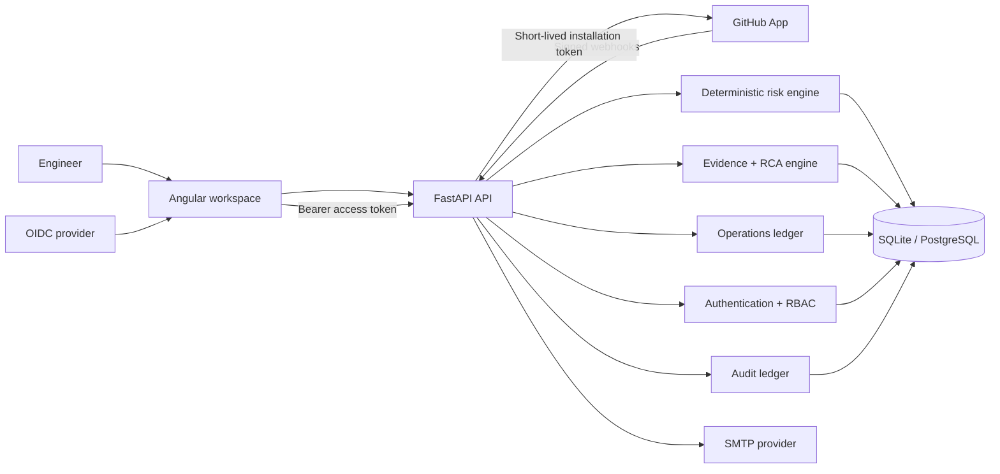

# DeployGuard AI

Evidence-first change risk and incident investigation for engineering teams.

[](https://github.com/kingggg5/deployguardai)
[](https://github.com/kingggg5/deployguardai)
[](https://github.com/kingggg5/deployguardai)

DeployGuard helps a platform or reliability team answer two practical questions:

1. How risky is this change before it reaches production?
2. When an incident starts, what evidence supports or contradicts each possible cause?

The project combines a deterministic risk engine, service-graph blast-radius analysis, an evidence ledger, ranked RCA hypotheses, human feedback, and a tenant-aware workspace. It runs with synthetic scenarios for local evaluation and can connect to real GitHub repositories through a GitHub App.

> **ภาษาไทย:** DeployGuard เป็นระบบช่วยวิเคราะห์ความเสี่ยงของ Pull Request และสืบสวน incident จากหลักฐานจริง เช่น change metadata, deployment events และ telemetry โดยแยกข้อมูลตัวอย่างออกจากข้อมูลที่เชื่อมต่อจริงอย่างชัดเจน


## What is implemented

- Deterministic change-risk scoring with explicit, testable weights
- Service dependency graph and bounded blast-radius traversal
- Incident timeline, evidence inspection, and top-three RCA hypotheses
- Evidence, counter-evidence, uncertainty, and human verdicts
- DORA metrics derived from stored change and incident records
- Tenant-isolated workspaces with `viewer`, `responder`, `admin`, and `owner` roles
- Per-user workspace, repository, and scenario context
- OIDC Authorization Code + PKCE in the Angular client
- Backend JWT verification through issuer JWKS, audience, algorithm, and claim checks
- GitHub App installation, repository discovery, selection, and synchronization
- Signed GitHub webhook validation and delivery deduplication
- Connected change-risk records created from verified Pull Request metadata
- Optional GitHub Check Runs that publish deterministic, non-blocking decision support
- API-backed service catalog with ownership, tier, lifecycle, dependencies, repositories, runbooks, and tags
- Versioned workspace risk policy with optimistic concurrency protection
- Normalized operational event ledger with provenance, filtering, correlation, and idempotent ingestion
- Human-controlled incident lifecycle, append-only notes, assignments, and notification inbox
- SMTP workspace invitations with hashed, expiring, single-use claim tokens
- Append-only audit events for security-sensitive workspace actions
- SQLite for local development and PostgreSQL for container or production deployments
- Alembic migrations, including migration of populated legacy databases

DeployGuard does **not** execute shell commands, deploy, roll back, or remediate infrastructure. LLM synthesis remains disabled until an evidence-only contract and evaluation gate are configured.

## Product areas

| Area | Purpose |
| --- | --- |
| Investigation | Review topology, incident evidence, hypotheses, counter-evidence, and verdict history |
| Change risk | Analyze code size, operational flags, coverage gaps, blast radius, and rollback readiness |
| DORA metrics | Track deployment frequency, lead time, change failure rate, and mean time to restore |
| Scenario lab | Run clearly labelled synthetic cases without touching production systems |
| Operations center | Register services, govern risk policy, inspect accepted events, coordinate incidents, assign responders, and read notifications |
| Workspace & team | Create tenants, connect repositories, manage roles, invite teammates, inspect connector health, and inspect audit events |
| Deployment ledger | Normalize signed GitHub deployment lifecycle events, link exact changes by repository + commit SHA, and preserve DORA-compatible status |

## Tech stack

### Frontend

| Technology | Use |
| --- | --- |
| Angular 22 | Standalone components and application shell |
| TypeScript 6 | Strictly typed UI, API contracts, and state |
| RxJS 7.8 | HTTP orchestration and asynchronous state |
| Angular Reactive Forms | Workspace, repository, invitation, and analysis inputs |
| angular-auth-oidc-client 20 | OIDC Authorization Code + PKCE |
| SCSS | Design tokens, responsive layout, dark mode, and component styling |
| Vitest 4 + jsdom | Frontend unit and interaction tests |
| Nginx 1.27 | Production static hosting, API proxying, SPA fallback, and security headers |

### Backend

| Technology | Use |
| --- | --- |
| Python 3.12 | Runtime |
| FastAPI | Typed REST API and OpenAPI documentation |
| Pydantic 2 | Request, response, and settings validation |
| SQLAlchemy 2 | Relational persistence and tenant-scoped queries |
| Alembic | Versioned database migrations |
| PyJWT + cryptography | OIDC/JWKS and GitHub App JWT verification/signing |
| SQLite | Local development database |
| PostgreSQL 16 | Container and production database |
| psycopg 3 | PostgreSQL driver |
| Pytest + HTTPX | Backend unit and integration tests |
| Uvicorn | ASGI server |

### Infrastructure and delivery

- Multi-stage Node/Nginx frontend image
- Python slim backend image
- Docker Compose with health checks and persistent PostgreSQL storage
- Same-origin `/api/v1` proxy in production
- Configurable CORS for local development
- Runtime capability endpoint so the UI only exposes configured providers

## Architecture



The backend owns authorization and tenant boundaries. The browser never receives a GitHub installation token or GitHub App private key. A GitHub installation remains in `pending_verification` until a signed installation webhook confirms it.

## Synthetic and connected data

DeployGuard treats data origin as part of the domain model:

- `synthetic` records are local scenarios used for demos, tests, and evaluation.
- `connected` records come from a verified provider integration.

The UI labels synthetic content and does not present it as live production evidence. In production mode, development identity, manual repository fixtures, and raw invitation tokens are disabled.

## Local development

### Requirements

- Python 3.12
- Node.js 22 or newer
- npm
- PowerShell 7 is recommended for the helper scripts

Clone the current repository:

```powershell
git clone https://github.com/kingggg5/deployguardai.git
cd deployguardai
```

Start the backend and frontend:

```powershell
.\scripts\run-dev.ps1
```

Use `-SkipInstall` after dependencies have already been installed:

```powershell
.\scripts\run-dev.ps1 -SkipInstall
```

Open:

- UI: [http://127.0.0.1:4300](http://127.0.0.1:4300)
- OpenAPI: [http://127.0.0.1:8100/docs](http://127.0.0.1:8100/docs)
- Health check: [http://127.0.0.1:8100/api/v1/health](http://127.0.0.1:8100/api/v1/health)

Runtime logs and PID files are written to `.runtime/`.

Stop both processes:

```powershell
.\scripts\stop-dev.ps1
```

### Run each service manually

Backend:

```powershell
cd backend
python -m venv .venv
.\.venv\Scripts\python -m pip install -e ".[test]"
.\.venv\Scripts\python -m uvicorn app.main:app --host 127.0.0.1 --port 8100 --reload
```

Frontend:

```powershell
cd frontend
npm ci
npm start
```

The Angular development server proxies `/api` to `http://127.0.0.1:8100`.

## Docker Compose

Create the local environment file and start the stack:

```powershell
Copy-Item .env.example .env
docker compose up --build
```

Services:

| Service | Address |
| --- | --- |
| Web UI | `http://127.0.0.1:4300` |
| API | `http://127.0.0.1:8100` |
| PostgreSQL | Internal Compose network |

Stop the stack:

```powershell
docker compose down
```

Use `docker compose down -v` only when you intentionally want to delete the local PostgreSQL volume.

## Production configuration

Copy `.env.example` to `.env` and provide secrets through your deployment platform or secret manager. Do not commit `.env`. The included Compose file uses `ENVIRONMENT=container`; override it in your production deployment definition.

### Authentication

```dotenv
ENVIRONMENT=production
AUTH_PROVIDER=oidc
OIDC_ISSUER=https://identity.example.com
OIDC_AUDIENCE=deployguard-api
OIDC_CLIENT_ID=deployguard-web
OIDC_SCOPE=openid profile email
OIDC_JWKS_URL=https://identity.example.com/.well-known/jwks.json
```

Production refuses to start with development authentication. Invitation matching requires a verified email claim.

### GitHub App

```dotenv
GITHUB_APP_ID=
GITHUB_APP_SLUG=
GITHUB_APP_PRIVATE_KEY=
GITHUB_WEBHOOK_SECRET=
GITHUB_API_URL=https://api.github.com
GITHUB_API_VERSION=2026-03-10
GITHUB_CHECKS_ENABLED=false
GITHUB_WEBHOOK_MAX_BODY_BYTES=1048576
```

Recommended read-only repository permissions:

- Metadata
- Pull requests
- Deployments
- Checks (write, only when `GITHUB_CHECKS_ENABLED=true`)

Subscribe to `pull_request`, `workflow_run`, `deployment`, and `deployment_status`. Installation events verify the workspace connection. Check Runs never deploy, roll back, or block a branch; their conclusions are limited to `success` and `neutral` and always include the evidence quality and next human action.

### Invitation email

```dotenv
SMTP_HOST=
SMTP_PORT=587
SMTP_USERNAME=
SMTP_PASSWORD=
SMTP_FROM_EMAIL=
SMTP_USE_TLS=true
FRONTEND_PUBLIC_URL=https://deployguard.example.com
```

When SMTP is not configured in production, invitation controls are disabled instead of reporting a false success.

### Telemetry ingestion

```dotenv
TELEMETRY_INGEST_TOKEN=replace-with-a-random-32-character-or-longer-root-secret
```

`TELEMETRY_INGEST_TOKEN` is a credential root, not the bearer sent by a
production collector. Derive a workspace-bound collector credential on the
server:

```powershell
cd backend
$env:DEPLOYGUARD_WORKSPACE_ID = "workspace-uuid"
python -c "import os; from app.services import derive_telemetry_collector_token as d; print(d(os.environ['TELEMETRY_INGEST_TOKEN'], os.environ['DEPLOYGUARD_WORKSPACE_ID']))"
```

Send the derived `dgct_...` bearer with `X-DeployGuard-Workspace`, an optional
`X-DeployGuard-Repository`, and a stable `X-DeployGuard-Event-ID`. Production
rejects the raw root secret. The endpoint accepts normalized evidence, not
native OTLP payloads; terminate TLS and redact secrets or personal data before
ingestion.

## Database migrations

The application upgrades the configured database to the latest Alembic revision during startup.

Manual migration commands:

```powershell
cd backend
python -m alembic -c alembic.ini upgrade head
python -m alembic -c alembic.ini current
```

Production refuses to migrate an unknown, unversioned, non-empty database. Back up production data before applying a new migration.

## Tests and verification

Backend:

```powershell
cd backend
python -m pytest
```

Frontend:

```powershell
cd frontend
npm test -- --watch=false
npm run build
npm audit --omit=dev
```

Compose:

```powershell
docker compose config --quiet
```

Current verification baseline:

- 40 backend tests passing
- 37 frontend tests passing
- Angular production build passing
- Production npm dependency audit reports 0 vulnerabilities
- Fresh and populated legacy migration cycles passing
- Desktop and 390×844 mobile Operations Center flows verified against the running API

The test counts are a regression baseline, not a claim of 100% code coverage.

## Repository layout

```text
deployguardai/
├── backend/
│   ├── app/
│   │   ├── auth/                 # OIDC and bearer authentication
│   │   ├── api.py                # Investigation and evidence routes
│   │   ├── engines.py            # Deterministic risk and graph engines
│   │   ├── operations_api.py     # Service, policy, event, incident, and notification routes
│   │   ├── operations_services.py # Tenant-scoped operations invariants
│   │   ├── provider_api.py       # GitHub provider routes
│   │   ├── provider_services.py  # GitHub connection and repository sync
│   │   ├── tenant.py             # Per-user tenant context
│   │   └── workspace_api.py      # Workspaces, members, invites, and audit
│   ├── migrations/               # Alembic revisions
│   └── tests/
├── frontend/
│   └── src/app/
│       ├── core/                 # API clients, auth, models, and navigation
│       ├── features/             # Operations, DORA, scenarios, and workspace activation
│       └── layout/               # Scope switcher and command palette
├── docs/                         # Architecture, API, data, security, and guides
├── scripts/                      # Development and evaluation helpers
└── docker-compose.yml
```

## API and security notes

- OpenAPI is available at `/docs`.
- Domain errors use stable machine-readable codes.
- GitHub webhook HMAC comparison is constant-time.
- Webhook delivery IDs are protected by a database uniqueness constraint.
- Invitation tokens are random, hashed at rest, expiring, and single-use.
- Cross-workspace access returns a not-found response instead of exposing tenant existence.
- Database reset and external ingestion endpoints are secure by default.
- No autonomous remediation or infrastructure credential path exists.

More detail:

- [Architecture](docs/ARCHITECTURE.md)
- [API contract](docs/API_CONTRACT.md)
- [Data model](docs/DATA_MODEL.md)
- [Security model](docs/SECURITY.md)
- [Operations runbook](docs/OPERATIONS.md)
- [Telemetry gateway contract](docs/TELEMETRY_GATEWAY.md)
- [Evaluation](docs/EVALUATION.md)
- [Thai user guide](docs/USER_GUIDE_TH.md)

## Known limitations

- Connected topology remains empty until dependency evidence is ingested.
- Unknown coverage, rollback, and observability evidence is treated conservatively.
- SMTP delivery is synchronous in the current MVP.
- Event processing is in-process; durable queues, retention automation, and outbox delivery remain production-hardening work.
- Deployment signal grouping/correlation is intentionally not automatic yet; deployment records are canonical, while incident linkage remains human/evidence controlled.
- PostgreSQL row locks are used where available, but database-enforced row-level security is not included.
- Provider credentials are not included in this repository.
- A production deployment still needs HTTPS, rate limiting, managed secrets, backups, monitoring, and a security review.

## License

No license file is currently included. Add one before distributing or accepting external contributions.
