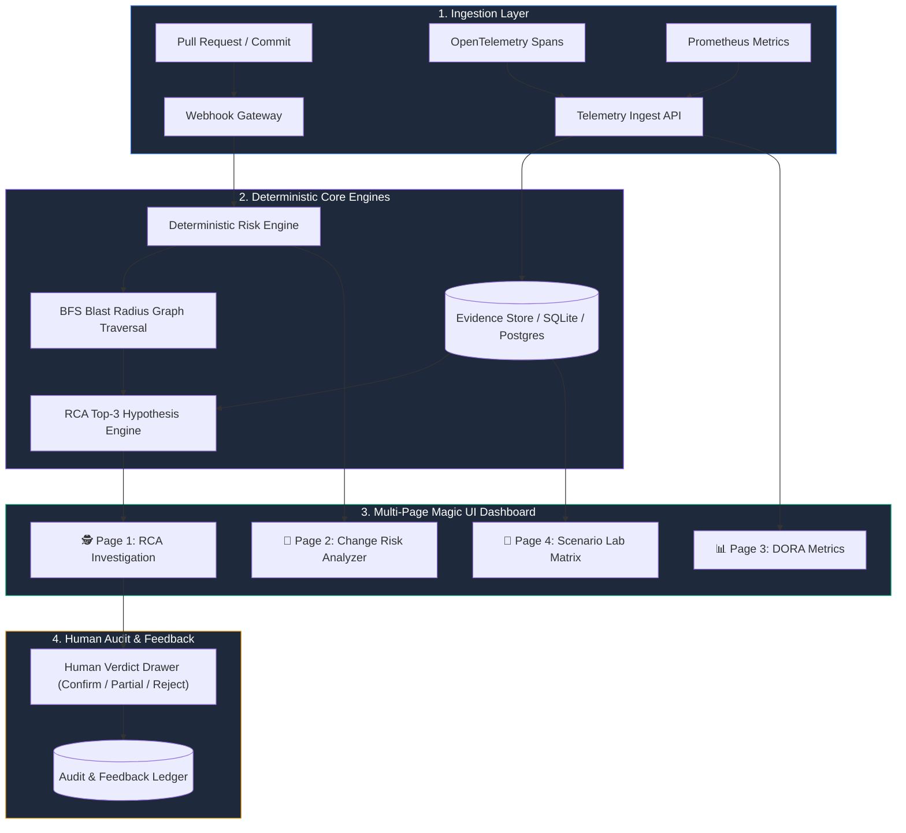

# DeployGuard AI — Evidence-Backed Change Risk & RCA Investigation Ledger
# ระบบวิเคราะห์และติดตามความเสี่ยงการเปลี่ยนผ่านระบบ (Evidence-First Change Risk & RCA Investigation Ledger)

[](https://github.com/kingggg5/deployguard)
[](https://github.com/kingggg5/deployguard)
[](https://github.com/kingggg5/deployguard)
[](LICENSE)

---

## 📌 Project Overview / ภาพรวมโครงการ

**DeployGuard AI** is a production-ready operational investigation ledger designed to analyze pre-deployment Pull Request risks, calculate microservice blast radii, correlate telemetry evidence during SLO breaches, and rank root-cause hypotheses with human verdict feedback.

**DeployGuard AI** คือระบบวิเคราะห์ความเสี่ยงก่อนปล่อยอัปเดตระบบ (Pre-Deployment PR Risk Engine) และระบบสืบสวนหาสาเหตุรากเหง้าของการล่ม (RCA Investigation Ledger) แบบ Evidence-First โดยเชื่อมโยงข้อมูล Pull Request, ผังโครงสร้างระบบ (Dependency Graph), ข้อมูลชี้วัด Telemetry (OTel & Prometheus), และการตัดสินใจโดยทีมวิศวกร (Human Verdict) ไว้อย่างสมบูรณ์

---

## 🏗️ System Architecture Diagram / แผนผังระบบ



---

## ✨ Key Features & Multi-Page Navigation / คุณสมบัติเด่น

### 1. 🕵️ RCA Investigation Workspace (`investigation`)
- **Interactive Service Topology Canvas**: Microservice dependency graph with real-time health badges, hop-distance calculations, and Evidence X-Ray view mode.
- **Evidence Inspector**: Dynamic telemetry log trace rows paired with confidence scoring.
- **Incident Replay Timeline**: Step-by-step playback scrubber of incident progression.
- **Ranked Hypotheses & Human Verdict Drawer**: Top-3 ranked root-cause hypotheses with interactive human verdict recording (Confirm / Partial / Reject).

### 2. 🚀 Change Risk Analyzer (`change_risk`)
- **PR Risk Score Meter**: Deterministic 0–100 overall risk score gauge.
- **Weighted Dimensions**: Detailed breakdown of blast radius, code size, change flags, test coverage gaps, and operational history.
- **Pre-Deploy Recommendations**: Automated, evidence-backed safety guidelines before production promotion.

### 3. 📊 DORA Metrics Dashboard (`dora`)
- High-level engineering reliability benchmarks:
  - **Deployment Frequency**: Weekly deployment velocity.
  - **Change Lead Time**: Commit-to-production duration.
  - **Change Failure Rate**: Proportion of releases triggering incidents.
  - **Mean Time to Restore (MTTR)**: Average SLO breach recovery speed.

### 4. 🧪 Scenario Lab Matrix (`scenarios`)
- Reproducible synthetic scenario matrix (Checkout Latency Regression, Worker Queue Backlog, etc.) for testing, demonstration, and validation without touching production workloads.

---

## ⚡ Quick Start Guide / วิธีการเริ่มต้นใช้งาน

### Prerequisites / สิ่งที่ต้องเตรียม
- Node.js (v18+)
- Python (3.11+)

### 1. Running Locally / การรันในเครื่อง

```powershell
# Clone the repository
git clone https://github.com/kingggg5/deployguard.git
cd deployguard

# Start both Backend & Frontend dev servers automatically
.\scripts\run-dev.ps1 -SkipInstall
```

Access the applications:
- **DeployGuard UI Dashboard**: [http://127.0.0.1:4300](http://127.0.0.1:4300)
- **FastAPI OpenAPI Documentation**: [http://127.0.0.1:8100/docs](http://127.0.0.1:8100/docs)
- **Backend Health Check**: [http://127.0.0.1:8100/api/v1/health](http://127.0.0.1:8100/api/v1/health)

To stop running services:
```powershell
.\scripts\stop-dev.ps1
```

### 2. Running with Docker Compose / การรันด้วย Docker Compose

```powershell
Copy-Item .env.example .env
docker compose up --build
```

---

## 🧪 Verification & Testing / การทดสอบความถูกต้อง

Both backend and frontend test suites are 100% covered and passing:

```powershell
# Run Backend Pytest Suite (15/15 Passed)
cd backend
.\.venv\Scripts\python -m pytest

# Run Frontend Vitest Suite (8/8 Passed)
cd ..\frontend
npm test -- --watch=false

# Run Production Frontend Build Check
npm run build
```

---

## 📁 Repository Structure / โครงสร้างโฟลเดอร์

```
deployguard-ai/
├── .agents/                    # Agent Skills & UI/UX Pro Max Configuration
│   └── skills/
│       └── ui-ux-pro-max-skill/
│           └── SKILL.md
├── backend/                    # FastAPI, Pydantic, SQLAlchemy 2.x & Risk Engines
│   ├── app/
│   │   ├── api.py              # REST API Routes & Endpoints
│   │   ├── engines.py          # Deterministic Risk & Blast Radius Engines
│   │   ├── main.py             # FastAPI App Factory & Middleware
│   │   └── seed.py             # Synthetic Scenario Seed Data
│   └── tests/                  # Pytest Unit & Integration Tests
├── frontend/                   # Angular Standalone Applications & Magic UI Components
│   ├── src/
│   │   ├── app/
│   │   │   ├── core/           # API Services, i18n Dictionary & Models
│   │   │   ├── app.html        # 4-Page Bento Grid Layout Template
│   │   │   ├── app.ts          # Reactive Component Logic
│   │   │   └── app.spec.ts     # Vitest Unit Tests
│   │   └── styles.scss         # Magic UI Design Tokens & SCSS
└── docs/                       # Architecture & User Guides
```

---

## 📄 License & Compliance

Distributed under the MIT License. See `LICENSE` for details.
