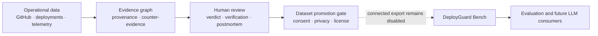
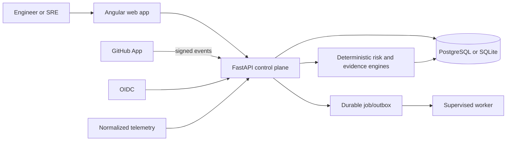

# DeployGuard AI

**Evidence-first change risk, incident investigation, and operational dataset governance for production teams.**

[](https://github.com/kingggg5/deployguardai/actions/workflows/ci.yml)
[](https://github.com/kingggg5/deployguardai/actions/workflows/codeql.yml)
[](https://securityscorecards.dev/viewer/?uri=github.com/kingggg5/deployguardai)
[](LICENSE)

[English](README.md) · [ภาษาไทย](README_TH.md) · [Quickstart](docs/QUICKSTART.md) · [Documentation](docs/ARCHITECTURE.md)


DeployGuard connects changes, deployments, service topology, runtime signals,
and human decisions in one evidence ledger. It helps an engineer answer two
questions: **why is this change risky?** and **which incident hypothesis is best
supported by evidence?** It never deploys, rolls back, or changes infrastructure.

## Why teams use it

- **Explain risk before production.** See weighted signals, missing evidence,
  rollback readiness, service criticality, and dependency blast radius.
- **Investigate with evidence and counter-evidence.** Rank hypotheses without
  hiding uncertainty, then preserve the next verification step.
- **Keep human decisions accountable.** Verdicts carry server-owned actor
  provenance and structured verification outcomes with cited evidence IDs.
- **Turn incidents into reproducible memory.** Content-addressed postmortem
  snapshots preserve exactly what reviewers approved at a point in time.
- **Prepare operational data safely.** Connected records can only become dataset
  candidates after resolution, immutable snapshotting, and audited,
  purpose-specific consent. Passing the gate still does not export data.

## What is included

| Area | Capabilities |
| --- | --- |
| Change risk | Deterministic scoring, versioned policies, missing-evidence signals, rollback readiness, and blast radius |
| Incident investigation | Timeline, evidence ledger, counter-evidence, ranked hypotheses, assignments, notifications, and human verdicts |
| Dataset governance | Actor provenance, structured verification, immutable postmortem snapshots, append-only consent decisions, and readiness gates |
| GitHub integration | GitHub App installation, repository sync, signed PR/deployment webhooks, and optional Check Runs |
| Team workspaces | OIDC/development auth, role-based access, invitations, audit events, and tenant isolation |
| Operations | Service catalog, normalized telemetry, durable jobs, retries, dead letters, traces, metrics, backup, and restore tooling |
| Evaluation | DeployGuard Bench schema, versioned synthetic examples, SHA-256 manifests, golden/property tests, and CI artifacts |

## Operational data, evidence graph, dataset

DeployGuard treats AI as a **consumer** of verified operational data—not as the
source of evidence or ground truth.




### Dataset maturity

| Layer | Status |
| --- | --- |
| Synthetic schema, export, and evaluation foundation | **Implemented.** DeployGuard Bench v0.1 has 3 synthetic examples: 2 evaluation-eligible, 1 unverified, 0 training-approved. |
| Connected incident capture governance | **Implemented.** Actor provenance, structured verification, immutable snapshots, and audited consent are enforced and recorded. |
| Connected export and publication pipeline | **Not implemented.** The connected-data exporter is intentionally closed; redaction, release review, and revocation propagation remain required. |
| Production LLM dataset or public benchmark | **Not complete.** There is no real consented corpus, frozen hidden test set, public leaderboard, or external model integration. |

The target of 1,000 deployment scenarios and 500 incident investigations is a
roadmap goal, not a current dataset-size claim. See [DeployGuard Bench](bench/README.md)
and the [AI boundary](docs/AI_BOUNDARY.md).

## Quick start

Requirements: Docker Engine or Docker Desktop with Compose v2.

```bash
git clone https://github.com/kingggg5/deployguardai.git
cd deployguardai
docker compose up --build
```

Open the app at <http://127.0.0.1:4300> and OpenAPI at
<http://127.0.0.1:8100/docs>. Connected mode starts empty. For the isolated,
deterministic product tour:

```bash
docker compose -p deployguard-demo \
  -f docker-compose.yml -f docker-compose.demo.yml up --build
```

Synthetic records are visibly labelled and never pass the connected-data gate.
Provider setup, local development, and cleanup are in the
[quickstart](docs/QUICKSTART.md).

## Architecture



PostgreSQL is the production source of truth and enforces row-level tenant
isolation. SQLite supports local development. A separate [.NET 10 read-only
spike](spikes/dotnet-readonly/README.md) measures parity without replacing the
production authority.

## Technology and verification

- **Web:** Angular 22, TypeScript 6, RxJS, SCSS design tokens
- **API:** Python 3.12, FastAPI, Pydantic 2, SQLAlchemy 2, Alembic
- **Data:** PostgreSQL 16 with RLS; SQLite for local development
- **Operations:** Docker Compose, OpenTelemetry, Prometheus, Nginx, GHCR
- **Quality:** Pytest, Vitest, golden/property/contract tests, CodeQL,
  dependency review, OpenSSF Scorecard, SBOM, and build provenance

```bash
cd backend && python -m pytest && cd ..
cd frontend && npm test -- --watch=false && npm run build && cd ..
docker compose config --quiet
python scripts/evaluate_benchmarks.py --output .runtime/evaluation-results.json
python scripts/export_operational_dataset.py --check --output-dir bench/datasets/synthetic-v0.1
python scripts/capture_contracts.py --check
```

## Documentation and community

[Quickstart](docs/QUICKSTART.md) · [Architecture](docs/ARCHITECTURE.md) ·
[API](docs/API_CONTRACT.md) · [Security](docs/SECURITY.md) ·
[Operations](docs/OPERATIONS.md) · [Evaluation](docs/EVALUATION.md) ·
[Roadmap](docs/ROADMAP.md) · [Contributing](CONTRIBUTING.md)

Vulnerabilities must be reported privately through
[`.github/SECURITY.md`](.github/SECURITY.md). DeployGuard is licensed under
[Apache-2.0](LICENSE).

## Current limitations

- No external LLM provider or public, real-world RCA benchmark is integrated.
- Connected export, deterministic secret/PII redaction, publication review,
  release registry, and revocation propagation are not implemented.
- Telemetry uses DeployGuard's normalized contract; there is no native OTLP
  evidence receiver yet.
- Slack, Teams, PagerDuty, autonomous remediation, and production execution are
  intentionally not bundled.
- Managed secrets, multi-replica rate limiting, alert routing, backup storage,
  and disaster-recovery ownership remain operator responsibilities.
