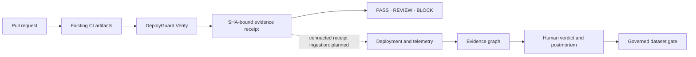

# DeployGuard AI

**Deterministic change evidence before merge. Accountable production evidence after deploy. No LLM key required.**

[](https://github.com/kingggg5/deployguardai/actions/workflows/ci.yml)
[](https://github.com/kingggg5/deployguardai/actions/workflows/codeql.yml)
[](https://securityscorecards.dev/viewer/?uri=github.com/kingggg5/deployguardai)
[](LICENSE)

[English](README.md) · [ภาษาไทย](README_TH.md) · [Quickstart](docs/QUICKSTART.md) · [API contract](docs/API_CONTRACT.md) · [Roadmap](docs/ROADMAP.md)


DeployGuard AI is an open-source change-safety platform for GitHub, DevOps,
and SRE teams. It turns existing CI artifacts into reproducible receipts tied
to an exact commit, then preserves deployment, incident, evidence, and human
decision history in one auditable system.

DeployGuard does not upload source code to an LLM, execute repository-defined
commands, deploy, roll back, or modify production infrastructure.

## Why DeployGuard

- **Prove what ran.** Bind JUnit, Cobertura/LCOV, SARIF, and build evidence to
  the exact base and head SHAs.
- **Keep unknown honest.** Missing, stale, or mismatched evidence becomes
  `REVIEW`, never a fabricated zero or successful check.
- **Investigate with evidence.** Preserve supporting evidence,
  counter-evidence, uncertainty, verification steps, and accountable verdicts.
- **Build operational memory safely.** Govern postmortem snapshots and dataset
  eligibility with actor provenance, consent, privacy, and license gates.

## How it works



The CLI is the decision authority. The optional Skill and `AGENTS.md` improve
agent workflow, but agent prose cannot change a receipt or bypass policy.

## Try Verify locally

DeployGuard Verify is pre-release and currently installs from a checkout:

```bash
git clone https://github.com/kingggg5/deployguardai.git
cd deployguardai
python -m pip install ./verify

deployguard verify --base origin/main --head HEAD \
  --evidence-sha "$(git rev-parse HEAD)" \
  --junit artifacts/junit.xml \
  --coverage artifacts/coverage.xml \
  --sarif artifacts/results.sarif
```

The command writes `.deployguard/artifacts/evidence-receipt.json`.

| Decision | Exit | Meaning |
| --- | ---: | --- |
| `PASS` | `0` | Every required artifact is present, fresh, SHA-matched, and compliant. |
| `REVIEW` | `2` | Evidence is missing, stale, mismatched, or requires a human decision. |
| `BLOCK` | `3` | Observed evidence violates an objective policy rule. |
| `ERROR` | `4` | Verification could not complete; the gate fails closed. |

Run `deployguard init --github --agent codex` to create a protected-base policy,
a fail-closed workflow, and concise repository guidance. The composite
[GitHub Action](action.yml) is available at the repository root; publish and
pin a full release SHA before depending on it in a protected production branch.

## Run the connected platform

Requirements: Docker Engine or Docker Desktop with Compose v2.

```bash
docker compose up --build
```

Open the web app at <http://127.0.0.1:4300> and the public API through the .NET
control plane at <http://127.0.0.1:8100/docs>. Connected mode starts empty. See
the [Quickstart](docs/QUICKSTART.md) for GitHub App, OIDC, synthetic demo, and
local development setup.

## What is available today

| Product lane | Status |
| --- | --- |
| Keyless verification | Deterministic CLI, protected-base policy, canonical receipt, stable exit codes, and composite Action are implemented. |
| Connected operations | Workspaces, GitHub events, change risk, deployments, telemetry, incidents, evidence graphs, verdict provenance, jobs, and PostgreSQL RLS are implemented. |
| Outcome closure | Authenticated receipt ingestion and explicit stable/failed/rolled-back outcome closure remain P0. |
| Dataset and evaluation | Synthetic schema, manifests, governed promotion gates, and evaluation tooling exist; no real public production corpus or leaderboard is claimed. |

## Architecture

Angular is the web client. ASP.NET Core 10 and YARP form the public,
fail-closed control plane. FastAPI owns the internal application services, and
Python remains the deterministic risk/evidence engine. PostgreSQL 16 is the
production source of truth with row-level tenant isolation; SQLite supports
local development. See the [detailed architecture (Thai)](docs/ARCHITECTURE.md)
and the [API contract](docs/API_CONTRACT.md).

## Project status

DeployGuard is pre-1.0. The core evidence and governance contracts are tested,
but the standalone Action has not been released as `v1`, connected receipt
ingestion is not complete, and DeployGuard Bench contains synthetic—not
production—examples. Track these boundaries in the [Roadmap](docs/ROADMAP.md),
[AI boundary](docs/AI_BOUNDARY.md), and [dataset card](bench/README.md).

## Community

- [Contributing](CONTRIBUTING.md) · [Code of Conduct](CODE_OF_CONDUCT.md) · [Governance](GOVERNANCE.md)
- [Security policy](.github/SECURITY.md) · [Threat model](docs/SECURITY.md) · [Support](SUPPORT.md)
- [Operations](docs/OPERATIONS.md) · [Data model](docs/DATA_MODEL.md) · [Changelog](CHANGELOG.md)

DeployGuard AI is licensed under [Apache-2.0](LICENSE).
