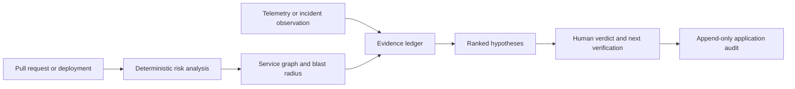
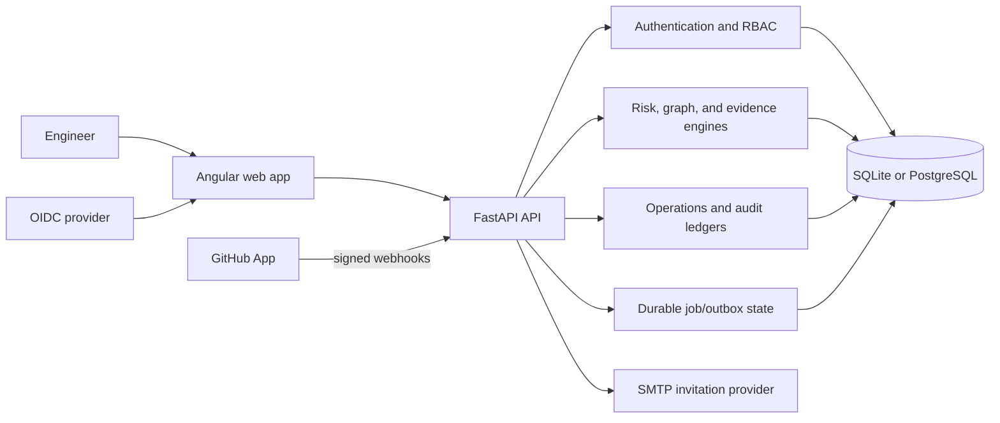

# DeployGuard AI

Evidence-first change-risk analysis and incident investigation for platform and reliability teams.

[](https://github.com/kingggg5/deployguardai/actions/workflows/ci.yml)
[](https://github.com/kingggg5/deployguardai/actions/workflows/codeql.yml)
[](https://securityscorecards.dev/viewer/?uri=github.com/kingggg5/deployguardai)
[](LICENSE)

DeployGuard connects pull requests, deployments, service dependencies, telemetry, and human observations in one tenant-scoped workspace. It helps an engineer answer two questions with traceable evidence:

1. What makes this change risky before it reaches production?
2. Which incident hypothesis is best supported, what contradicts it, and what should we verify next?

The core is deterministic and reproducible. Risk scores, blast radius, ranked hypotheses, and explanations are derived from explicit weights, stored evidence, and versioned workspace policy. DeployGuard is decision support: it does not deploy, roll back, execute shell commands, or remediate infrastructure autonomously.

## What the product provides

| Area | Outcome |
| --- | --- |
| Change risk | Explainable scoring, missing-evidence signals, rollback readiness, service criticality, and dependency blast radius |
| Investigation | Incident timeline, evidence and counter-evidence, uncertainty, ranked hypotheses, and human verdicts |
| Connected data | GitHub App installation, repository/PR sync, signed webhooks, deployment lifecycle, and scoped normalized telemetry |
| Operations | Service catalog, risk policy, operational-event ledger, incident lifecycle, assignments, notifications, and audit events |
| Workspace | Tenant-scoped access, `viewer`/`responder`/`admin`/`owner` roles, invitations, repository scope, and connector health |
| Evaluation | Clearly labelled synthetic scenarios and versioned SHA-256-pinned benchmark manifests |

## Safety and data truth

Data origin is part of the domain model and is visible in both API responses and the UI:

- `connected` records come from a verified provider integration or authenticated telemetry collector.
- `synthetic` records are local fixtures for demos, tests, and evaluation only.
- A fresh runtime starts with an empty connected-mode database; it does not silently seed a demo repository.
- `SEED_SYNTHETIC_DATA=true` is explicit and rejected by production configuration.

The browser never receives a GitHub installation token, GitHub App private key, SMTP password, or telemetry root credential. LLM synthesis is disabled until an evidence-only contract, citation validator, and evaluation gate exist.

## Product flow



## Architecture



The backend owns authorization and workspace boundaries. Provider adapters normalize external input; deterministic engines own scoring and explanations; persistence is managed through Alembic migrations.

## Technology stack

| Layer | Technology | Purpose |
| --- | --- | --- |
| Frontend | Angular 22, TypeScript 6, RxJS, Reactive Forms | Standalone components, typed API clients, responsive workspace workflows |
| UI | SCSS design tokens and GitHub/Primer-inspired patterns | Repository context, tabs, labels, forms, timelines, tables, dark mode, and keyboard navigation |
| Backend | Python 3.12, FastAPI, Pydantic 2 | Typed REST API, validation, and OpenAPI |
| Data | SQLAlchemy 2, Alembic, SQLite, PostgreSQL 16, psycopg 3 | Tenant-scoped persistence and schema evolution |
| Security | PyJWT, cryptography, OIDC/JWKS, GitHub App HMAC | Identity verification and signed provider events |
| Delivery | Docker Compose, Nginx, Uvicorn, GitHub Actions | Local/production-shaped runtime and release checks |
| Verification | Pytest, HTTPX, Vitest, jsdom, pip-audit, npm audit | Backend/API tests, frontend tests, builds, and dependency checks |

## Quick start

### Requirements

- Python 3.12+
- Node.js 22+
- npm
- PowerShell 7 for helper scripts
- Docker Desktop for the Compose profile (optional)

Clone and start the local application:

```powershell
git clone https://github.com/kingggg5/deployguardai.git
cd deployguardai
.\scripts\run-dev.ps1
```

Use `-SkipInstall` after dependencies are installed. Stop local services with `.\scripts\stop-dev.ps1`.

Open:

- Web UI: <http://127.0.0.1:4300>
- OpenAPI: <http://127.0.0.1:8100/docs>
- Liveness: <http://127.0.0.1:8100/api/v1/health/live>
- Readiness: <http://127.0.0.1:8100/api/v1/health/ready>
- Private metrics scrape: <http://127.0.0.1:8100/api/v1/metrics>

The default local run is connected mode with no seeded records. Create a workspace and configure a GitHub App before expecting real repositories, pull requests, deployments, or telemetry. For deterministic fixtures only:

```powershell
$env:SEED_SYNTHETIC_DATA = "true"
.\scripts\run-dev.ps1
```

Never enable synthetic seeding against a production database.

### Docker Compose

```powershell
Copy-Item .env.example .env
docker compose up --build
```

Compose provides the UI on `:4300`, the API on `:8100`, and PostgreSQL on the internal network. Do not use `docker compose down -v` unless deleting the local database volume is intentional.

## Configure real providers

Keep secrets in a managed secret provider. Do not commit `.env`, private keys, or credentials.

### OIDC

Set `ENVIRONMENT=production`, `AUTH_PROVIDER=oidc`, issuer, audience, client ID, scope, and JWKS URL. The API validates issuer, audience, algorithm, signature, expiry, and verified email. The Angular client uses Authorization Code + PKCE.

### GitHub App

Configure App ID, slug, private key, webhook secret, API version, and repository permissions. Subscribe to `installation`, `pull_request`, `workflow_run`, `deployment`, and `deployment_status`. Optional Check Runs are non-blocking decision support; they never deploy or roll back changes.

### Telemetry

Set `TELEMETRY_INGEST_TOKEN` on the server and derive a workspace-bound collector token. Send the derived bearer with `X-DeployGuard-Workspace`, an optional repository header, and a stable event ID. The endpoint accepts DeployGuard's normalized contract, not raw OTLP payloads; terminate TLS and redact secrets before ingestion.

### Invitations

Configure SMTP and `FRONTEND_PUBLIC_URL`. In production without SMTP, invitation controls are disabled instead of returning a false success.

See [`.env.example`](.env.example), [API contract](docs/API_CONTRACT.md), [operations runbook](docs/OPERATIONS.md), and [telemetry contract](docs/TELEMETRY_GATEWAY.md).

For a read-only live-contract check (no DeployGuard or GitHub records are created), run:

```powershell
.\scripts\verify-github-live.ps1 -Repository owner/name
```

## Operational foundations included

- Durable `background_jobs` outbox with idempotent enqueue, atomic claim, bounded retry/backoff, stale-lease recovery, dead-letter state, explicit replay, and credential-like payload rejection.
- Private low-cardinality Prometheus metrics at `/api/v1/metrics`; no path, tenant, request ID, or payload labels.
- Request IDs, structured JSON access logs, body-size limits, and process-local ingress rate limiting.
- Atomic SQLite backup and PostgreSQL custom-archive backup with no-overwrite-by-default behavior.
- Read-only backup validation through `scripts/restore_check.py` and dry-run-first retention reports through `scripts/retention_report.py`.
- Liveness/readiness probes, Alembic migration checks, CI, CodeQL, dependency review, Scorecard, container builds, and reproducible evaluation artifacts.

These are application-level foundations. A separately supervised worker, shared gateway, managed secret store, scheduled retention, legal hold, and restore drill are still deployment responsibilities.

## Production readiness

| Status | Meaning | Examples |
| --- | --- | --- |
| Implemented in repository | Tested runtime path exists | Deterministic engines, tenant/RBAC checks, signed webhook verification, migrations, queue primitives, metrics, backup helpers |
| Provider/configuration gated | Requires operator-owned credentials or external service | OIDC, GitHub App, SMTP, normalized telemetry, PostgreSQL deployment |
| Deployment required | Cannot be safely provided by application code alone | HTTPS/WAF, distributed rate limiting, managed secrets, alerting, on-call, encrypted backup storage |
| Deliberately not implemented | Safety boundary or missing evaluation gate | Autonomous remediation, shell/cluster access, arbitrary outbound webhooks, LLM synthesis |

DeployGuard should be described as **production-integratable**, not production-hardened, until deployment-specific controls and drills are complete.

## Verification

```powershell
cd backend
python -m pytest
python -m compileall -q app migrations
pip-audit -r requirements.txt --progress-spinner off

cd ..\frontend
npm test -- --watch=false
npm run build
npm audit --omit=dev --audit-level=high

cd ..
docker compose config --quiet
python scripts/evaluate_benchmarks.py --output .runtime/evaluation-results.json
```

The current regression baseline is 56 backend tests and 50 frontend tests. Test counts are not a claim of complete code coverage. CI also runs migration smoke tests, container builds, CodeQL, dependency review, and OpenSSF Scorecard.

## Documentation and community

- [Architecture](docs/ARCHITECTURE.md) — trust boundaries and data flow
- [API contract](docs/API_CONTRACT.md) — endpoints and error codes
- [Data model](docs/DATA_MODEL.md) — tenant, evidence, operations, and audit records
- [Security model](docs/SECURITY.md) — authentication, authorization, and provider handling
- [Operations runbook](docs/OPERATIONS.md) — deployment, probes, backups, retention, and recovery
- [Evaluation](docs/EVALUATION.md) — benchmark provenance and scoring
- [Thai user guide](docs/USER_GUIDE_TH.md) — คู่มือการใช้งานภาษาไทย
- [Contributing](CONTRIBUTING.md) · [Governance](GOVERNANCE.md) · [Support](SUPPORT.md) · [Changelog](CHANGELOG.md)

DeployGuard is licensed under [Apache-2.0](LICENSE). Report security issues privately using [`.github/SECURITY.md`](.github/SECURITY.md), not a public issue.

## Honest limitations

- Connected dependency topology remains empty until dependency evidence is ingested.
- Missing coverage, rollback, and observability evidence is treated conservatively as unknown.
- The queue/outbox is a safe persistence primitive; webhook, event, notification, and invitation producers remain synchronous until a separately supervised worker is deployed.
- The built-in rate limiter is process-local; multi-replica deployments need a shared gateway or distributed limiter.
- PostgreSQL RLS is not enabled; application tenant predicates require PostgreSQL defense-in-depth and negative isolation testing before high-assurance use.
- Retention helpers are allow-listed and explicit, but scheduling, legal hold, workspace deletion, deletion audit, and backup expiry remain external policy/workflow work.
- Native OTLP ingestion, Slack/Teams/PagerDuty adapters, production SLO dashboards, public evaluation datasets, and calibration reports are not bundled.

## สรุปภาษาไทย

DeployGuard AI เป็นระบบช่วยทีม Platform และ SRE วิเคราะห์ความเสี่ยงของ change ก่อน deploy และสืบสวน incident จากหลักฐานที่ตรวจสอบย้อนกลับได้ โดยรวม pull request, dependency ของ service, deployment, telemetry และความเห็นจากมนุษย์ไว้ใน workspace เดียว

ระบบใช้ deterministic engine ที่มีน้ำหนักคะแนนชัดเจน แยก `connected` กับ `synthetic` อย่างชัดเจน และไม่มีความสามารถในการ deploy, rollback, รัน shell หรือแก้ infrastructure อัตโนมัติ

ใน repository มีระบบ tenant/RBAC, signed GitHub webhook, durable job/outbox foundation, metrics, backup/restore verification, retention report, migration, CI และ security baseline แล้ว ส่วนการเปิดใช้งาน production จริงยังต้องเตรียม OIDC, GitHub App, SMTP, HTTPS, managed secrets, distributed rate limit, PostgreSQL hardening, monitoring, backup policy และผู้รับผิดชอบระบบให้ครบถ้วน
