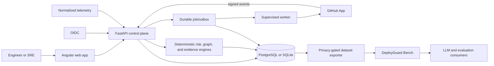

# DeployGuard AI

**Evidence-first change risk and incident investigation for production teams.**

[](https://github.com/kingggg5/deployguardai/actions/workflows/ci.yml)
[](https://github.com/kingggg5/deployguardai/actions/workflows/codeql.yml)
[](https://securityscorecards.dev/viewer/?uri=github.com/kingggg5/deployguardai)
[](LICENSE)

[English](README.md) · [ภาษาไทย](README_TH.md) · [Quickstart](docs/QUICKSTART.md) · [Documentation](docs/ARCHITECTURE.md)

<p align="center">
  
</p>

<p align="center"><em>Synthetic product tour. Demo records are labelled and isolated from connected data.</em></p>

DeployGuard connects pull requests, deployments, service dependencies, runtime
signals, and human decisions in one workspace. It helps teams understand
**why a change may be unsafe** and **which incident hypothesis is best supported
by evidence**—without deploying, rolling back, or changing infrastructure.

## Data strategy: AI consumes the evidence graph

DeployGuard AI is building an operational-data foundation for evaluating future
AI and LLM systems in Production Engineering:

| Layer | Role |
| --- | --- |
| 1. Operational data | Normalize GitHub, OpenTelemetry, Prometheus, deployment, and human investigation events with provenance |
| 2. Evidence graph | Connect changes, topology, supporting evidence, counter-evidence, hypotheses, verification, verdicts, and postmortems |
| 3. DeployGuard Bench | Publish privacy-reviewed, versioned examples for evaluation and, where consent/license/split policy allow, model training |

AI is a downstream **consumer** of the dataset—not the source of evidence or
ground truth. The repository now includes the [DeployGuard Bench](bench/README.md)
v0.1 schema, deterministic exporter, and three synthetic seed examples. The
target of 1,000 deployment scenarios and 500 incident investigations is a
roadmap goal, not a current dataset-size claim. A real incident is only a
candidate example until consent, redaction, licensing, and human review pass;
the current seed is evaluation-only and is not approved for model training.

## Why DeployGuard

- **Explain risk, not just a score.** Review contributing signals, missing
  evidence, rollback readiness, service criticality, and blast radius.
- **Investigate with evidence and counter-evidence.** Rank hypotheses, preserve
  uncertainty, and record the next verification step and human verdict.
- **Keep decisions reproducible.** Scoring, graph traversal, ranking, and
  explanations are deterministic, versioned, and covered by golden tests.
- **Connect real systems safely.** Use a GitHub App, signed webhooks, OIDC,
  tenant-scoped telemetry, PostgreSQL RLS, and a durable provider outbox.
- **Never confuse a demo with production.** Connected mode starts empty;
  synthetic records remain visibly labelled in the API and UI.

## What is included

| Area | Capabilities |
| --- | --- |
| Change risk | Explainable scoring, policy versions, missing-evidence signals, rollback readiness, and dependency blast radius |
| Incident investigation | Timeline, evidence ledger, counter-evidence, ranked hypotheses, assignments, notifications, and human verdicts |
| GitHub integration | App installation, repository sync, signed PR/deployment webhooks, and optional Check Runs |
| Team workspaces | OIDC/development auth, `viewer`/`responder`/`admin`/`owner` roles, invitations, audit events, and tenant isolation |
| Operations | Service catalog, deployment lifecycle, normalized telemetry, durable jobs, retries, dead letters, traces, metrics, backup, and restore tooling |
| Dataset and evaluation | DeployGuard Bench schema/exporter, versioned synthetic examples, SHA-256 manifests, golden/property tests, contract fixtures, and CI artifacts |

## Project status

| Capability | Current status |
| --- | --- |
| Connected runtime | Implemented; a fresh environment contains no demo data and requires operator-owned GitHub/OIDC/SMTP/telemetry configuration |
| AI/LLM | **No external model is called.** The supported path is a deterministic, citation-gated evidence explanation |
| Dataset | DeployGuard Bench v0.1 contains 3 synthetic seed examples: 2 development-evaluation eligible, 1 unverified, and 0 approved for training |
| Evaluation | Engine-backed synthetic evaluation runs in CI; public/real-world accuracy, calibration, and production impact are not yet measured |
| Production | Production-integratable; TLS, managed secrets, durable telemetry, alerting, backups, and on-call ownership remain deployment responsibilities |

See [Evaluation](docs/EVALUATION.md), the [AI boundary](docs/AI_BOUNDARY.md),
and [Production readiness](docs/OPERATIONS.md) before making accuracy or
production-readiness claims.

## Quick start

Requirements: Docker Engine or Docker Desktop with Compose v2.

```bash
git clone https://github.com/kingggg5/deployguardai.git
cd deployguardai
docker compose up --build
```

Open the web app at <http://127.0.0.1:4300> and OpenAPI at
<http://127.0.0.1:8100/docs>. Connected mode starts empty. To run the isolated,
deterministic product tour instead:

```bash
docker compose -p deployguard-demo \
  -f docker-compose.yml -f docker-compose.demo.yml up --build
```

Do not add `--volumes` when stopping Compose unless deleting the local database
is intentional. Local Python/Node workflows, provider setup, and cleanup are
documented in the [quickstart](docs/QUICKSTART.md).

## Architecture



The backend owns authorization and workspace boundaries. Provider adapters
normalize external input; deterministic engines own scores and explanations;
PostgreSQL is the production source of truth. A separate [.NET 10 read-only
spike](spikes/dotnet-readonly/README.md) measures parity and operational value
without replacing the production authority.

## Technology

- **Web:** Angular 22, TypeScript 6, RxJS, SCSS design tokens
- **API:** Python 3.12, FastAPI, Pydantic 2, SQLAlchemy 2, Alembic
- **Data:** PostgreSQL 16 with RLS; SQLite for local development
- **Operations:** Docker Compose, OpenTelemetry, Prometheus, Nginx, GHCR
- **Quality:** Pytest, Vitest, contract/golden/property tests, CodeQL,
  dependency review, OpenSSF Scorecard, signed release images, SBOM, and provenance

## Verify

```bash
cd backend
python -m pytest
python -m compileall -q app migrations

cd ../frontend
npm test -- --watch=false
npm run build

cd ..
docker compose config --quiet
python scripts/evaluate_benchmarks.py --output .runtime/evaluation-results.json
python scripts/export_operational_dataset.py --check \
  --output-dir bench/datasets/synthetic-v0.1
python scripts/capture_contracts.py --check
```

Exact test counts are not presented as quality or accuracy claims. CI is the
source of truth for required checks and generated evaluation artifacts.

## Documentation

- [Quickstart](docs/QUICKSTART.md) — connected mode, isolated demo, and cleanup
- [Architecture](docs/ARCHITECTURE.md) — components, trust boundaries, and data flow
- [API contract](docs/API_CONTRACT.md) — endpoints, authorization, and errors
- [Security model](docs/SECURITY.md) — authentication, tenant isolation, and provider handling
- [Operations](docs/OPERATIONS.md) — deployment, probes, backups, retention, and recovery
- [Evaluation](docs/EVALUATION.md) — datasets, methodology, results, and limitations
- [DeployGuard Bench](bench/README.md) — operational-example schema, dataset card, privacy boundary, and reproduction
- [AI boundary](docs/AI_BOUNDARY.md) — evidence contract and external-model activation gates
- [Release guide](docs/RELEASE.md) — versioning, images, SBOM, provenance, and rollback

## Community

Contributions are welcome. Read [CONTRIBUTING.md](CONTRIBUTING.md), the
[Code of Conduct](CODE_OF_CONDUCT.md), [Governance](GOVERNANCE.md), and
[Support](SUPPORT.md) before opening a pull request. Release changes are tracked
in [CHANGELOG.md](CHANGELOG.md).

Report vulnerabilities privately using [`.github/SECURITY.md`](.github/SECURITY.md),
not a public issue. DeployGuard is licensed under [Apache-2.0](LICENSE).

## Current limitations

- No external LLM provider or public/real-world RCA benchmark is integrated.
- Connected incidents are never exported automatically; consent, redaction,
  licensing, review, and versioned publication are not implemented yet.
- Telemetry ingestion uses DeployGuard's normalized contract; it is not a native
  OTLP evidence receiver.
- Slack, Teams, PagerDuty, organization-specific SLO dashboards, autonomous
  remediation, and production execution are intentionally not bundled.
- Multi-replica rate limiting, managed secrets, alert routing, backup storage,
  and disaster-recovery ownership must be provided by the operator.
