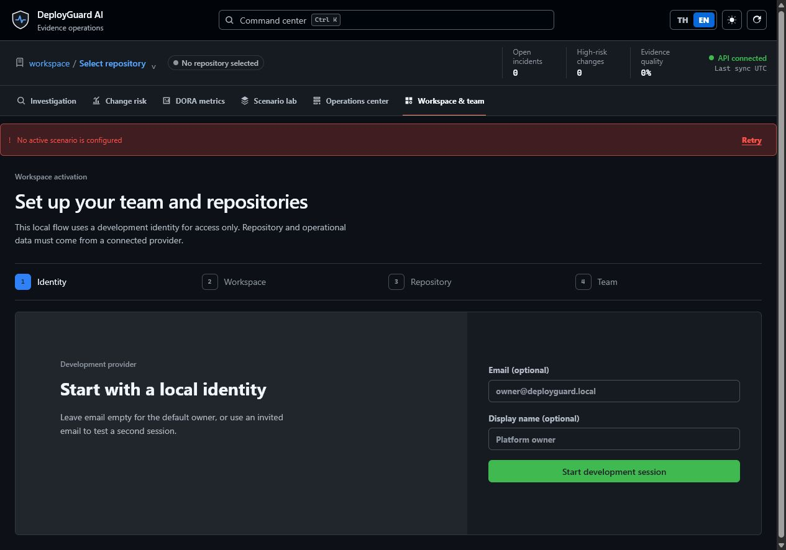
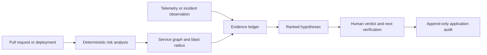
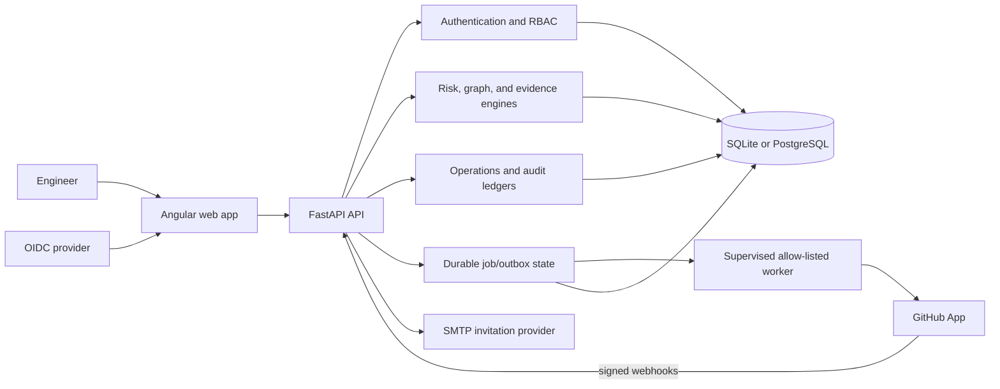

# DeployGuard AI

Understand deployment risk before production. Investigate incidents with
traceable evidence instead of guesses.

[](https://github.com/kingggg5/deployguardai/actions/workflows/ci.yml)
[](https://github.com/kingggg5/deployguardai/actions/workflows/codeql.yml)
[](https://securityscorecards.dev/viewer/?uri=github.com/kingggg5/deployguardai)
[](LICENSE)

<p align="center">
  
</p>

<p align="center">
  
</p>

<p align="center"><em>Latest connected-mode desktop setup. No synthetic repository or incident data is shown.</em></p>

<p align="center">
  <a href="README.md">English</a> · <a href="README_TH.md">ภาษาไทย</a> · <a href="docs/QUICKSTART.md">Quickstart</a> · <a href="docs/RELEASE.md">Release guide</a>
</p>

DeployGuard connects pull requests, deployments, service dependencies, telemetry, and human observations in one tenant-scoped workspace. It is built for platform, SRE, and engineering teams that need an explainable answer before changing production:

1. What makes this change risky before it reaches production?
2. Which incident hypothesis is best supported, what contradicts it, and what should we verify next?

The core is deterministic and reproducible. Risk scores, blast radius, ranked hypotheses, and explanations are derived from explicit weights, stored evidence, and versioned workspace policy. DeployGuard is decision support: it does not deploy, roll back, execute shell commands, or remediate infrastructure autonomously.

**In one workflow:** inspect a pull request's change risk, see the dependency
blast radius, connect deployment and runtime evidence, compare ranked root-cause
hypotheses, and record the engineer's verdict. The UI always identifies
synthetic records so a demo is never mistaken for production evidence.

## Try it in three minutes

The default runtime is connected mode: it starts empty and never pretends that demo records came from GitHub. For a safe product tour, use the separate synthetic profile; every synthetic record is labelled in the API and UI.

```bash
git clone https://github.com/kingggg5/deployguardai.git
cd deployguardai

# Connected mode — configure a GitHub App when you are ready for real data.
docker compose up --build

# Optional demo mode — isolated database, deterministic synthetic scenarios.
docker compose -p deployguard-demo \
  -f docker-compose.yml -f docker-compose.demo.yml up --build

# macOS/Linux shortcut when GNU Make is available.
make demo
```

Open <http://127.0.0.1:4300>. The API and OpenAPI explorer are available at
<http://127.0.0.1:8100/docs>. Stop connected mode with `docker compose down`.
Stop the demo with:

```bash
docker compose -p deployguard-demo -f docker-compose.yml \
  -f docker-compose.demo.yml down
```

Do not add `--volumes` unless deleting that profile's local database is
intentional. The full setup, provider configuration, and cleanup guide is in
[docs/QUICKSTART.md](docs/QUICKSTART.md).

## Why this project exists

Most change-risk tools show a score, while most incident tools show a timeline.
DeployGuard connects the two and keeps the reasoning inspectable: each signal
has provenance, counter-evidence is first-class, uncertainty is explicit, and
the final decision stays with a human reviewer. This makes it useful as a
decision layer across GitHub, telemetry, and existing deployment systems rather
than as another system that owns production execution.

## What the product provides

| Area | Outcome |
| --- | --- |
| Change risk | Explainable scoring, missing-evidence signals, rollback readiness, service criticality, and dependency blast radius |
| Investigation | Incident timeline, evidence and counter-evidence, uncertainty, ranked hypotheses, and human verdicts |
| Connected data | GitHub App installation, repository/PR sync, signed webhooks, deployment lifecycle, and scoped normalized telemetry |
| Operations | Service catalog, risk policy, operational-event ledger, incident lifecycle, assignments, notifications, and audit events |
| Workspace | Tenant-scoped access, `viewer`/`responder`/`admin`/`owner` roles, invitations, repository scope, and connector health |
| Evaluation | Clearly labelled synthetic scenarios and versioned SHA-256-pinned benchmark manifests |

Every stored change and incident analysis reports the schema, engine, scoring
policy, and graph-policy version that produced it. Historical rows created
before provenance capture are labelled `legacy-unversioned`; the API never
pretends they were produced by the current engine.

## Safety and data truth

Data origin is part of the domain model and is visible in both API responses and the UI:

- `connected` records come from a verified provider integration or authenticated telemetry collector.
- `synthetic` records are local fixtures for demos, tests, and evaluation only.
- A fresh runtime starts with an empty connected-mode database; it does not silently seed a demo repository.
- `SEED_SYNTHETIC_DATA=true` is explicit and rejected by production configuration.

The browser never receives a GitHub installation token, GitHub App private key,
SMTP password, or telemetry root credential. The repository includes a
citation-gated, deterministic evidence explanation baseline: every displayed
statement is checked against incident evidence IDs before it is returned. No
external AI provider is configured, contacted, or required by default. An
opt-in provider remains gated on redaction, tenant isolation, evaluation, and
operational review; see [the AI boundary](docs/AI_BOUNDARY.md).

## Product flow



## Architecture



The backend owns authorization and workspace boundaries. Provider adapters normalize external input; deterministic engines own scoring and explanations; persistence is managed through Alembic migrations.

## Technology stack

| Layer | Technology | Purpose |
| --- | --- | --- |
| Frontend | Angular 22.1, TypeScript 6, RxJS, Reactive Forms | Standalone components, typed API clients, responsive workspace workflows |
| UI | SCSS design tokens and GitHub/Primer-inspired patterns | Repository context, tabs, labels, forms, timelines, tables, dark mode, and keyboard navigation |
| Backend | Python 3.12, FastAPI, Pydantic 2 | Typed REST API, validation, and OpenAPI |
| Data | SQLAlchemy 2, Alembic, SQLite, PostgreSQL 16, psycopg 3 | Tenant-scoped persistence and schema evolution |
| Security | PyJWT, cryptography, OIDC/JWKS, GitHub App HMAC, PostgreSQL RLS | Identity verification, signed provider events, and database tenant isolation |
| Observability | OpenTelemetry, OTLP/HTTP, Prometheus, Collector | Correlated API/worker traces, low-cardinality metrics, and redaction |
| Delivery | Docker Compose, Nginx, Uvicorn, GitHub Actions, GHCR | Local/production-shaped runtime and signed multi-architecture images |
| Verification | Pytest, HTTPX, Vitest, jsdom, pip-audit, npm audit | Backend/API tests, frontend tests, builds, and dependency checks |

### Runtime migration evidence

The production authority remains the FastAPI modular monolith. A separate
[.NET 10 read-only spike](spikes/dotnet-readonly/README.md) ports the deterministic
engines and verifies golden hashes, representative GET contracts, optional RLS
posture, and same-workload performance before any migration is considered. This
keeps the project useful to Python teams today while giving .NET adopters an
evidence-based path instead of a speculative rewrite. The current evidence is
9/9 golden cases, 5/5 representative read responses, a passing read-only RLS
probe, and a three-sample engine benchmark where .NET p95 is 1.49× slower than
Python; full CRUD/worker and operational parity remain intentionally gated.

## Quick start

### Local development requirements

- Python 3.12+
- Node.js 24+
- npm
- PowerShell 7 on Windows, or Bash on Linux/macOS for helper scripts
- Docker Desktop or Docker Engine + Compose v2 for the recommended path

Clone and start the local application:

```powershell
git clone https://github.com/kingggg5/deployguardai.git
cd deployguardai
.\scripts\run-dev.ps1
```

```bash
git clone https://github.com/kingggg5/deployguardai.git
cd deployguardai
./scripts/run-dev.sh
```

Use `-SkipInstall` (PowerShell) or `--skip-install` (Bash) after dependencies
are installed. Stop local services with `.\scripts\stop-dev.ps1` or
`./scripts/stop-dev.sh`. `make dev`, `make test`, `make coverage`, and
`make demo` provide the same common paths where GNU Make is available.

Open:

- Web UI: <http://127.0.0.1:4300>
- OpenAPI: <http://127.0.0.1:8100/docs>
- Liveness: <http://127.0.0.1:8100/api/v1/health/live>
- Readiness: <http://127.0.0.1:8100/api/v1/health/ready>
- Private metrics scrape: <http://127.0.0.1:8100/api/v1/metrics>

The default local run is connected mode with no seeded records. Create a workspace and configure a GitHub App before expecting real repositories, pull requests, deployments, or telemetry. For deterministic fixtures only:

```powershell
$env:SEED_SYNTHETIC_DATA = "true"
.\scripts\run-dev.ps1
```

Never enable synthetic seeding against a production database.

### Docker Compose

```powershell
Copy-Item .env.example .env
docker compose up --build
```

Compose provides the UI on `:4300`, the API on `:8100`, and PostgreSQL on the internal network. Do not use `docker compose down -v` unless deleting the local database volume is intentional.

### Container images

Versioned releases publish signed images to GitHub Container Registry:

```text
ghcr.io/kingggg5/deployguardai-api:<version>
ghcr.io/kingggg5/deployguardai-web:<version>
```

For production, pin both services to the digest recorded in the GitHub release
instead of `latest`. The release workflow also publishes SBOM and provenance
attestations; see [docs/RELEASE.md](docs/RELEASE.md).

## Configure real providers

Keep secrets in a managed secret provider. Do not commit `.env`, private keys, or credentials.

### OIDC

Set `ENVIRONMENT=production`, `AUTH_PROVIDER=oidc`, issuer, audience, client ID, scope, and JWKS URL. The API validates issuer, audience, algorithm, signature, expiry, and verified email. The Angular client uses Authorization Code + PKCE.

### GitHub App

Configure App ID, slug, private key, webhook secret, API version, and repository permissions. Subscribe to `installation`, `pull_request`, `workflow_run`, `deployment`, and `deployment_status`. Optional Check Runs are non-blocking decision support; they never deploy or roll back changes.

### Telemetry

Set `TELEMETRY_INGEST_TOKEN` on the server and derive a workspace-bound collector token. Send the derived bearer with `X-DeployGuard-Workspace`, an optional repository header, and a stable event ID. The endpoint accepts DeployGuard's normalized contract, not raw OTLP payloads; terminate TLS and redact secrets before ingestion.

### Invitations

Configure SMTP and `FRONTEND_PUBLIC_URL`. In production without SMTP, invitation controls are disabled instead of returning a false success.

See [`.env.example`](.env.example), [API contract](docs/API_CONTRACT.md), [operations runbook](docs/OPERATIONS.md), and [telemetry contract](docs/TELEMETRY_GATEWAY.md).

For a read-only live-contract check (no DeployGuard or GitHub records are created), run:

```powershell
.\scripts\verify-github-live.ps1 -Repository owner/name
```

## Operational foundations included

- Durable `background_jobs` outbox with transactional GitHub Check enqueue, an allow-listed supervised worker, idempotent provider recovery, bounded retry/backoff, stale-lease recovery, dead-letter state, explicit replay, W3C trace propagation, and credential-like payload rejection.
- Responder-visible failed/dead-letter queue summaries and admin-only audited replay without exposing job payloads or stored error text.
- PostgreSQL RLS policies on data-plane tables, transaction-local tenant context, fail-closed behavior without context, and negative cross-tenant CRUD/pool-leakage tests against a non-owner role.
- Private low-cardinality Prometheus metrics at `/api/v1/metrics`; no path, tenant, request ID, or payload labels.
- Optional OpenTelemetry API/worker tracing through redacting local and production Collector configurations.
- Request IDs, structured JSON access logs, body-size limits, and process-local ingress rate limiting.
- Atomic SQLite backup and PostgreSQL custom-archive backup with no-overwrite-by-default behavior.
- Isolated writable restore rehearsals through `scripts/restore_rehearsal.py`; dry-run-first, batched retention with legal-hold control and append-only deletion audit through `scripts/retention_report.py`.
- Liveness/readiness probes, Alembic migration checks, CI, CodeQL, dependency review, Scorecard, container builds, and reproducible evaluation artifacts.

Compose includes the API, web app, PostgreSQL, supervised worker, one-shot migration job, and an optional local Collector. A shared gateway, managed secrets, retention schedule, durable telemetry backend, backup storage, alerts, and on-call ownership remain deployment responsibilities because the repository cannot truthfully provision organization-specific infrastructure or credentials.

## Production readiness

| Status | Meaning | Examples |
| --- | --- | --- |
| Implemented in repository | Tested runtime path exists | Deterministic engines, tenant/RBAC + PostgreSQL RLS, signed webhook verification, worker/outbox, OTLP tracing, migrations, retention and restore tooling |
| Provider/configuration gated | Requires operator-owned credentials or external service | OIDC, GitHub App, SMTP, normalized telemetry, PostgreSQL deployment |
| Deployment required | Cannot be safely provided by application code alone | HTTPS/WAF, distributed rate limiting, managed secrets, alerting, on-call, encrypted backup storage |
| Deliberately not implemented | Safety boundary or missing evaluation gate | Autonomous remediation, shell/cluster access, arbitrary outbound webhooks, external AI-provider calls |

DeployGuard should be described as **production-integratable**, not production-hardened, until deployment-specific controls and drills are complete.

Run the fail-closed readiness gate before a production release:

```powershell
python scripts/production_readiness.py
```

The gate validates the application configuration and requires explicit operator attestations for TLS, managed secrets, distributed rate limiting, supervised workers, retention, restore, durable telemetry, alerting, and on-call ownership. It never invents or prints credentials.

Production database duties use separate short-lived credentials: the API and
worker use a non-owner RLS role, while migration, backup, retention, and restore
jobs receive their own audited URLs. See the [operations runbook](docs/OPERATIONS.md)
and `deploy/postgres/runtime-role-grants.sql`.

## Verification

```powershell
cd backend
python -m pytest
python -m compileall -q app migrations
pip-audit -r requirements.txt --progress-spinner off

cd ..\frontend
npm test -- --watch=false
npm run build
npm audit --omit=dev --audit-level=high

cd ..
docker compose config --quiet
python scripts/evaluate_benchmarks.py --output .runtime/evaluation-results.json
```

Backend and frontend regression suites and coverage floors are required in CI;
exact test counts are intentionally not used as a quality or coverage claim. CI
also exercises the Alembic chain on SQLite and PostgreSQL, runs an engine-backed
synthetic evaluation, and builds containers alongside CodeQL, dependency review,
and OpenSSF Scorecard.

## Documentation and community

- [Quickstart](docs/QUICKSTART.md) — connected mode, isolated demo, and cleanup
- [Architecture](docs/ARCHITECTURE.md) — trust boundaries and data flow
- [API contract](docs/API_CONTRACT.md) — endpoints and error codes
- [Data model](docs/DATA_MODEL.md) — tenant, evidence, operations, and audit records
- [Security model](docs/SECURITY.md) — authentication, authorization, and provider handling
- [Operations runbook](docs/OPERATIONS.md) — deployment, probes, backups, retention, and recovery
- [Evaluation](docs/EVALUATION.md) — benchmark provenance and scoring
- [AI boundary](docs/AI_BOUNDARY.md) — evidence contract, citation gate, and provider activation requirements
- [Maintainer launch checklist](docs/MAINTAINER_LAUNCH.md) — repository metadata, preview release, and contributor backlog
- [.NET 10 read-only spike](spikes/dotnet-readonly/README.md) — parity gates and runtime comparison
- [Thai user guide](docs/USER_GUIDE_TH.md) — คู่มือการใช้งานภาษาไทย
- [Contributing](CONTRIBUTING.md) · [Governance](GOVERNANCE.md) · [Support](SUPPORT.md) · [Changelog](CHANGELOG.md) · [Release guide](docs/RELEASE.md)

DeployGuard is licensed under [Apache-2.0](LICENSE). Report security issues privately using [`.github/SECURITY.md`](.github/SECURITY.md), not a public issue.

## Honest limitations

- Connected dependency topology remains empty until dependency evidence is ingested.
- Missing coverage, rollback, and observability evidence is treated conservatively as unknown.
- Signed PR webhooks enqueue GitHub Check publication transactionally; manual Check retry, notifications, invitations, and normalized event processing remain synchronous by design.
- The built-in rate limiter is process-local; multi-replica deployments need a shared gateway or distributed limiter.
- RLS protects data-plane tables only. Authentication, invitation claims, provider mapping, webhook ledgers, and worker queues remain control-plane tables guarded by application authorization; production must use a non-owner, non-superuser, non-`BYPASSRLS` runtime role.
- Retention scheduling, backup expiry/storage, workspace deletion, and legal-hold ownership remain operator workflows; the included scripts provide fail-closed controls and auditable execution primitives.
- Native OTLP evidence ingestion, Slack/Teams/PagerDuty adapters, organization-specific SLO dashboards, public evaluation datasets, and calibration reports are not bundled.

## ภาษาไทย

อ่านคำอธิบายและขั้นตอนใช้งานภาษาไทยได้ที่ [README_TH.md](README_TH.md) และ
[คู่มือผู้ใช้ภาษาไทย](docs/USER_GUIDE_TH.md)
