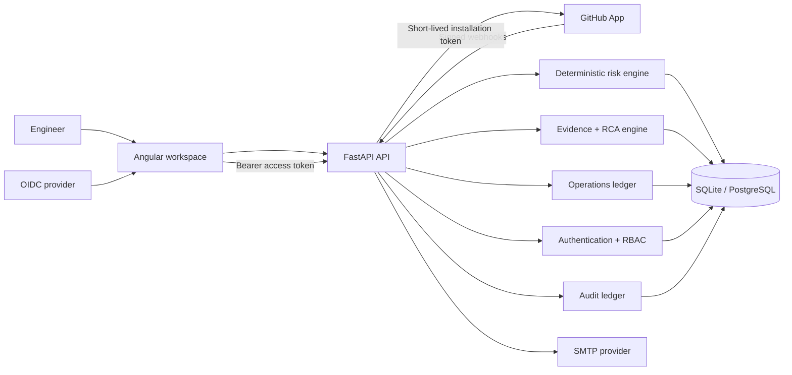

# DeployGuard AI

Evidence-first change risk and incident investigation for engineering teams.

[](https://github.com/kingggg5/deployguardai/actions/workflows/ci.yml)
[](https://github.com/kingggg5/deployguardai/actions/workflows/codeql.yml)
[](https://securityscorecards.dev/viewer/?uri=github.com/kingggg5/deployguardai)

DeployGuard helps platform and reliability teams answer two practical questions:

1. How risky is this change before it reaches production?
2. When an incident starts, what evidence supports or contradicts each possible cause?

The project combines a deterministic risk engine, service-graph blast-radius analysis, an evidence ledger, ranked RCA hypotheses, human feedback, and a tenant-aware workspace. Connected mode is the default: records arrive from a verified GitHub App and authenticated telemetry. Synthetic scenarios are an explicit opt-in for evaluation only.

The interface follows a repository-native, GitHub/Primer-inspired interaction model: global product controls, visible workspace and repository scope, underlined product navigation, issue-style ledgers, settings navigation, compact labels, and evidence timelines. DeployGuard keeps its own identity and does not copy GitHub branding or assets.

## Why teams use it

- Review risky changes before deployment without turning a score into an automatic gate.
- See why a risk score changed, which services are affected, and which evidence is missing.
- Investigate incidents with supporting evidence, counter-evidence, uncertainty, and the next verification step in one place.
- Keep repository, deployment, telemetry, incident, and human-verdict records inside the same tenant boundary.
- Reproduce evaluation scenarios without presenting fixtures as production data.

## ภาษาไทย

DeployGuard AI ช่วยทีม Platform, SRE และผู้ดูแลระบบวิเคราะห์ความเสี่ยงของ Pull Request ก่อน deploy และสืบสวน incident หลังเกิดปัญหา โดยเชื่อม change metadata, service dependency, deployment, telemetry และหลักฐานจากมนุษย์เข้าด้วยกัน

ประโยชน์หลัก:

- เห็นเหตุผลของคะแนนความเสี่ยง ไม่ได้เห็นเพียงตัวเลขสรุป
- ตรวจสอบ blast radius ว่าการเปลี่ยนแปลงกระทบ service ใดและผ่าน dependency เส้นทางไหน
- เปรียบเทียบสมมติฐานสาเหตุหลัก พร้อมหลักฐานสนับสนุน หลักฐานโต้แย้ง ความไม่แน่นอน และขั้นตอนที่ควรตรวจต่อ
- จัดการ workspace, repository, role, invitation, service catalog, incident และ audit trail ในขอบเขต tenant เดียวกัน
- แยก `connected data` กับ `synthetic data` ชัดเจน จึงไม่ทำให้ข้อมูลทดสอบดูเหมือนข้อมูล production
- ใช้หน้าตาและรูปแบบการนำทางที่คุ้นเคยสำหรับนักพัฒนา เช่น repository context, underline tabs, ledgers, settings navigation และ command palette

## What is implemented / ระบบที่มีแล้ว

- Deterministic change-risk scoring with explicit, testable weights
- Service dependency graph and bounded blast-radius traversal
- Incident timeline, evidence inspection, and top-three RCA hypotheses
- Evidence, counter-evidence, uncertainty, and human verdicts
- DORA metrics derived from stored change and incident records
- Tenant-isolated workspaces with `viewer`, `responder`, `admin`, and `owner` roles
- Per-user workspace, repository, and scenario context
- OIDC Authorization Code + PKCE in the Angular client
- Backend JWT verification through issuer JWKS, audience, algorithm, and claim checks
- GitHub App installation, repository discovery, selection, and synchronization
- Signed GitHub webhook validation and delivery deduplication
- Connected change-risk records created from verified Pull Request metadata
- Optional GitHub Check Runs that publish deterministic, non-blocking decision support
- API-backed service catalog with ownership, tier, lifecycle, dependencies, repositories, runbooks, and tags
- Versioned workspace risk policy with optimistic concurrency protection
- Normalized operational event ledger with provenance, filtering, correlation, and idempotent ingestion
- Human-controlled incident lifecycle, append-only notes, assignments, and notification inbox
- SMTP workspace invitations with hashed, expiring, single-use claim tokens
- Append-only audit events for security-sensitive workspace actions
- Repository-native responsive shell with workspace/repository scope, underlined product navigation, and keyboard command palette
- Truthful connected, synthetic, waiting, and unavailable states at the point of action
- Bilingual English/Thai shell and key workflow copy, dark mode, visible keyboard focus, and reduced-motion support
- SQLite for local development and PostgreSQL for container or production deployments
- Alembic migrations, including migration of populated legacy databases
- Request IDs, structured JSON access logs, bounded ingress body limits, and an in-process rate-limit baseline for auth and ingestion routes
- Separate `/health/live` and `/health/ready` probes for container/orchestrator checks
- Versioned, SHA-256-pinned evidence benchmark manifests with CI-uploaded evaluation results

DeployGuard does **not** execute shell commands, deploy, roll back, or remediate infrastructure. LLM synthesis remains disabled until an evidence-only contract and evaluation gate are configured.

## Product areas / ส่วนประกอบของระบบ

| Area | Purpose | ประโยชน์ |
| --- | --- | --- |
| Investigation | Review topology, incident evidence, hypotheses, counter-evidence, and verdict history | สืบสวนเหตุการณ์จากหลักฐานที่ตรวจย้อนกลับได้ |
| Change risk | Analyze code size, operational flags, coverage gaps, blast radius, and rollback readiness | ประเมินความเสี่ยงก่อน deploy พร้อมเหตุผลและข้อมูลที่ยังขาด |
| DORA metrics | Track deployment frequency, lead time, change failure rate, and mean time to restore | ติดตามประสิทธิภาพและความเสถียรของกระบวนการส่งมอบ |
| Scenario lab | Run clearly labelled synthetic cases without touching production systems | ทดสอบ deterministic engines และ workflow โดยไม่กระทบระบบจริง |
| Operations center | Register services, govern risk policy, inspect accepted events, coordinate incidents, assign responders, and read notifications | รวมงาน service ownership, policy, event และ incident ไว้ใน ledger เดียว |
| Workspace & team | Create tenants, connect repositories, manage roles, invite teammates, inspect connector health, and inspect audit events | จัดการขอบเขต tenant, สิทธิ์ผู้ใช้ และการเชื่อมต่ออย่างตรวจสอบได้ |
| Deployment ledger | Normalize signed GitHub deployment lifecycle events, link exact changes by repository + commit SHA, and preserve DORA-compatible status | เชื่อม deployment กับ change ที่ถูกต้องและใช้คำนวณ DORA ได้ |

## Tech stack

### Frontend

| Technology | Use |
| --- | --- |
| Angular 22 | Standalone components and application shell |
| TypeScript 6 | Strictly typed UI, API contracts, and state |
| RxJS 7.8 | HTTP orchestration and asynchronous state |
| Angular Reactive Forms | Workspace, repository, invitation, and analysis inputs |
| angular-auth-oidc-client 20 | OIDC Authorization Code + PKCE |
| SCSS | Design tokens, responsive layout, dark mode, and component styling |
| GitHub Primer patterns | Design reference for repository context, underline navigation, action lists, labels, forms, timelines, and data tables; no Primer runtime dependency |
| Vitest 4 + jsdom | Frontend unit and interaction tests |
| Nginx 1.27 | Production static hosting, API proxying, SPA fallback, and security headers |

### Backend

| Technology | Use |
| --- | --- |
| Python 3.12 | Runtime |
| FastAPI | Typed REST API and OpenAPI documentation |
| Pydantic 2 | Request, response, and settings validation |
| SQLAlchemy 2 | Relational persistence and tenant-scoped queries |
| Alembic | Versioned database migrations |
| PyJWT + cryptography | OIDC/JWKS and GitHub App JWT verification/signing |
| SQLite | Local development database |
| PostgreSQL 16 | Container and production database |
| psycopg 3 | PostgreSQL driver |
| Pytest + HTTPX | Backend unit and integration tests |
| Uvicorn | ASGI server |

### Infrastructure and delivery

- Multi-stage Node/Nginx frontend image
- Python slim backend image
- Docker Compose with health checks and persistent PostgreSQL storage
- Same-origin `/api/v1` proxy in production
- Configurable CORS for local development
- Runtime capability endpoint so the UI only exposes configured providers

## Architecture



The backend owns authorization and tenant boundaries. The browser never receives a GitHub installation token or GitHub App private key. A GitHub installation remains in `pending_verification` until a signed installation webhook confirms it.

## Synthetic and connected data

DeployGuard treats data origin as part of the domain model:

- `synthetic` records are local scenarios used for demos, tests, and evaluation.
- `connected` records come from a verified provider integration.

The UI labels synthetic content and does not present it as live production evidence. A fresh runtime does not seed the bundled scenarios. To run the deterministic evaluation suite locally, set `SEED_SYNTHETIC_DATA=true`; this flag is rejected in production. Real workspace testing uses the GitHub App installation flow and signed webhooks, plus a scoped telemetry credential for runtime events.

## Local development

### Requirements

- Python 3.12
- Node.js 22 or newer
- npm
- PowerShell 7 is recommended for the helper scripts

Clone the current repository:

```powershell
git clone https://github.com/kingggg5/deployguardai.git
cd deployguardai
```

Start the backend and frontend:

```powershell
.\scripts\run-dev.ps1
```

Use `-SkipInstall` after dependencies have already been installed:

```powershell
.\scripts\run-dev.ps1 -SkipInstall
```

Open:

- UI: [http://127.0.0.1:4300](http://127.0.0.1:4300)
- OpenAPI: [http://127.0.0.1:8100/docs](http://127.0.0.1:8100/docs)
- Liveness: [http://127.0.0.1:8100/api/v1/health/live](http://127.0.0.1:8100/api/v1/health/live)
- Readiness: [http://127.0.0.1:8100/api/v1/health/ready](http://127.0.0.1:8100/api/v1/health/ready)

The default local run starts with an empty connected-mode database. Open **Workspace & team**, create a workspace, and connect a GitHub App before expecting repository, pull request, deployment, or telemetry records. No hardcoded demo repository is used in this mode.

For deterministic evaluation only:

```powershell
$env:SEED_SYNTHETIC_DATA = "true"
.\scripts\run-dev.ps1
```

Do not use that flag with a production database. Production configuration rejects it at startup.

To verify the running API against a real public GitHub repository without
creating or mutating any records, run:

```powershell
.\scripts\verify-github-live.ps1 -Repository kingggg5/deployguardai
```

This read-only check confirms the API health contract and fetches the current
repository metadata, latest commits, open pull requests, and deployment list
from GitHub. Importing that repository into a workspace still requires a
configured GitHub App and its signed installation webhook; the application does
not silently fall back to a fixture repository.

Runtime logs and PID files are written to `.runtime/`.

Stop both processes:

```powershell
.\scripts\stop-dev.ps1
```

### Run each service manually

Backend:

```powershell
cd backend
python -m venv .venv
.\.venv\Scripts\python -m pip install -e ".[test]"
.\.venv\Scripts\python -m uvicorn app.main:app --host 127.0.0.1 --port 8100 --reload
```

Frontend:

```powershell
cd frontend
npm ci
npm start
```

The Angular development server proxies `/api` to `http://127.0.0.1:8100`.

## Docker Compose

Create the local environment file and start the stack:

```powershell
Copy-Item .env.example .env
docker compose up --build
```

Services:

| Service | Address |
| --- | --- |
| Web UI | `http://127.0.0.1:4300` |
| API | `http://127.0.0.1:8100` |
| PostgreSQL | Internal Compose network |

Stop the stack:

```powershell
docker compose down
```

Use `docker compose down -v` only when you intentionally want to delete the local PostgreSQL volume.

## Production configuration

Copy `.env.example` to `.env` and provide secrets through your deployment platform or secret manager. Do not commit `.env`. The included Compose file uses `ENVIRONMENT=container`; override it in your production deployment definition.

### Authentication

```dotenv
ENVIRONMENT=production
AUTH_PROVIDER=oidc
OIDC_ISSUER=https://identity.example.com
OIDC_AUDIENCE=deployguard-api
OIDC_CLIENT_ID=deployguard-web
OIDC_SCOPE=openid profile email
OIDC_JWKS_URL=https://identity.example.com/.well-known/jwks.json
```

Production refuses to start with development authentication. Invitation matching requires a verified email claim.

### GitHub App

```dotenv
GITHUB_APP_ID=
GITHUB_APP_SLUG=
GITHUB_APP_PRIVATE_KEY=
GITHUB_WEBHOOK_SECRET=
GITHUB_API_URL=https://api.github.com
GITHUB_API_VERSION=2026-03-10
GITHUB_CHECKS_ENABLED=false
GITHUB_WEBHOOK_MAX_BODY_BYTES=1048576
```

Recommended read-only repository permissions:

- Metadata
- Pull requests
- Deployments
- Checks (write, only when `GITHUB_CHECKS_ENABLED=true`)

Subscribe to `pull_request`, `workflow_run`, `deployment`, and `deployment_status`. Installation events verify the workspace connection. Check Runs never deploy, roll back, or block a branch; their conclusions are limited to `success` and `neutral` and always include the evidence quality and next human action.

### Invitation email

```dotenv
SMTP_HOST=
SMTP_PORT=587
SMTP_USERNAME=
SMTP_PASSWORD=
SMTP_FROM_EMAIL=
SMTP_USE_TLS=true
FRONTEND_PUBLIC_URL=https://deployguard.example.com
```

When SMTP is not configured in production, invitation controls are disabled instead of reporting a false success.

### Telemetry ingestion

```dotenv
TELEMETRY_INGEST_TOKEN=replace-with-a-random-32-character-or-longer-root-secret
```

`TELEMETRY_INGEST_TOKEN` is a credential root, not the bearer sent by a
production collector. Derive a workspace-bound collector credential on the
server:

```powershell
cd backend
$env:DEPLOYGUARD_WORKSPACE_ID = "workspace-uuid"
python -c "import os; from app.services import derive_telemetry_collector_token as d; print(d(os.environ['TELEMETRY_INGEST_TOKEN'], os.environ['DEPLOYGUARD_WORKSPACE_ID']))"
```

Send the derived `dgct_...` bearer with `X-DeployGuard-Workspace`, an optional
`X-DeployGuard-Repository`, and a stable `X-DeployGuard-Event-ID`. Production
rejects the raw root secret. The endpoint accepts normalized evidence, not
native OTLP payloads; terminate TLS and redact secrets or personal data before
ingestion.

## Database migrations

The application upgrades the configured database to the latest Alembic revision during startup.

Manual migration commands:

```powershell
cd backend
python -m alembic -c alembic.ini upgrade head
python -m alembic -c alembic.ini current
```

Production refuses to migrate an unknown, unversioned, non-empty database. Back up production data before applying a new migration.

## Tests and verification

Backend:

```powershell
cd backend
python -m pytest
```

Frontend:

```powershell
cd frontend
npm test -- --watch=false
npm run build
npm audit --omit=dev
```

Compose:

```powershell
docker compose config --quiet
```

Current verification baseline:

- 47 backend tests passing
- 50 frontend tests passing
- Angular production build passing
- Production npm dependency audit reports 0 vulnerabilities
- Fresh and populated legacy migration cycles passing
- Desktop and 390×844 mobile Operations Center flows verified against the running API

The test counts are a regression baseline, not a claim of 100% code coverage.

## Repository layout

```text
deployguardai/
├── backend/
│   ├── app/
│   │   ├── auth/                 # OIDC and bearer authentication
│   │   ├── api.py                # Investigation and evidence routes
│   │   ├── engines.py            # Deterministic risk and graph engines
│   │   ├── operations_api.py     # Service, policy, event, incident, and notification routes
│   │   ├── operations_services.py # Tenant-scoped operations invariants
│   │   ├── provider_api.py       # GitHub provider routes
│   │   ├── provider_services.py  # GitHub connection and repository sync
│   │   ├── tenant.py             # Per-user tenant context
│   │   └── workspace_api.py      # Workspaces, members, invites, and audit
│   ├── migrations/               # Alembic revisions
│   └── tests/
├── frontend/
│   └── src/app/
│       ├── core/                 # API clients, auth, models, and navigation
│       ├── features/             # Operations, DORA, scenarios, and workspace activation
│       └── layout/               # Scope switcher and command palette
├── docs/                         # Architecture, API, data, security, and guides
├── scripts/                      # Development and evaluation helpers
└── docker-compose.yml
```

## API and security notes

- OpenAPI is available at `/docs`.
- Domain errors use stable machine-readable codes.
- GitHub webhook HMAC comparison is constant-time.
- Webhook delivery IDs are protected by a database uniqueness constraint.
- Invitation tokens are random, hashed at rest, expiring, and single-use.
- Cross-workspace access returns a not-found response instead of exposing tenant existence.
- Database reset and external ingestion endpoints are secure by default.
- No autonomous remediation or infrastructure credential path exists.

More detail:

- [Architecture](docs/ARCHITECTURE.md)
- [API contract](docs/API_CONTRACT.md)
- [Data model](docs/DATA_MODEL.md)
- [Security model](docs/SECURITY.md)
- [Operations runbook](docs/OPERATIONS.md)
- [Telemetry gateway contract](docs/TELEMETRY_GATEWAY.md)
- [Evaluation](docs/EVALUATION.md)
- [Thai user guide](docs/USER_GUIDE_TH.md)
- [Contributing guide](CONTRIBUTING.md)
- [Governance](GOVERNANCE.md)
- [Support](SUPPORT.md)
- [Changelog](CHANGELOG.md)
- [Security reporting policy](.github/SECURITY.md)

## Production-readiness roadmap / ระบบที่ควรเพิ่มต่อ

The following table separates the baselines already implemented in this repository from the production capabilities that still require external infrastructure or a larger operational design. Prioritize by deployment risk rather than visual novelty.

ตารางนี้แยกสิ่งที่ทำแล้วออกจากสิ่งที่ยังต้องทำใน production จริง โดยเรียงตามความเสี่ยง ไม่ใช่เพิ่มเพียงเพื่อให้ feature เยอะขึ้น

| Priority | System to add | Why it matters / เหตุผล |
| --- | --- | --- |
| P0 | Production identity and provider rollout | Configure real OIDC, a GitHub App, SMTP, telemetry credentials, public HTTPS webhook ingress, and managed secrets. ตัวระบบรองรับสัญญาเหล่านี้แล้ว แต่ต้องมี provider และ credential จริงก่อนใช้งาน production |
| P0 | Production database operations | Verify PostgreSQL migrations under load, automate encrypted backups and restore drills, define retention, and monitor connection pools. Application migration checks exist; backup/restore execution still belongs to the deployment platform. ต้องพิสูจน์การกู้คืนข้อมูลจริงก่อนเปิดใช้กับ incident records |
| P0 | Continuous integration and release gates | **Baseline implemented:** GitHub Actions runs backend/frontend tests, build/audit, Compose validation, migration smoke tests, dependency audit, CodeQL, dependency review, and Scorecard. Repository branch protection and release signing still need owner configuration. ป้องกัน regression และทำให้สถานะ release ตรวจสอบได้จริง |
| P1 | Durable delivery pipeline | Move webhook/event/email processing to a durable queue with bounded retries, dead-letter handling, replay controls, and back-pressure. Current records are idempotent and retry-aware, but delivery remains in-process. ป้องกัน event หายหรือยิงซ้ำเมื่อ provider ช้าหรือล่ม |
| P1 | Edge protection and abuse controls | **Application baseline implemented:** request IDs, body-size limits, structured access logs, and bounded rate limits protect auth and ingestion routes. Add distributed gateway limits, tenant quotas, bot protection, and alert routing in production. ลดความเสี่ยง DoS และการใช้ ingestion endpoint ผิดวัตถุประสงค์ |
| P1 | Operational observability | **Baseline implemented:** JSON access logs and separate liveness/readiness probes. Add traces, metrics, service dashboards, SLOs, alert routing, and connector-delivery metrics for DeployGuard itself. ระบบที่ใช้ดูแล production ต้องถูก monitor ได้เช่นเดียวกัน |
| P1 | Security hardening | Add secret rotation, dependency and container scanning, CSP/reporting, formal threat-model review, audit retention/export, and optional database row-level security. เพิ่ม defense in depth โดยไม่พึ่ง application checks เพียงชั้นเดียว |
| P2 | Native telemetry gateway | Package an OpenTelemetry Collector/gateway that validates, redacts, normalizes, and forwards supported OTLP signals into the evidence contract. ช่วยให้การเชื่อม telemetry จริงง่ายและปลอดภัยกว่าการเขียน integration เอง |
| P2 | Evaluation and calibration runner | **Baseline implemented:** versioned manifests, SHA-256 provenance, top-k/MRR/confusion metrics, and CI artifacts. Add public incident datasets, calibration curves, and mandatory review when scoring weights move. ป้องกัน deterministic scoring และ RCA quality ถอยหลังโดยไม่รู้ตัว |
| P2 | Team workflow integrations | Add configurable Slack/Teams/PagerDuty-style notification adapters, saved filters/views, export policies, and approval-aware incident handoff. ลดงานสลับเครื่องมือแต่ยังคงให้มนุษย์เป็นผู้ตัดสินใจ |

DeployGuard should continue to avoid autonomous deployment, rollback, remediation, and shell execution. Future automation should gather or route evidence, never take irreversible infrastructure action on a score alone.

## Known limitations / ข้อจำกัดปัจจุบัน

- Connected topology remains empty until dependency evidence is ingested.
- Unknown coverage, rollback, and observability evidence is treated conservatively.
- SMTP delivery is synchronous in the current MVP.
- Event processing is in-process; durable queues, retention automation, and outbox delivery remain production-hardening work.
- The built-in rate limiter is process-local; production deployments still require a shared gateway or distributed limiter.
- Deployment signal grouping/correlation is intentionally not automatic yet; deployment records are canonical, while incident linkage remains human/evidence controlled.
- PostgreSQL row locks are used where available, but database-enforced row-level security is not included.
- Provider credentials are not included in this repository.
- A production deployment still needs HTTPS, rate limiting, managed secrets, backups, monitoring, and a security review.

## License

DeployGuard AI is released under the [Apache License 2.0](LICENSE). See
[CONTRIBUTING.md](CONTRIBUTING.md), [GOVERNANCE.md](GOVERNANCE.md), and
[.github/SECURITY.md](.github/SECURITY.md) before contributing.
