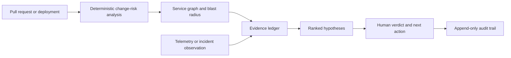
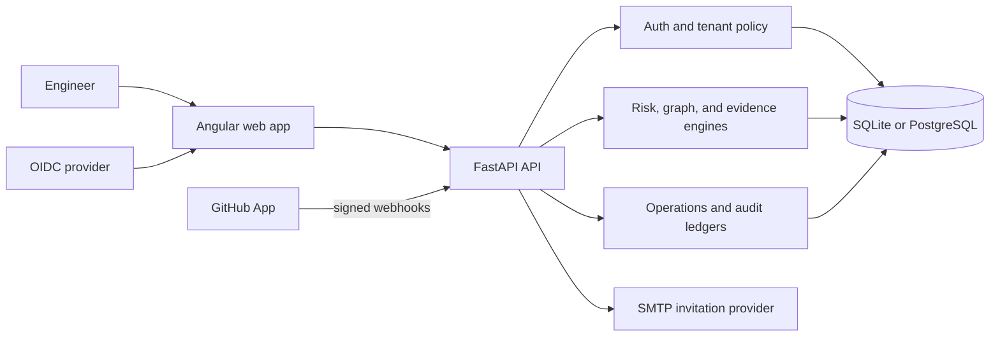

# DeployGuard AI

Evidence-first change risk and incident investigation for platform and reliability teams.

[](https://github.com/kingggg5/deployguardai/actions/workflows/ci.yml)
[](https://github.com/kingggg5/deployguardai/actions/workflows/codeql.yml)
[](https://securityscorecards.dev/viewer/?uri=github.com/kingggg5/deployguardai)

DeployGuard helps an engineer make a better change decision before deployment and a faster, more defensible decision during an incident. It connects pull-request metadata, service dependencies, deployments, telemetry, and human observations in one tenant-scoped workspace.

The core is deliberately deterministic. A risk score, blast radius, hypothesis rank, and explanation can be reproduced from the stored evidence and the versioned policy that produced it. The product is decision support: it does not deploy, roll back, execute shell commands, or remediate infrastructure on its own.

## At a glance

| Capability | What is available today |
| --- | --- |
| Change risk | Explicit, testable scoring weights; coverage and rollback-readiness gaps; service blast radius |
| Incident investigation | Evidence and counter-evidence, uncertainty, timeline, ranked hypotheses, and human verdicts |
| Connected data | GitHub App installation, repository and pull-request sync, signed webhooks, deployment lifecycle, and scoped telemetry ingestion |
| Operations | Service catalog, risk policy, normalized event ledger, incident lifecycle, assignments, notifications, and audit events |
| Workspace | Tenant isolation, roles (`viewer`, `responder`, `admin`, `owner`), invitations, repository scope, and connector health |
| Evaluation | Clearly labelled synthetic scenarios and versioned, SHA-256-pinned benchmark manifests |
| Security baseline | OIDC Authorization Code + PKCE, JWT/JWKS validation, request IDs, structured logs, body limits, rate-limit baseline, low-cardinality metrics, migrations, CI, CodeQL, dependency review, and Scorecard |

## Why it exists

Most change-risk and incident tools show a number without preserving the reasoning behind it. DeployGuard keeps the reasoning visible:

- Review why a score changed, which services may be affected, and which evidence is still missing.
- Compare competing incident hypotheses with supporting evidence, counter-evidence, uncertainty, and the next verification step.
- Keep repository, deployment, telemetry, incident, and human-verdict records inside the same workspace boundary.
- Make synthetic scenarios useful for demos and evaluation without presenting fixtures as production data.

## Product workflow



## Main product areas

### Change risk

Analyze a verified pull request or change record using explicit signals such as change size, operational flags, test coverage gaps, rollback readiness, service criticality, and dependency reach. The result includes the contributing factors and missing evidence instead of only a pass/fail label.

### Investigation

Inspect an incident timeline, service topology, evidence quality, counter-evidence, and the top hypotheses. Every conclusion remains traceable to a stored evidence item and a human-controlled verdict.

### Operations center

Maintain service ownership, tier and lifecycle metadata, runbooks, dependencies, repositories, workspace risk policy, operational events, incident assignments, and an in-app notification inbox.

### Workspace and team

Create a workspace, connect a GitHub App installation, select repositories, invite teammates, assign roles, review connector health, and inspect security-sensitive audit events.

## Connected data and synthetic data

Data origin is part of the domain model and is visible in the API and UI:

- `connected` records come from a verified provider integration or an authenticated telemetry collector.
- `synthetic` records are local scenarios for tests, demos, and the benchmark suite.
- A new runtime starts in connected mode with an empty database. It does not silently seed a demo repository.
- Synthetic data is enabled only when `SEED_SYNTHETIC_DATA=true`; production configuration rejects that flag.

The repository includes a read-only GitHub smoke check (`scripts/verify-github-live.ps1`) so you can verify the live API contract without importing or mutating records. Importing a repository into a workspace still requires a configured GitHub App and its signed installation webhook.

## Architecture



The browser never receives a GitHub installation token or App private key. Authorization and workspace isolation are enforced by the backend. A GitHub installation remains pending until a signed installation webhook confirms it.

## Technology stack

| Layer | Technology | Role |
| --- | --- | --- |
| Frontend | Angular 22, TypeScript 6, RxJS, Reactive Forms | Standalone components, typed API clients, workspace shell, and responsive workflows |
| UI | SCSS design tokens and GitHub/Primer-inspired patterns | Repository context, tabs, labels, forms, timelines, tables, dark mode, and keyboard navigation; no Primer runtime dependency |
| Backend | Python 3.12, FastAPI, Pydantic 2 | Typed REST API and validation |
| Data | SQLAlchemy 2, Alembic, SQLite, PostgreSQL 16, psycopg 3 | Tenant-scoped persistence and versioned migrations |
| Security | PyJWT, cryptography, OIDC/JWKS, GitHub App signatures | Authentication, token verification, and signed provider events |
| Delivery | Docker Compose, Nginx, Uvicorn, GitHub Actions | Local/production-shaped runtime, SPA hosting, CI, and security checks |
| Verification | Pytest, HTTPX, Vitest, jsdom, pip-audit, npm audit | Backend/API tests, frontend tests, builds, and dependency checks |

## Run locally

### Requirements

- Python 3.12+
- Node.js 22+
- npm
- Docker Desktop (optional, for the Compose stack)
- PowerShell 7 for the helper scripts

Clone the repository:

```powershell
git clone https://github.com/kingggg5/deployguardai.git
cd deployguardai
```

The simplest development path is:

```powershell
.\scripts\run-dev.ps1
```

Use `-SkipInstall` when dependencies are already installed:

```powershell
.\scripts\run-dev.ps1 -SkipInstall
```

Open the following endpoints:

- Web UI: <http://127.0.0.1:4300>
- OpenAPI: <http://127.0.0.1:8100/docs>
- Liveness: <http://127.0.0.1:8100/api/v1/health/live>
- Readiness: <http://127.0.0.1:8100/api/v1/health/ready>
- Private metrics scrape: <http://127.0.0.1:8100/api/v1/metrics>

The default run uses an empty connected-mode database. Create a workspace and connect a GitHub App before expecting repository, pull-request, deployment, or telemetry records.

For deterministic evaluation only:

```powershell
$env:SEED_SYNTHETIC_DATA = "true"
.\scripts\run-dev.ps1
```

Do not use synthetic seeding with a production database. Stop local services with:

```powershell
.\scripts\stop-dev.ps1
```

### Run with Docker Compose

```powershell
Copy-Item .env.example .env
docker compose up --build
```

The Compose stack provides the web UI on `:4300`, the API on `:8100`, and PostgreSQL on the internal network. Use `docker compose down -v` only when you intentionally want to remove the local database volume.

## Connect real providers

DeployGuard is useful with real data only after its provider contracts are configured. Keep secrets in a deployment secret manager; never commit `.env` or private keys.

### OIDC

Set `ENVIRONMENT=production`, `AUTH_PROVIDER=oidc`, and the issuer, audience, client ID, scope, and JWKS URL values in `.env.example`. The API validates issuer, audience, algorithm, signature, and claims. The Angular client uses Authorization Code + PKCE.

### GitHub App

Configure the App ID, slug, private key, webhook secret, API URL/version, and repository permissions. Subscribe to `installation`, `pull_request`, `workflow_run`, `deployment`, and `deployment_status`. Optional Check Runs are non-blocking decision support; they never deploy or roll back a change.

### Telemetry

Set `TELEMETRY_INGEST_TOKEN` and derive a workspace-bound collector token on the server. Send the derived bearer with `X-DeployGuard-Workspace`, an optional repository header, and a stable event ID. The endpoint accepts DeployGuard's normalized evidence contract, not raw OTLP payloads; terminate TLS and redact secrets before ingestion.

### Email invitations

Configure SMTP and `FRONTEND_PUBLIC_URL`. If SMTP is not configured in production, invitation controls are disabled instead of returning a false success.

See [`.env.example`](.env.example), the [operations runbook](docs/OPERATIONS.md), and the [telemetry contract](docs/TELEMETRY_GATEWAY.md) for the full configuration reference.

## Production boundary

This repository includes application-level safeguards and release checks. A production operator still owns the surrounding infrastructure:

| Included here | Still required from the deployment platform |
| --- | --- |
| Typed API, tenant checks, audit events, request IDs, body limits, a process-local rate-limit baseline, and a private aggregate `/api/v1/metrics` endpoint | Public HTTPS, WAF or distributed rate limiting, managed secrets, key rotation, and network policy |
| Alembic migrations, liveness/readiness probes, a durable job/outbox primitive, and explicit backup/retention helpers | PostgreSQL sizing, encrypted backup storage, restore drills, scheduled retention, legal-hold workflows, and connection-pool monitoring |
| CI tests/builds, CodeQL, dependency review, Scorecard, and container checks | Branch protection, release approvals/signing, alert routing, and on-call ownership |
| Deterministic engines and evidence provenance | Human review of policy changes, calibration, and operational decisions |

DeployGuard intentionally has no autonomous deployment, rollback, remediation, shell execution, or cluster-credential path. LLM synthesis is disabled until an evidence-only contract and evaluation gate exist.

## Tests and verification

```powershell
cd backend
python -m pytest

cd ..\frontend
npm test -- --watch=false
npm run build
npm audit --omit=dev

cd ..
docker compose config --quiet
```

The current regression baseline is 55 backend tests and 50 frontend tests. These counts are not a claim of complete code coverage. CI also runs migration smoke tests, `pip-audit`, compile checks, benchmark evaluation, CodeQL, dependency review, and OpenSSF Scorecard.

## Documentation

- [Architecture](docs/ARCHITECTURE.md) — boundaries, data flow, and trust model
- [API contract](docs/API_CONTRACT.md) — endpoints and machine-readable error codes
- [Data model](docs/DATA_MODEL.md) — tenant, evidence, operations, and audit records
- [Security model](docs/SECURITY.md) — authentication, authorization, and provider handling
- [Operations runbook](docs/OPERATIONS.md) — deployment, probes, logs, migrations, and recovery guidance
- [Evaluation](docs/EVALUATION.md) — benchmark manifest, provenance, and scoring
- [Thai user guide](docs/USER_GUIDE_TH.md) — คู่มือการใช้งานภาษาไทย
- [Product workspace research](docs/PRODUCT_WORKSPACE_RESEARCH.md) — product and workflow rationale

## Open-source community

DeployGuard is Apache-2.0 licensed and welcomes focused, reviewable contributions:

- Start with [CONTRIBUTING.md](CONTRIBUTING.md) and [GOVERNANCE.md](GOVERNANCE.md).
- Use the issue templates for bugs, features, configuration, and security concerns.
- Read [SUPPORT.md](SUPPORT.md) for questions and troubleshooting.
- Report vulnerabilities privately using [`.github/SECURITY.md`](.github/SECURITY.md); do not open a public issue.
- Review [CHANGELOG.md](CHANGELOG.md) for release notes.

## Roadmap

The next improvements are intentionally operational rather than cosmetic:

- **P0:** real OIDC/GitHub/SMTP rollout, HTTPS ingress, managed secrets, PostgreSQL backup and restore drills, and release branch protection.
- **P1:** wire the durable job/outbox primitive into event and email producers; add shared gateway limits, traces, SLOs, alert routing, secret rotation, scheduled retention, and deletion audit.
- **P2:** an OpenTelemetry gateway, public evaluation datasets and calibration reports, and configurable Slack/Teams/PagerDuty-style notification adapters.

The application already exposes the contracts needed for these integrations, but provider accounts, credentials, and operational ownership cannot be shipped inside an open-source repository.

## Known limitations

- Connected topology is empty until dependency evidence is ingested.
- Missing coverage, rollback, and observability evidence is treated conservatively as unknown.
- A durable job/outbox table with bounded retry, stale-lease recovery, dead-lettering, and explicit replay is available, but event and invitation producers are still synchronous until a separately supervised worker is deployed.
- The built-in rate limiter is process-local; use a shared gateway or distributed limiter for multiple replicas.
- Database row-level security is not enabled; tenant isolation is enforced in application queries and should be paired with platform controls for high-assurance deployments.
- Provider credentials, HTTPS termination, backups, monitoring, and incident response remain deployment responsibilities.

## License

DeployGuard AI is released under the [Apache License 2.0](LICENSE).

---

## สรุปภาษาไทย

DeployGuard AI เป็นระบบช่วยทีม Platform และ SRE ประเมินความเสี่ยงของ change ก่อน deploy และสืบสวน incident จากหลักฐานที่ตรวจสอบย้อนกลับได้ ระบบรวมข้อมูล pull request, dependency ของ service, deployment, telemetry และความเห็นจากมนุษย์ไว้ใน workspace เดียว โดยใช้ deterministic engine ที่มีน้ำหนักคะแนนชัดเจนและทดสอบซ้ำได้

ระบบแยก `connected` (ข้อมูลจาก provider จริง) กับ `synthetic` (ข้อมูลสำหรับ demo และ evaluation) อย่างชัดเจน และไม่ทำงานที่มีความเสี่ยงสูงแทนมนุษย์ เช่น deploy, rollback, รัน shell หรือแก้ infrastructure อัตโนมัติ

เริ่มต้นใช้งานได้ด้วย `scripts/run-dev.ps1` หรือ Docker Compose ดูรายละเอียด API, security, operations และคู่มือภาษาไทยได้จากลิงก์ในหัวข้อ Documentation ด้านบน ส่วนการเปิด production จริงยังต้องเตรียม OIDC, GitHub App, SMTP, HTTPS, managed secrets, PostgreSQL backup/restore, monitoring และผู้รับผิดชอบระบบให้ครบถ้วน
