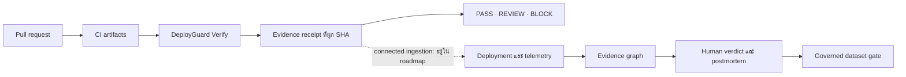

# DeployGuard AI

**หลักฐานแบบ deterministic ก่อน merge และประวัติการตัดสินใจหลัง deploy โดยไม่ต้องใช้ LLM key**

[English](README.md) · [ภาษาไทย](README_TH.md) · [คู่มือเริ่มต้น](docs/QUICKSTART.md) · [Architecture](docs/ARCHITECTURE.md) · [Roadmap](docs/ROADMAP.md)


DeployGuard AI เป็นแพลตฟอร์ม change safety แบบ open source สำหรับทีม GitHub,
DevOps และ SRE ระบบนำ artifact ที่ CI สร้างอยู่แล้วมาทำ receipt ซึ่งผูกกับ
commit จริง จากนั้นเก็บ deployment, incident, evidence และการตัดสินใจของคน
ไว้ในระบบที่ตรวจสอบย้อนหลังได้

DeployGuard ไม่ส่ง source code ไปยัง LLM, ไม่รันคำสั่งจาก repository,
ไม่ deploy, ไม่ rollback และไม่แก้ production infrastructure ให้เอง

## จุดเด่น

- **พิสูจน์สิ่งที่ตรวจจริง** ด้วย JUnit, Cobertura/LCOV, SARIF และ build
  evidence ที่ผูกกับ base/head SHA
- **ไม่ซ่อนข้อมูลที่ไม่รู้** หลักฐานที่ขาด เก่า หรือ SHA ไม่ตรงจะเป็น
  `REVIEW` ไม่ใช่ค่า 0 หรือผลสำเร็จปลอม
- **สืบสวนจากหลักฐาน** รองรับ supporting evidence, counter-evidence,
  uncertainty, verification step และ human verdict ที่มี provenance
- **สร้าง operational memory อย่างปลอดภัย** ด้วย immutable snapshot,
  consent, privacy, license และ dataset promotion gate

## การทำงาน



CLI เป็นผู้ตัดสินผล ส่วน Skill และ `AGENTS.md` ช่วยจัด workflow เท่านั้น
และไม่สามารถเปลี่ยน receipt หรือข้าม policy ได้

## ทดลอง Verify

DeployGuard Verify ยังเป็น pre-release และติดตั้งจาก repository checkout:

```bash
git clone https://github.com/kingggg5/deployguardai.git
cd deployguardai
python -m pip install ./verify

deployguard verify --base origin/main --head HEAD \
  --evidence-sha "$(git rev-parse HEAD)" \
  --junit artifacts/junit.xml \
  --coverage artifacts/coverage.xml \
  --sarif artifacts/results.sarif
```

ผลลัพธ์อยู่ที่ `.deployguard/artifacts/evidence-receipt.json`

| ผล | Exit | ความหมาย |
| --- | ---: | --- |
| `PASS` | `0` | หลักฐานที่ policy ต้องการมีครบ ใหม่ SHA ตรง และผ่านเงื่อนไข |
| `REVIEW` | `2` | หลักฐานขาด เก่า SHA ไม่ตรง หรือต้องให้คนตัดสิน |
| `BLOCK` | `3` | หลักฐานจริงไม่ผ่านกฎแบบ objective |
| `ERROR` | `4` | ตรวจสอบไม่สำเร็จและระบบ fail closed |

ใช้ `deployguard init --github --agent codex` เพื่อสร้าง policy, workflow
และคำแนะนำสำหรับ agent ส่วน [GitHub Action](action.yml) อยู่ที่ root ของ
repository แต่ควรออก release และ pin full SHA ก่อนใช้กับ protected branch จริง

## เปิด connected platform

ต้องมี Docker Engine หรือ Docker Desktop ที่รองรับ Compose v2

```bash
docker compose up --build
```

เปิดเว็บที่ <http://127.0.0.1:4300> และ API ผ่าน .NET control plane ที่
<http://127.0.0.1:8100/docs> โหมด connected เริ่มจากฐานข้อมูลว่าง อ่าน
[คู่มือเริ่มต้น](docs/QUICKSTART.md) สำหรับ GitHub App, OIDC และ synthetic demo

## สถานะปัจจุบัน

- **ทำแล้ว:** keyless verifier, evidence receipt, change risk, incident
  investigation, evidence graph, actor provenance, immutable snapshot,
  audited consent, durable jobs และ PostgreSQL RLS
- **P0 ถัดไป:** authenticated receipt ingestion และการปิดผลหลัง deploy เป็น
  stable, failed, rolled back หรือ incident linked
- **Dataset:** มี schema, synthetic examples และ governance gate แต่ยังไม่มี
  real production corpus, public benchmark หรือ leaderboard
- **Release:** โปรเจกต์ยังเป็น pre-1.0 และ GitHub Action ยังไม่ได้ออก `v1`

อ่านรายละเอียดใน [Roadmap](docs/ROADMAP.md), [AI boundary](docs/AI_BOUNDARY.md),
[DeployGuard Bench](bench/README.md) และ [Architecture](docs/ARCHITECTURE.md)

## ชุมชน

- [Contributing](CONTRIBUTING.md) · [Code of Conduct](CODE_OF_CONDUCT.md) · [Governance](GOVERNANCE.md)
- [Security policy](.github/SECURITY.md) · [Threat model](docs/SECURITY.md) · [Support](SUPPORT.md)
- [Operations](docs/OPERATIONS.md) · [Data model](docs/DATA_MODEL.md) · [Changelog](CHANGELOG.md)

DeployGuard AI ใช้สัญญาอนุญาต [Apache-2.0](LICENSE)
