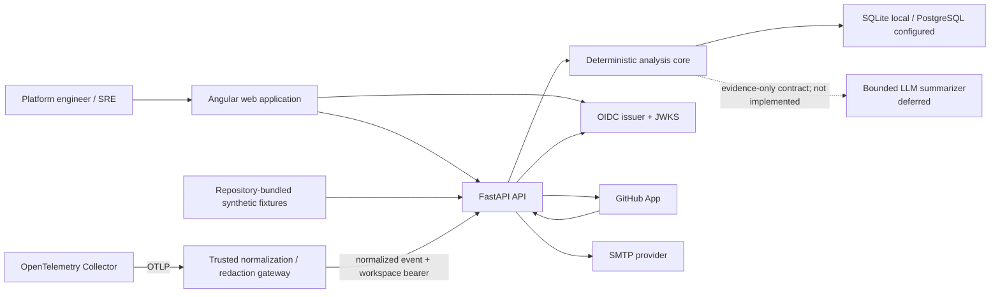
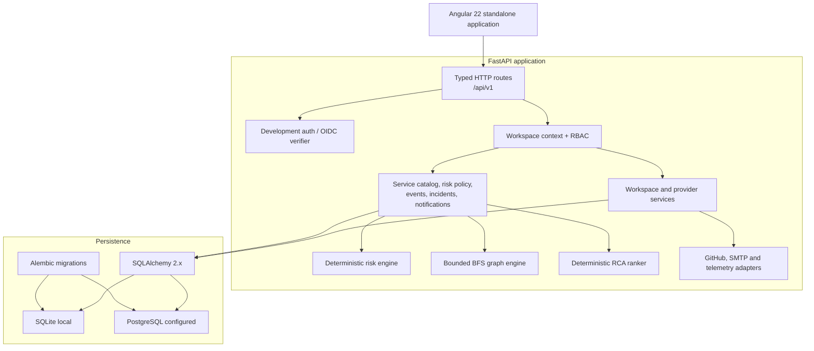
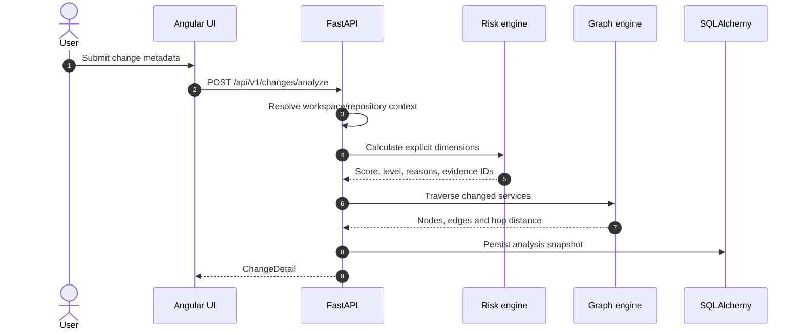
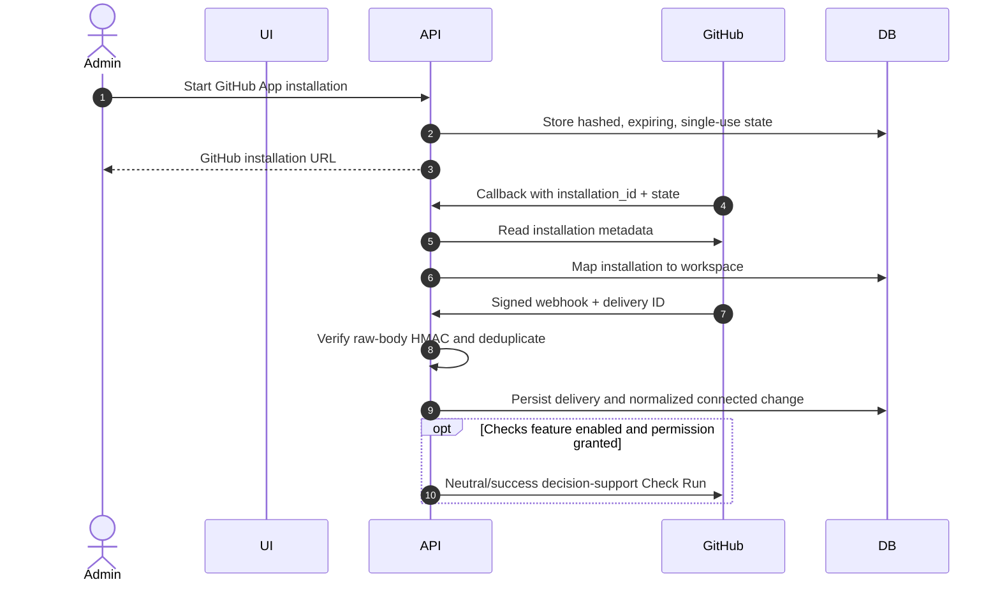
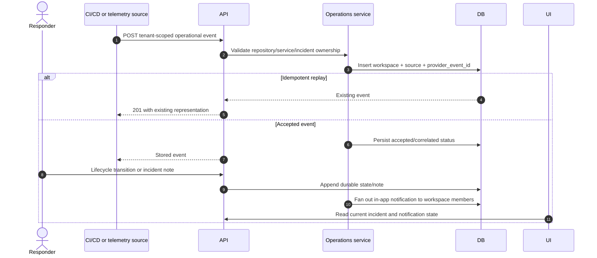

# สถาปัตยกรรม DeployGuard AI

DeployGuard AI เป็น investigation ledger สำหรับเชื่อม change, deployment,
service dependency, operational evidence และ incident เข้าด้วยกัน โดยให้
deterministic engines เป็นเจ้าของ risk scoring, blast-radius traversal และ
hypothesis ranking ระบบให้คำแนะนำเพื่อการตรวจสอบ แต่ไม่มีสิทธิ์ deploy,
rollback, รัน shell หรือเข้าถึง cluster

## สถานะของ capability

เอกสารนี้ใช้คำต่อไปนี้อย่างเคร่งครัด:

- **ใช้งานได้ใน local/synthetic mode** — รันได้โดยไม่ต้องมี external
  credential และข้อมูลทุกชุดติดป้าย `data_mode = "synthetic"`
- **implemented แต่ต้องตั้งค่า credential** — code path มีอยู่จริง แต่จะทำงาน
  เมื่อกำหนด OIDC, GitHub App, SMTP หรือ telemetry token ที่เกี่ยวข้อง
- **ยังไม่เป็น production control** — มี contract หรือบางส่วนของระบบแล้ว แต่
  ยังขาด operational hardening เช่น queue, retention job, rate limiting,
  PostgreSQL RLS หรือ backup/restore drill
- **deferred** — ไม่มี runtime path ในปัจจุบัน

สถานะปัจจุบัน:

| Capability | สถานะจริง |
|---|---|
| Synthetic scenarios, risk ledger, blast radius และ deterministic RCA | ใช้งานได้ใน local mode |
| Development bearer session, workspace, repository, invitation และ RBAC | ใช้งานได้ใน non-production |
| OIDC JWT verification ผ่าน issuer JWKS | Implemented; ต้องตั้งค่า OIDC |
| GitHub App install, repository sync, signed webhook และ optional Check Run | Implemented; ต้องตั้งค่า GitHub App และเปิด write flag |
| Invitation email ผ่าน SMTP | Implemented; local ใช้ development outbox |
| Normalized telemetry event endpoint | Implemented; ใช้ workspace-derived collector bearer และ tenant-scoped ledger |
| OTLP protocol receiver | ไม่มีใน FastAPI; ใช้ Collector แปลงเป็น normalized event |
| Alembic schema migration | ใช้งานแล้วตอน application startup |
| PostgreSQL | รองรับผ่าน SQLAlchemy/psycopg; production verification ยังต้องทำ |
| LLM synthesis | Deferred; endpoint ปัจจุบันคืน `501` |

## System context



Synthetic fixtures และ connected data ใช้ domain contract ชุดเดียวกัน แต่ไม่
ถูกทำให้ดูเหมือนเป็นแหล่งข้อมูลเดียวกัน UI และ API ต้องแสดง `data_mode` และ
connection state ตามจริงเสมอ

## Container และ component view



### Responsibility boundaries

| Component | รับผิดชอบ | ไม่รับผิดชอบ |
|---|---|---|
| Angular UI | Navigation, forms, connected/synthetic labels, loading/error/empty states และ responsive presentation | คำนวณคะแนนหรือบังคับ authorization |
| FastAPI routes | HTTP validation, dependency injection, typed response และ domain-error mapping | ฝัง scoring weights หรือ query ข้าม workspace |
| Tenant/RBAC layer | Resolve principal, workspace context และ minimum role | ใช้ UI hiding เป็น security control |
| Operations services | Service catalog, policy versioning, event dedupe, incident lifecycle, notes และ notification fan-out | ส่ง deployment command หรือ arbitrary outgoing webhook |
| Deterministic engines | Risk, graph traversal, evidence weighting และ hypothesis ranking | สร้าง evidence ที่ไม่มี provenance |
| Provider adapters | แปลง external data เป็น normalized domain input | เปลี่ยน deterministic score โดยตรง |
| Database/Alembic | System of record และ schema evolution | แทนที่ backup, restore หรือ retention operation |

## Identity, tenant และ RBAC flow

Production รับ bearer token จาก OIDC issuer เท่านั้น FastAPI ตรวจ signature,
issuer, audience, expiry และ verified email ผ่าน JWKS แล้ว map `(issuer,
subject)` เป็น local user ส่วน development session สร้าง opaque bearer token
ที่เก็บเฉพาะ SHA-256 digest และถูกปิดใน production profile

เพื่อรักษา synthetic demo flow Investigation routes เดิมบางส่วนสามารถ resolve
configured development user เมื่อไม่มี bearer ได้เฉพาะ non-production
Operations/workspace routes ต้องมี bearer และ production ไม่มี fallback นี้

ทุก protected operation resolve `WorkspaceMembership` ก่อน query หรือ mutation
ข้อมูล tenant role เรียงระดับเป็น:

```text
viewer < responder < admin < owner
```

- `viewer` อ่าน workspace, catalog, policy, events, incidents และ notification
  ของตนเอง
- `responder` เพิ่ม operational event, เปลี่ยน incident lifecycle และเขียน note
- `admin` จัดการ service catalog, risk policy, repository, provider และ invitation
- `owner` มีสิทธิ์ระดับสูงสุด รวมถึงเชิญสมาชิก role `admin`

Application-level tenant filtering ใช้งานแล้ว แต่ PostgreSQL RLS ยังไม่มี จึง
ต้องถือ RLS เป็น defense-in-depth ที่ยังค้าง ไม่ใช่ control ที่มีอยู่แล้ว

## Change analysis



Risk และ blast radius เป็น deterministic snapshots การส่ง input เดิมภายใต้
weights และ graph เดิมต้องได้ผลเดิม แต่ snapshot ยังไม่มี explicit schema/scoring
version จึงยังไม่เหมาะกับ historical model comparison ระยะยาว

## Connected GitHub flow



Webhook delivery ID มี unique constraint และ signature ถูกตรวจบน raw body
การ publish GitHub Check มี durable publication state, stable external identity,
attempt/error/next-retry metadata และ create-or-PATCH recovery ต่อ repository/head
SHA อย่างไรก็ตาม webhook processing ยัง synchronous และยังไม่มี durable work
queue, dead-letter queue หรือ background retry scheduler การเขียน GitHub Check
ปิดโดย default และไม่ใช่ deployment gate Responder สามารถ retry ผ่าน explicit
endpoint ได้เมื่อ workspace/repository/change scope ถูกต้อง

PR delivery เดินสถานะ `processing → processed|failed` Signed retry ที่มี
installation/repository identity ตรงกับ delivery เดิมสามารถประมวลผล PR ที่ยัง
ไม่ `processed` ใหม่ได้ ส่วน workflow/deployment retry ตรวจ normalized
operational event แยกต่างหากและสร้าง event ที่หายไปแบบ idempotent

## Operational event และ incident flow



Operational event เป็น durable normalized record ไม่ใช่ raw OTLP storage
การรับ event ใช้ tenant context จาก authenticated request หรือ workspace-derived
collector credential และตรวจ foreign key ทุกตัวให้อยู่ใน workspace เดียวกัน
Replay ที่ canonical payload/origin เดิมไม่สร้าง row, audit หรือ notification ซ้ำ
แต่ identity เดิมที่ content/origin ต่างกันคืน `409` Member provenance ถูก discard
และ Server สร้าง trust statement ใหม่พร้อม reserved `_ingestion` เพื่อแยก
`member_api` จาก provider adapter ที่ผ่าน trusted mapping แล้ว

Concurrency control ใช้คนละแบบตาม aggregate: service graph และ incident mutation
lock rows บน database ที่รองรับ `FOR UPDATE`, risk policy ใช้ optimistic
compare-and-swap ด้วย version และ event dedupe พึ่ง unique constraint

## Data source contract

### Synthetic/local

- seed loader สร้าง scenario, change, graph, incident และ evidence แบบ idempotent
- development repository เป็น fixture adapter ไม่ใช่ GitHub connection จริง
- development invitation คืน claim token เพียงครั้งเดียวผ่าน response แบบ
  `Cache-Control: no-store`
- development fallback ถูกปิดใน production

### Credential-gated connected

- OIDC ต้องมี issuer, audience และ JWKS URL
- GitHub ต้องมี App ID, slug, private key และ webhook secret
- SMTP ต้องมี host และ sender configuration
- telemetry ingest ต้องมี bearer token
- capability endpoint บอก UI ตาม runtime configuration ว่า provider ใดพร้อมใช้

## Architecture decisions

### ADR-001 — Deterministic first

Risk scoring, graph traversal, ranking และ explanation template ต้อง reproduce
และ audit ได้ LLM จึงไม่เป็นเจ้าของคะแนน ไม่เพิ่ม candidate ที่ไม่มี evidence
และไม่อยู่ใน execution path ปัจจุบัน

### ADR-002 — Workspace เป็น tenant boundary

ข้อมูลธุรกิจทุกชุดต้อง resolve ผ่าน membership และมี `workspace_id` ใน query
หรือ relationship ที่พากลับไปยัง workspace ได้ การคืน `404 workspace_not_found`
เมื่อผู้ใช้ไม่มี membership ลดการเปิดเผยว่าทรัพยากรของ tenant อื่นมีอยู่จริง

### ADR-003 — SQLite local, PostgreSQL สำหรับ deployment

SQLite เหมาะกับ local development ส่วน production target คือ PostgreSQL ผ่าน
psycopg Alembic เป็นเจ้าของ schema lifecycle ทั้งสองแบบ ห้ามใช้
`Base.metadata.create_all()` เป็น production migration strategy

### ADR-004 — Relational source of truth, JSON analysis snapshots

Identity, tenancy, provider, catalog, policy, event, lifecycle assignee,
feedback และ notification ใช้ relational records ส่วน risk, blast radius,
timeline (รวม responder notes), evidence และ hypothesis ยังเป็น JSON snapshots
เพื่อคืน aggregate ให้ UI ได้รวดเร็ว ข้อแลกเปลี่ยนคือ database ยัง enforce
reference ภายใน JSON ไม่ได้

### ADR-005 — At-least-once input, idempotent persistence

GitHub webhook และ operational event อาจถูกส่งซ้ำ ระบบใช้ provider delivery ID
หรือ `(workspace_id, source, provider_event_id)` เป็น dedupe key Replay คืนผล
เดิมและต้องไม่สร้าง side effect ซ้ำ Delivery ledger กับ normalized event ledger
มี dedupe คนละชั้นเพื่อให้ signed provider retry ซ่อม event ที่หายหลัง partial
processing ได้

### ADR-006 — No autonomous remediation

ไม่มี deployment token, cluster credential, shell execution, rollback API หรือ
arbitrary outgoing webhook ใน process ของ DeployGuard

## Reliability boundary

มีอยู่แล้ว:

- `/api/v1/health` ตรวจ database ด้วย `SELECT 1`
- typed response models และ stable domain error envelope
- Alembic upgrade ตอน application startup
- idempotent synthetic seed
- provider webhook และ operational-event dedupe
- signed webhook retry reconciliation สำหรับ PR/workflow/deployment records
- tenant-scoped reads/writes และ role checks ที่ service layer

ยังต้องทำก่อนเรียก production-ready:

- แยก liveness กับ readiness
- background queue, retry policy, dead-letter queue และ reconciliation
- rate limit, request-body limit และ per-workspace quota
- automated retention/deletion
- PostgreSQL RLS และ concurrency/integration test
- backup/restore drill และ migration rollback procedure
- telemetry/alerts สำหรับตัว DeployGuard เอง

Runbook สำหรับ deployment และ failure handling อยู่ใน
[OPERATIONS.md](OPERATIONS.md) ส่วน security controls และ known gaps อยู่ใน
[SECURITY.md](SECURITY.md)
