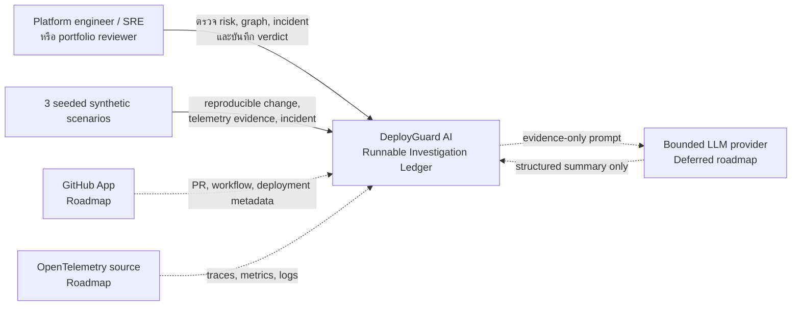
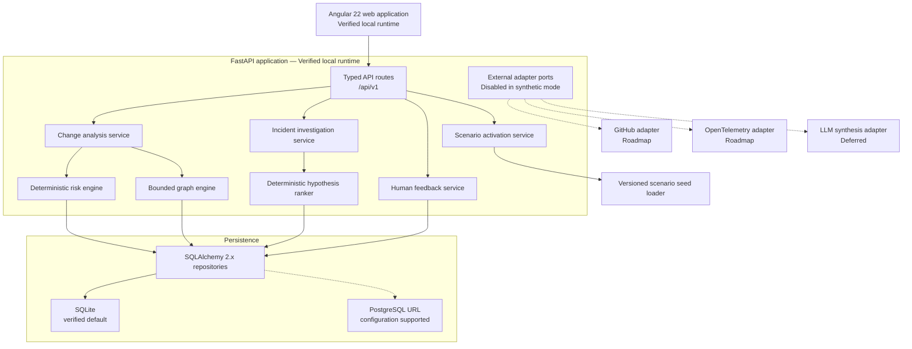
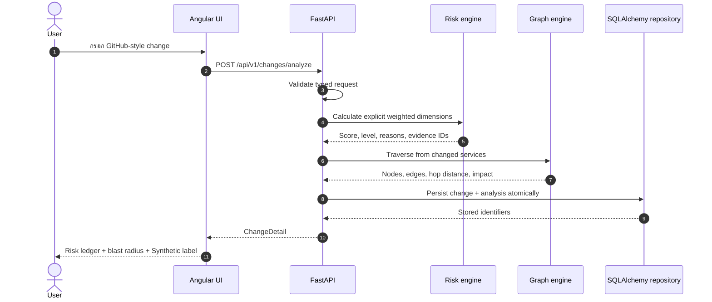
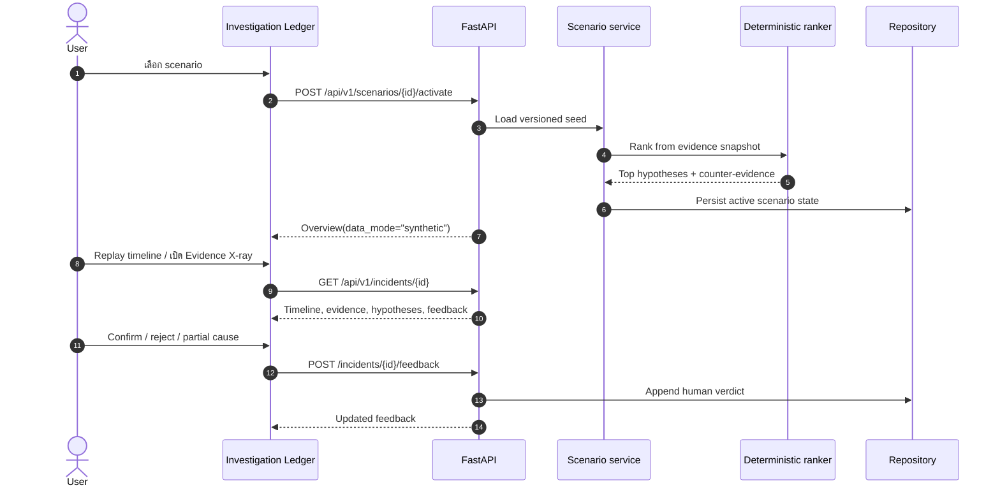
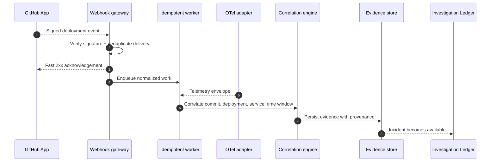

# สถาปัตยกรรม DeployGuard AI

> สถานะ: **Synthetic MVP implement และตรวจแล้ว** — Angular 22 รันที่ `127.0.0.1:4300`, FastAPI รันที่ `127.0.0.1:8100`, SQLite เป็นค่าเริ่มต้น และรองรับ PostgreSQL URL ผ่าน configuration ส่วน GitHub App, OpenTelemetry ingestion, authentication/tenancy, migrations, real-dataset benchmarks และ LLM ยังเป็น roadmap

## Verified implementation snapshot

- 10 routes ภายใต้ `/api/v1`
- 3 seeded synthetic scenarios
- deterministic risk engine 6 dimensions
- BFS blast radius แบบ bounded traversal และ cycle-safe
- deterministic RCA Top 3 พร้อม evidence/counter-evidence
- persistent human feedback
- backend 13 tests ผ่าน
- frontend 7 testsและ production build ผ่าน
- CORS และ desktop/mobile browser flow ผ่านการตรวจ
- `docker compose config` ผ่าน แต่ Docker image build ยังไม่ยืนยัน เพราะ Linux daemon ไม่พร้อม

## เป้าหมายทางสถาปัตยกรรม

- ทำให้เส้นทาง `change → risk → blast radius → incident → hypothesis → human verdict` ตรวจสอบย้อนกลับได้
- แยก deterministic analysis ออกจาก presentation และ future LLM synthesis
- รัน synthetic demo ได้โดยไม่ต้องมี external credentials
- รองรับ SQLite สำหรับ local demo และ PostgreSQL ผ่าน configuration
- เก็บ external integration ไว้หลัง adapter boundary
- ไม่เปิดช่องให้ระบบวิเคราะห์ deploy, rollback, รัน shell หรือเข้าถึง cluster

## System context

เส้นทึบคือ runnable synthetic MVP เส้นประคือ roadmap และยังไม่ใช่ capability ที่ใช้งานได้

## Container/component view

### Responsibility boundaries

| Component | รับผิดชอบ | ไม่รับผิดชอบ |
|---|---|---|
| Angular 22 UI | Visualization, scenario switching, Evidence X-ray, incident replay, loading/error/empty states และ responsive panes | คำนวณคะแนนหรือจัดอันดับ hypothesis |
| FastAPI routes | Validation, HTTP contract, domain error mapping | ฝัง scoring weights ใน controller |
| Risk engine | คะแนน 0–100 จาก explicit weights | อนุมัติ/ปฏิเสธ deployment |
| Graph engine | Blast radius แบบ bounded traversal | General graph database query endpoint |
| RCA ranker | จัดอันดับจาก evidence/counter-evidence | สร้างหลักฐานที่ไม่มีอยู่ |
| Scenario loader | Seed 3 scenarios แบบ idempotent และติดป้าย synthetic | เลียนแบบ production customer |
| Future LLM adapter | สรุป evidence ที่ถูกจำกัดขอบเขต | ให้คะแนน, execute tool หรือ remediation |

## Change analysis sequence

คุณสมบัติสำคัญ:

- request เดียวกันภายใต้ scoring version และ graph snapshot เดียวกันต้องให้ผลเดิม
- score contribution ทุก dimension ต้องอ้าง evidence ID
- graph traversal ต้องมี maximum depth และ cycle protection
- persistence ล้มเหลวต้องไม่คืนผลเหมือนบันทึกสำเร็จ

## Synthetic incident investigation sequence

Feedback ต้องไม่ rewrite evidence, rank เดิม หรือ timestamp ย้อนหลัง การเรียนรู้จาก feedback เป็น pipeline ในอนาคตและต้อง version dataset ใหม่

## Connected incident sequence — roadmap

Sequence นี้เป็น roadmap เท่านั้น GitHub และ OTel ยังไม่ implement ดู security gate ที่ [SECURITY.md](SECURITY.md)

## Architecture decisions

### ADR-001 — Deterministic first

Risk scoring, graph traversal, ranking และ explanation template ต้อง deterministic และทดสอบได้ก่อนเพิ่ม LLM เหตุผลคือคะแนนและสาเหตุจำเป็นต้อง reproduce, audit และเปรียบเทียบ baseline ได้

### ADR-002 — SQLite local, PostgreSQL configured

SQLite เป็น default runtime ที่ตรวจแล้ว ส่วน configuration layer แปลง `postgres://`/`postgresql://` เป็น SQLAlchemy psycopg URL ได้และมี automated test รองรับ อย่างไรก็ตาม ยังไม่มี PostgreSQL integration test หรือ migration framework จึงยังไม่ถือว่า PostgreSQL deployment ผ่านการยืนยัน

### ADR-003 — Application BFS บน JSON snapshot; PostgreSQL adjacency ก่อน graph database

MVP ปัจจุบันเก็บ service graph/blast-radius เป็น JSON snapshots และคำนวณ BFS ใน deterministic Python engine วิธีนี้เพียงพอกับ 3 bounded synthetic scenarios แต่ยังไม่ใช่ graph store สำหรับ connected telemetry

เมื่อ normalize graph แล้ว ให้ประเมิน PostgreSQL adjacency/recursive CTE ก่อนเพิ่ม database ใหม่ ตาม [PostgreSQL recursive-query documentation](https://www.postgresql.org/docs/current/queries-with.html)

พิจารณา Neo4j เมื่อ:

- traversal ลึกหรือ variable-length เป็น workload หลัก
- graph algorithms กลายเป็น product capability
- benchmark บน reference dataset ไม่ผ่าน p95 target
- ทีมยอมรับภาระ sync, backup และ authorization เพิ่ม

Decision benchmark ใน roadmap: 100k nodes, 1m edges, 3-hop traversal p95 ไม่เกิน 200 ms บน reference environment

### ADR-004 — External systems behind ports

Synthetic scenario loader, GitHub adapter, OTel adapter และ future LLM adapter ต้อง implement interface เดียวกับ normalized domain inputs ทำให้ demo ไม่ต้องมี credentials และ integration failure ไม่เปลี่ยน deterministic core

### ADR-005 — No autonomous remediation

Recommendation แสดง “verify next” เท่านั้น ไม่มี shell, deployment token, rollback API หรือ cluster credential ใน process นี้

## Reliability and observability

ตรวจแล้ว:

- `/api/v1/health` ตรวจ database ด้วย `SELECT 1` และคืน `status`, `database`, `service`, `data_mode`
- FastAPI ใช้ typed response models และ domain error envelope
- CORS อนุญาต local UI ทั้ง `127.0.0.1:4300` และ `localhost:4300`
- scenario seeding เป็น idempotent
- risk, BFS และ RCA มี deterministic tests
- UI มี loading/error/empty states และ human feedback persistence

ยังเป็น roadmap:

- scoring/scenario/graph snapshot version ใน audit record
- external-delivery inbox/replay
- production telemetry ของตัว DeployGuard เอง
- migration, backup/restore และ retention operations

## Deployment views

| Phase | Runtime | Data source | สถานะ |
|---|---|---|---|
| Local synthetic MVP | Angular 22 + FastAPI + SQLite | 3 seeded scenarios | ✅ Runnable และตรวจ browser/CORS แล้ว |
| Local PostgreSQL configuration | FastAPI + PostgreSQL URL | Synthetic seeds | ⚠️ Config/test ระดับ URL เท่านั้น ยังไม่มี migration/integration run |
| Docker Compose definition | Web + API + PostgreSQL | Synthetic seeds | ⚠️ `config` ผ่าน; image build ยังไม่ยืนยัน |
| Reproducible portfolio | Automated tests/build + docs | Synthetic fixtures | ✅ Core checks ผ่าน; real benchmark ยังไม่มี |
| Connected sandbox | GitHub App + OTel adapter | Explicit opt-in sandbox | Later roadmap |
| LLM-assisted summary | Bounded evidence-only adapter | Redacted evidence | Deferred จน evaluation gate ผ่าน |
