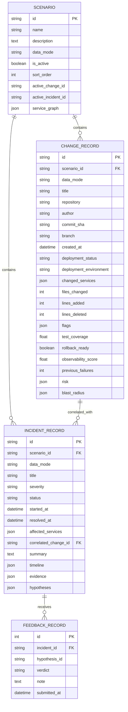
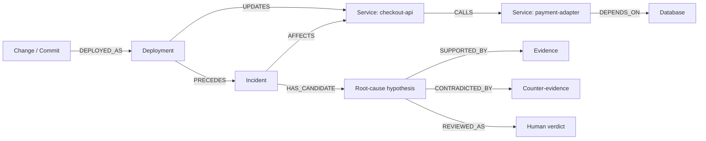

# Data model

## Workspace access domain

```text
User
  ├─ AccessToken (hashed, expiring, revocable)
  └─ WorkspaceMembership ── Workspace
                              ├─ Repository
                              ├─ Invitation (hashed one-time token)
                              └─ AuditEvent (append-only API)
```

Workspace slug, user email/provider subject, membership
`(workspace_id, user_id)`, and provider repository identity are unique. All
workspace-management queries resolve membership before returning tenant-owned
records.

> สถานะ: **SQLAlchemy schema ใช้งานแล้ว** บน SQLite default และรับ PostgreSQL URL ผ่าน configuration ปัจจุบันสร้าง schema ด้วย `Base.metadata.create_all()` และยังไม่มี Alembic migrations หรือ PostgreSQL integration run

## หลักการ

- ทุก timestamp เป็น ISO 8601 UTC
- score อยู่ในช่วง 0–100
- confidence และ quality อยู่ในช่วง 0–1
- seeded record ใช้ `data_mode = "synthetic"`
- risk, blast radius, timeline, evidence และ hypotheses ถูก persist เป็น typed JSON snapshots
- evidence และ counter-evidence ถูกอ้างด้วย stable IDs ภายใน incident JSON
- feedback เป็น record แยกใน `incident_feedback`
- scoring/scenario/graph versioning ยังเป็น roadmap

## Physical schema ที่ implement แล้ว



เหตุผลที่ MVP ใช้ JSON snapshots:

- API คืน risk/graph/incident เป็น aggregate เดียว
- seeded scenarios อ่านและสร้างซ้ำได้ง่าย
- deterministic engine เขียนผล snapshot ที่ UI ใช้โดยตรง

ข้อจำกัด:

- query/analytics ราย evidence หรือ edge ทำได้ยากกว่าสchema แบบ normalized
- database ไม่ enforce evidence-reference integrity ภายใน JSON
- migration/versioning ของ JSON shape ยังไม่มี
- multi-tenant keys และ RLS ยังไม่มี

ก่อนรับ connected telemetry หรือ real datasets ต้องประเมินการ normalize service edges, evidence และ hypothesis links

## Conceptual investigation graph

Relational entities เป็น system of record ส่วน graph เป็น projection สำหรับ blast radius และ explanation



## Aggregate boundaries

### Scenario

Scenario เป็น synthetic seed boundary:

- มี 3 embedded scenario specs และ automated idempotent-seed test
- activation เปลี่ยน `is_active` และ active change/incident
- scenario, change และ incident records ติดป้าย `synthetic`
- explicit seed version/checksum ยังไม่มี

### Change analysis

`ChangeRecord` เก็บ deterministic risk และ blast-radius snapshot ใน record เดียว `POST /changes/analyze` คำนวณและ persist aggregate ก่อนคืน `ChangeDetail`

### Incident investigation

`IncidentRecord` เก็บ timeline, evidence และ ranked hypotheses เป็น JSON snapshot ส่วน `FeedbackRecord` ถูกเพิ่มภายหลังและ survive page refresh การ version incident snapshot ยังเป็น roadmap

## API-to-model mapping

| API field | Physical persistence |
|---|---|
| `ChangeDetail.risk` | `ChangeRecord.risk` JSON |
| `risk.dimensions[]` | nested in `ChangeRecord.risk` |
| `blast_radius.nodes[]` | `ChangeRecord.blast_radius` JSON |
| `blast_radius.edges[]` | `ChangeRecord.blast_radius` JSON |
| `IncidentDetail.timeline[]` | `IncidentRecord.timeline` JSON |
| `IncidentDetail.evidence[]` | `IncidentRecord.evidence` JSON |
| `IncidentDetail.hypotheses[]` | `IncidentRecord.hypotheses` JSON |
| `IncidentDetail.feedback[]` | query from `FeedbackRecord` |

## Invariants

ตรวจโดย engine/schema/tests แล้ว:

1. `overall_score` และ dimension score ถูก clamp ที่ 0–100
2. confidence, quality และ data quality ถูกจำกัดที่ 0–1
3. risk ใช้ 6 dimensions และ fixed weights
4. RCA คืนสูงสุด 3 hypotheses และจัด rank ใหม่ 1–3
5. BFS มี cycle protection และ default maximum 4 hops
6. feedback อ้าง incident/hypothesis และ persist แยกจาก incident JSON
7. seeded records ใช้ `data_mode = "synthetic"`

ยังควรเพิ่มก่อน connected mode:

1. database-level JSON/evidence-reference validation
2. `resolved_at >= started_at` constraint
3. explicit uniqueness/idempotency key สำหรับ analyze/feedback
4. scenario/scoring/graph schema versions
5. synthetic/connected separation ที่ tenant/workspace level

## Tenant and connected-data evolution

MVP ปัจจุบันเป็น unauthenticated single-workspace local demo ไม่มี `tenant_id`/`installation_id` ก่อนรับข้อมูลจริง schema ต้องเพิ่ม keys เหล่านี้ใน primary, foreign และ unique constraints พร้อม PostgreSQL row-level security และ negative isolation tests

ห้าม expose runtime ปัจจุบันต่อ internet หรือถือว่า authentication/tenant isolation มีอยู่แล้ว

## Retention roadmap

| Data | ค่าเริ่มต้นที่เสนอ | หมายเหตุ |
|---|---:|---|
| Synthetic seeds | อยู่กับ repository version | ไม่มี customer data |
| Raw GitHub webhooks | 30 วัน | Roadmap; encrypted และ replay-controlled |
| Raw logs/traces | 7 วัน | Roadmap; redact secrets/PII |
| Aggregated evidence | 90 วัน | Configurable |
| Feedback/audit | ตาม policy ของ workspace | ต้องลบได้เมื่อ uninstall/delete |

ตัวเลขเหล่านี้เป็น proposed defaults ไม่ใช่ current implementation
