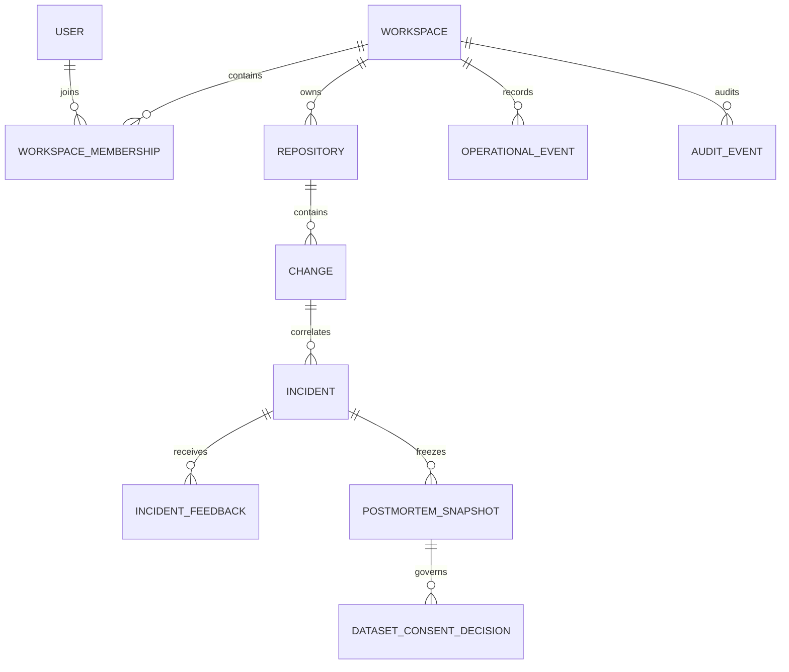

# Data model

DeployGuard uses a relational source of truth with selected JSON snapshots for
deterministic analysis output. PostgreSQL 16 is the production target; SQLite is
for local development and tests.

## Modeling principles

- Every tenant-owned record carries `workspace_id`.
- Provider IDs are not authorization boundaries; membership and tenant scope
  are resolved first.
- Deterministic analysis snapshots persist engine, schema, scoring-policy, and
  graph versions.
- Human feedback, audit events, postmortem snapshots, and consent decisions are
  append-oriented records.
- Synthetic and connected provenance remain explicit in storage and responses.
- PostgreSQL RLS provides a second tenant boundary for data-plane tables.

## Domain map

## Identity and workspace

| Table | Purpose and important invariants |
| --- | --- |
| `users` | Provider subject, normalized email, display name, active flag |
| `access_tokens` | Development tokens stored as SHA-256 digests, never plaintext |
| `workspaces` | Tenant root and unique slug |
| `workspace_memberships` | Unique user/workspace role: viewer, responder, admin, owner |
| `user_contexts` | Current workspace/repository/scenario selection |
| `workspace_invitations` | Hashed, expiring, revocable, single-use invitation |
| `audit_events` | Tenant-scoped mutation ledger with actor/request metadata |

## Provider and operations

| Table | Purpose |
| --- | --- |
| `repositories` | Workspace-owned source and connection status |
| `provider_connections` | Server-side GitHub installation mapping |
| `provider_authorization_states` | Hashed, expiring, single-use install state |
| `webhook_deliveries` | Durable delivery identity and processing state |
| `github_check_publications` | Idempotent create/find/PATCH publication state |
| `deployments` | Canonical provider deployment lifecycle |
| `background_jobs` | Durable outbox, lease, retry, failure, and dead-letter state |
| `services` | Service catalog, owner, tier, dependencies, and runbook metadata |
| `workspace_risk_policies` | Versioned thresholds and safety requirements |
| `operational_events` | Normalized, deduplicated provider/telemetry envelope |
| `notifications` | Recipient-scoped in-app notification state |

## Investigation records

### `scenarios`

Context for synthetic fixtures or a connected repository. Stores tenant/source
provenance, selected change and incident, ordering, and a service-graph snapshot.

### `changes`

Stores repository/commit/deployment metadata, explicit analysis inputs,
deterministic risk and blast-radius JSON, and persisted version provenance.

### `incidents`

Stores lifecycle status, severity, time range, affected services, correlated
change, optional assignee, timeline, evidence, hypotheses, and version
provenance. `resolved` is terminal for lifecycle mutation. Responder notes are
append-only typed timeline entries.

### `incident_feedback`

Each record contains:

- incident and hypothesis IDs;
- verdict, note, and creation time;
- server-owned actor user ID, display-name snapshot, and authentication provider;
- verification result, method, summary, and evidence-ID list.

Actor and verification fields may be null on legacy records. New requests
cannot supply actor identity. Hypothesis and evidence IDs live inside incident
JSON, so the service validates references before persistence.

### `postmortem_snapshots`

An append-only, content-addressed rendering of a resolved connected incident:

- Markdown content and SHA-256;
- monotonically assigned incident snapshot version;
- feedback count and engine/schema provenance;
- creator user ID, display-name snapshot, provider, and timestamp;
- unique `(incident_id, content_sha256)` identity.

Database triggers reject `UPDATE` and `DELETE` in SQLite and PostgreSQL. Creating
the same content again returns the existing record.

### `dataset_consent_decisions`

An append-only decision bound to workspace, incident, exact snapshot, and
purpose (`evaluation` or `training`). It stores `approved` or `revoked`, terms
version, reason, attestations, actor snapshot, and timestamp. Database triggers
reject `UPDATE` and `DELETE`; revocation is a new decision.

The table records consent provenance. It does not export data or prove that
automated redaction succeeded.

## Dataset readiness invariant

A connected incident can be `ready_for_review` only when all conditions hold:

1. connected provenance;
2. resolved lifecycle with resolution time;
3. attributed human verdict;
4. structured verification outcome;
5. immutable postmortem snapshot;
6. latest consent approves that exact snapshot and requested purpose.

Synthetic incidents are `not_applicable`. The connected exporter remains
disabled even when all rows exist.

## Migration lifecycle

| Revision | Purpose |
| --- | --- |
| `0001` | Initial workspace platform |
| `0002` | Tenant scope and user context |
| `0003` | Provider connections, webhook delivery, invitation delivery |
| `0004` | Services, risk policy, events, notifications, incident assignee |
| `0005` | GitHub Check publication and retry state |
| `0006` | Canonical deployment lifecycle |
| `0007` | Durable background job/outbox |
| `0008` | Analysis snapshot version provenance |
| `0009` | PostgreSQL tenant RLS |
| `0010` | Verdict provenance, structured verification, immutable snapshots, consent decisions |
| `0011` | Nullable connected-change evidence fields so unknown is never stored as fabricated zero/false |

Production rejects a non-empty unversioned database. Migrations run as a schema
owner before the application role starts; the runtime role must not own tables,
be superuser, or have `BYPASSRLS`.

## Current limitations

- JSON-contained references rely on service-layer validation.
- Scheduled retention, workspace deletion orchestration, and managed backup
  storage remain operator workflows.
- The audit ledger is append-oriented but not yet replicated to a tamper-proof
  external sink.
- Connected-data redaction, release registry, and publication do not exist.
- SQLite is not a production concurrency or tenant-isolation target.
