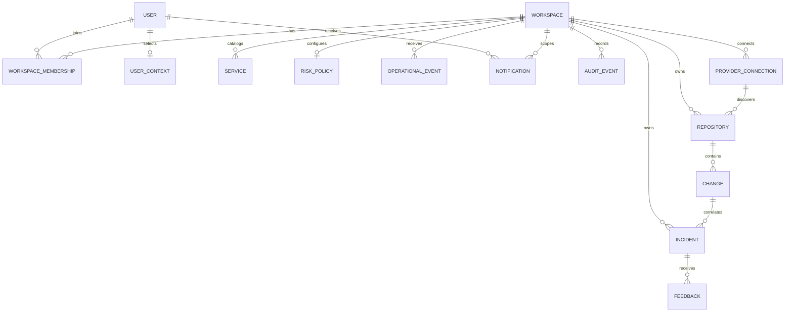

# Data model

SQLAlchemy 2.x models เป็น source of truth ฝั่ง application และ Alembic เป็น
เจ้าของ schema lifecycle ระบบใช้ SQLite สำหรับ local development และรองรับ
PostgreSQL ผ่าน `DATABASE_URL`

## Modeling principles

- `workspace_id` เป็น tenant partition key หลัก
- external identifiers ไม่ได้รับความเชื่อถือจน map เข้ากับ workspace/repository
  ฝั่ง server
- synthetic และ connected records แยกด้วย `data_mode`
- risk, blast radius, timeline, evidence และ hypotheses เป็น JSON snapshots
- identity, membership, provider, catalog, policy, event, feedback และ
  notification เป็น relational records ส่วน responder note อยู่ใน incident
  timeline JSON
- token ที่ระบบออกเองเก็บเฉพาะ SHA-256 digest
- timestamp ใช้ timezone-aware UTC ใน API contract
- duplicate external delivery ต้องถูกหยุดด้วย database unique constraint ไม่ใช่
  in-memory check

## Domain map



เส้นในภาพแสดง domain ownership ความสัมพันธ์บางจุดใน physical schema อาจเป็น
optional foreign key หรือ resolve ผ่าน workspace context

## Identity และ tenant tables

### `users`

เก็บ local projection ของ identity:

- `email` และ `provider_subject` unique
- `auth_provider` แยก development/OIDC/system identity
- OIDC subject ถูก derive จาก issuer + subject โดยไม่เชื่อ email เป็น stable ID
- `is_active` ปิด principal ได้โดยไม่ลบ historical record

### `access_tokens`

ใช้เฉพาะ development auth:

- เก็บ `token_hash` ไม่เก็บ raw bearer token
- มี `expires_at` และ `revoked_at`
- production profile ไม่อนุญาต development provider

### `workspaces` และ `workspace_memberships`

- workspace slug unique
- membership unique ที่ `(workspace_id, user_id)`
- role เป็น `viewer`, `responder`, `admin` หรือ `owner`
- query ข้อมูล tenant ต้องเริ่มจาก membership หรือ `TenantScope`

### `user_contexts`

เก็บ active `workspace_id`, `repository_id` และ `scenario_id` ต่อ user เพื่อให้
หน้า investigation เปลี่ยน context ได้โดยไม่ใช้ global active state ข้ามผู้ใช้
การ select context ตรวจว่า repository/scenario อยู่ใน workspace ที่ user เป็น
สมาชิก

### `workspace_invitations`

- token เก็บเป็น digest และ unique
- bind กับ normalized email
- lifecycle: `pending → accepted|revoked|expired`
- `expires_at`, `accepted_at`, `revoked_at` ทำให้ตรวจย้อนหลังได้

`invitation_deliveries` แยกผลการส่ง SMTP/development outbox ออกจาก invitation
state และไม่เก็บ claim token

## Repository และ provider tables

### `repositories`

Repository identity unique ที่:

```text
(workspace_id, provider, provider_repository_id)
```

`provider` แยก `development` กับ `github`, `data_mode` แยก `synthetic` กับ
`connected`, และ `connection_state`/`selected` บอกว่ายังเป็นแหล่งข้อมูลที่ใช้
งานอยู่หรือไม่

### `provider_connections`

เก็บ GitHub App installation ที่ map กับ workspace:

- หนึ่ง provider connection ต่อ workspace
- `installation_id` unique ข้าม workspace
- permissions และ repository selection เป็น snapshot จาก GitHub
- `pending_verification`, `connected` และ `revoked` เป็น connection states ที่
  สำคัญต่อ data trust

### `provider_authorization_states`

เก็บ hashed state สำหรับ install callback:

- unique, expiring และ single-use
- bind กับ provider, workspace และ initiating user

### `webhook_deliveries`

Dedupe key:

```text
(provider, delivery_id)
```

record เก็บ event type, installation, mapped workspace/repository, status และ
เวลา ingest แต่ไม่ได้เก็บ raw webhook body จึงเป็น delivery ledger ไม่ใช่ raw
event archive PR ที่ monitor ใช้ `processing`, `processed`, `failed` เพื่อให้
signed retry เดินงานที่ไม่จบต่อได้ Workflow/deployment retry ตรวจ normalized
event ledger อีกชั้นและสร้าง event ที่หายไปใหม่โดยใช้ delivery ID เดิม

## Service catalog และ policy

### `services`

Service เป็น first-class workspace resource ไม่ได้อนุมานจากชื่อ repository
เพียงอย่างเดียว ข้อมูลหลักประกอบด้วย:

- workspace-scoped slug และ display metadata
- owning team, criticality และ lifecycle/status metadata
- repository association เมื่อทราบ
- dependency IDs ที่ต้องอ้าง service ภายใน workspace เดียวกัน

Service slug unique ภายใน workspace Graph validation ปฏิเสธ self-dependency,
unknown/cross-workspace dependency และ cycle การ validate ที่ application layer
ทำให้ API คืน domain error ที่อ่านได้ แต่ database ยังไม่ได้แทน graph-cycle
constraint บน PostgreSQL การแก้ graph lock service rows ใน workspace ระหว่าง
validate/commit เพื่อลด concurrent cycle race ตอนวิเคราะห์ change ระบบ overlay
catalog nodes/dependencies ลง deterministic analysis graph, map repository-linked
service เป็น root และรวม canonical topology ใน analysis digest ดังนั้น tier และ
dependency ที่เปลี่ยนจะสร้าง risk/blast-radius snapshot ใหม่

### `workspace_risk_policies`

หนึ่ง policy ต่อ workspace และเก็บ explicit version:

- client update ต้องส่ง version ถัดไปจาก current version
- `warn_threshold < block_threshold`
- field ปัจจุบันคือ `enabled`, warn/block thresholds, `require_tests`,
  `require_rollback` และ `max_blast_radius`
- update เป็น admin-only, ใช้ optimistic predicate บน current version และสร้าง
  audit event

Policy เป็น configuration ของการตีความความเสี่ยง ไม่ให้สิทธิ์ระบบ deploy หรือ
block pipeline เอง Optional GitHub Check ใช้ policy นี้สร้าง findings และเลือก
ผล `success` หรือ `neutral` เท่านั้น

### `github_check_publications`

เก็บ durable publication state แยกจาก webhook delivery:

- unique `(repository_id, head_sha)` ป้องกัน duplicate Check ต่อ commit
- `external_id` คงที่ใช้ recover provider Check หลัง ambiguous failure
- `provider_check_id` ใช้ PATCH Check เดิมเมื่อ publish/retry ซ้ำ
- status: `pending`, `publishing`, `published`, `retryable_failed`,
  `permanent_failed`
- เก็บ attempt count, last error, next retry, details URL และ timestamps

ตารางนี้ทำให้ signed webhook retry หรือ explicit responder retry เดินต่อได้โดย
ไม่สร้าง Check ซ้ำ แต่ยังไม่มี background scheduler/worker

## Investigation domain

### `scenarios`

Scenario เป็น context ของ synthetic fixture หรือ connected repository:

- มี `workspace_id` และ `repository_id`
- `data_mode` ระบุ provenance class
- `service_graph` เป็น JSON snapshot
- active change/incident IDs ช่วยประกอบ overview

Synthetic seed ทำงานแบบ idempotent แต่ explicit seed checksum/schema version
ยังไม่มี

### `changes`

`ChangeRecord` เก็บ input และผล deterministic analysis ใน record เดียว:

- repository/commit/deployment metadata
- change statistics และ explicit evidence inputs
- `risk` JSON snapshot
- `blast_radius` JSON snapshot

JSON ช่วยคืน `ChangeDetail` aggregate ได้เร็ว แต่ database ยังตรวจ reference
ภายใน `evidence_ids` หรือ node/edge ไม่ได้ และ snapshot ยังไม่มี schema/scoring
version

### `incidents`

Incident มี workspace/repository/scenario context, severity, lifecycle status,
time range, affected services, correlated change และ optional assignee

`timeline`, `evidence` และ `hypotheses` ยังเป็น JSON snapshots Responder note
ถูก append เป็น typed timeline entry ที่มี `actor_user_id` ส่วน human feedback
เป็น relational record แยก การเพิ่มทั้งสองแบบไม่ rewrite evidence เดิม
`resolved` เป็น terminal lifecycle state และ assignee ต้องเป็น workspace member
Incident lifecycle/note mutation lock incident row บน PostgreSQL

### `incident_feedback`

Feedback อ้าง `incident_id` และ `hypothesis_id` พร้อม verdict/note/timestamp
ข้อจำกัดปัจจุบันคือ foreign key บังคับ incident ได้ แต่ hypothesis ID อยู่ใน
JSON จึงตรวจ referential integrity ที่ service layer

### Responder notes ใน `incidents.timeline`

Migration `0004` ไม่ได้สร้าง `incident_notes` table Responder note ถูก persist
เป็น `TimelineEvent(type="incident_note")` ใน JSON list พร้อม author และ
timestamp วิธีนี้ durable แต่ยังไม่มี database-level referential integrity,
pagination หรือ independent retention ต่อ note Lifecycle ของ incident ที่
resolved เปลี่ยนต่อไม่ได้ แต่ยังเพิ่ม post-resolution/postmortem note ได้

## Operational events และ notifications

### `operational_events`

Operational event เป็น normalized durable envelope สำหรับ CI/CD, GitHub หรือ
telemetry source:

- tenant key: `workspace_id`
- dedupe key: `(workspace_id, source, provider_event_id)`
- optional links: repository, service และ incident
- `ingestion_status`: `accepted` หรือ `correlated`
- payload/summary ที่ผ่าน typed input contract

ทุก optional foreign ID ถูกตรวจให้เป็น resource ของ workspace เดียวกันก่อน
commit การรับซ้ำคืน row เดิมแบบ idempotent และไม่สร้าง audit/notification ซ้ำ
เมื่อ canonical payload และ origin ตรงกันเท่านั้น ถ้า key เดิมแต่ material
ต่างกันคืน `409` Member provenance ถูก discard ทั้ง object ส่วน trusted adapter
เก็บ provider metadata ได้ Server เขียน reserved `provenance._ingestion` ด้วย
channel `member_api|trusted_internal`, actor และ request ID

ตารางนี้ไม่ใช่ raw logs/traces store และยังไม่มี background retention job

### `notifications`

Notification ผูกกับ `user_id` และ `workspace_id`:

- อ่านได้เฉพาะ recipient
- มี unread/read state และ `read_at`
- ใช้ deep-link/resource metadata เพื่อกลับไปยัง incident/event ที่เกี่ยวข้อง
- เป็น in-app notification เท่านั้น

ระบบไม่ส่ง notification ไป arbitrary URL และยังไม่มี Slack/Teams/PagerDuty
delivery records

## Audit events

`audit_events` เป็น application audit ledger ของ tenant mutation สำคัญ:

- actor, action, resource type/id
- request ID
- redacted metadata
- workspace และ creation timestamp

Audit API เป็น append-only แต่ database user ที่ application ใช้อยู่ยังสามารถ
แก้/ลบ row ได้ จึงไม่ควรเรียกว่า tamper-proof จนกว่าจะมี database privilege,
WORM export หรือ external audit sink

## Key invariants

| Invariant | Enforcement |
|---|---|
| Membership unique ต่อ user/workspace | Database unique constraint |
| Provider repository unique ต่อ workspace | Database unique constraint |
| GitHub delivery ไม่ process ซ้ำ | Database unique constraint |
| Operational event ไม่ ingest ซ้ำ | Database unique constraint |
| Tenant resource IDs อยู่ workspace เดียวกัน | Service-layer query validation + foreign keys |
| Service graph ไม่มี self/cycle | Service-layer graph validation + PostgreSQL row lock |
| Risk policy update ไม่ทับ version ปัจจุบัน | Compare-and-swap ด้วย explicit version |
| `warn_threshold < block_threshold` | Typed/domain validation |
| Incident assignee เป็น active workspace member | Service-layer validation |
| Resolved incident ไม่ transition ต่อ | Lifecycle service + incident row lock |
| Notification อ่านได้เฉพาะ recipient | Recipient-scoped query |
| GitHub Check ไม่ซ้ำต่อ repository/head | Unique constraint + stable external ID + create-or-PATCH |
| Risk score อยู่ 0–100 | Pydantic + deterministic engine clamp |
| Confidence/quality อยู่ 0–1 | Pydantic + engine bounds |

## Migration lifecycle

Application startup เรียก Alembic upgrade ถึง `head`

| Revision | Scope |
|---|---|
| `0001` | Core scenario/change/incident และ workspace access platform |
| `0002` | Tenant keys บน investigation records และ per-user context |
| `0003` | GitHub provider state, webhook delivery และ invitation delivery |
| `0004` | Service catalog, risk policy, operational events, notifications และ incident assignee |
| `0005` | Durable GitHub Check publication identity, retry และ provider state |

- empty database ถูกสร้างจาก migration chain
- production ปฏิเสธ non-empty database ที่ไม่มี `alembic_version`
- development/test/container อนุญาต legacy bootstrap แบบจำกัด โดยตรวจ table
  allowlist ก่อน stamp/upgrade
- `Base.metadata.create_all()` ไม่ใช่ startup path ปกติ

ก่อน production migration:

1. สำรองฐานข้อมูลและตรวจ restore
2. รัน `alembic current` และ `alembic history`
3. ทดลอง upgrade บน snapshot ที่ไม่ใช่ production
4. ตรวจ application compatibility ระหว่าง rollout
5. รัน smoke queries และตรวจ `alembic_version`

รายละเอียดอยู่ใน [OPERATIONS.md](OPERATIONS.md)

## Current limitations

- PostgreSQL RLS ยังไม่มี; tenant isolation พึ่ง application query + FK
- JSON snapshots ยังไม่มี schema/scoring/graph version
- ไม่มี automated retention, workspace deletion cascade workflow หรือ legal hold
- ไม่มี raw telemetry store และไม่มี field-level encryption
- ไม่มี backup/restore automation ใน repository
- audit ledger ยังไม่ tamper-proof
- service dependency DAG ตรวจใน application ไม่ได้ enforce ด้วย database
- SQLite ไม่ใช่ production concurrency target
- revision `0003` กับ model metadata มี unique-index representation drift บน
  provider installation/state fields; ต้อง review/reconcile ก่อนเชื่อ
  autogenerate diff แบบอัตโนมัติ
