# Roadmap 12 สัปดาห์

> สถานะ: runnable synthetic MVP เสร็จและผ่าน core verification แล้ว Roadmap นี้แยกสิ่งที่ส่งมอบจริงออกจาก evaluation, security และ connected integrations ที่ยังเหลือ

สัญลักษณ์:

- ✅ Implement และตรวจแล้ว
- 🟡 Implement บางส่วนหรือมีเฉพาะ configuration
- ⬜ ยังไม่ implement

## Current snapshot

| Capability | สถานะ | หลักฐาน/ข้อจำกัด |
|---|---|---|
| Angular 22 + FastAPI local runtime | ✅ | รันที่ ports 4300/8100 |
| SQLite persistence | ✅ | Default local database |
| PostgreSQL | 🟡 | URL/config tests มี; ยังไม่มี migration หรือ integration run |
| 3 synthetic scenarios | ✅ | Seed idempotency test |
| 10 API routes | ✅ | API tests ครอบคลุม primary flows |
| 6-dimension risk engine | ✅ | Determinism/bounds tests |
| BFS blast radius | ✅ | Decay/cycle tests |
| Top-3 evidence RCA | ✅ | Counter-evidence test |
| Human feedback | ✅ | Backend/frontend persistence tests |
| Frontend quality | ✅ | 7 testsและ production build |
| Backend quality | ✅ | 13 tests |
| Browser/CORS | ✅ | Desktop/mobile flow และ local origins verified |
| npm production audit | ✅ | 0 vulnerabilities |
| Docker Compose | 🟡 | `config` ผ่าน; image build ยังไม่ยืนยันเพราะ Linux daemon ไม่พร้อม |
| Auth/tenancy/migrations | ⬜ | ไม่ implement |
| GitHub/OTel/LLM | ⬜ | ไม่ implement |
| Real/public dataset benchmark | ⬜ | ไม่มี measured result |

## 12-week delivery map

```mermaid
flowchart LR
    W1["W1<br/>Foundation<br/>✅"]
    W2["W2<br/>Data + seeds<br/>✅"]
    W3["W3<br/>Risk + graph<br/>✅"]
    W4["W4<br/>Incident + RCA<br/>✅"]
    W5["W5<br/>Angular ledger<br/>✅"]
    W6["W6<br/>Verification<br/>✅"]
    W7["W7<br/>Versioned eval harness<br/>⬜"]
    W8["W8<br/>Public benchmarks<br/>⬜"]
    W9["W9<br/>Migrations + PostgreSQL<br/>⬜"]
    W10["W10<br/>Auth + tenancy<br/>⬜"]
    W11["W11<br/>GitHub + OTel sandbox<br/>⬜"]
    W12["W12<br/>Container release + LLM decision<br/>⬜"]

    W1 --> W2 --> W3 --> W4 --> W5 --> W6 --> W7 --> W8 --> W9 --> W10 --> W11 --> W12
```

เลขสัปดาห์แสดงลำดับ delivery ไม่ใช่หลักฐานว่าการทำงานใช้เวลาตามนั้นจริง

## Week 1 — Foundation ✅

Delivered:

- FastAPI, Pydantic, SQLAlchemy 2.x
- Angular 22 standalone application
- typed frontend API service
- `/api/v1` router และ domain errors
- local PowerShell run/stop scripts
- Dockerfiles และ Compose definition

Verified:

- local backend/frontend start
- health endpoint และ database readiness
- API base URL/CORS smoke path

## Week 2 — Data model และ seeded scenarios ✅

Delivered:

- `Scenario`, `ChangeRecord`, `IncidentRecord`, `FeedbackRecord`
- SQLite default persistence
- PostgreSQL URL normalization/configuration
- 3 embedded synthetic scenarios
- idempotent seed behavior

Known debt:

- schema ใช้ `create_all`
- JSON aggregates ยังไม่มี schema version
- ไม่มี migrations, tenant keys หรือ RLS

## Week 3 — Deterministic risk และ blast radius ✅

Delivered:

- 6 weighted dimensions: change size, service scope, change type, test confidence gap, operational history และ safety readiness gap
- score bounds/levels/data quality/recommendations
- BFS blast radius พร้อม confidence decay, hop cap และ cycle handling

Gate evidence:

- deterministic/bounds/safer-input tests ผ่าน
- BFS decay/cycle test ผ่าน

## Week 4 — Incident, evidence และ RCA ✅

Delivered:

- incident timeline
- typed evidence with support/contradiction links
- deterministic Top-3 hypotheses
- evidence-quality/reliability weighting
- human feedback persistence

Gate evidence:

- Top-3/counter-evidence algorithm test ผ่าน
- incident/feedback API tests ผ่าน

ข้อจำกัด: ผลเหล่านี้เป็น fixture correctness ไม่ใช่ real-dataset RCA accuracy

## Week 5 — Investigation Ledger UI ✅

Delivered:

- scenario rail
- risk ledger
- SVG topology
- Evidence X-ray
- evidence inspector
- incident replay
- RCA Top-3/detail
- confirm/partial/reject feedback
- responsive mobile panes

Gate evidence:

- 7 frontend tests ผ่าน
- production build ผ่าน
- desktop/mobile browser flow ผ่าน

## Week 6 — MVP verification ✅ / 🟡

Verified:

- backend 13 tests
- frontend 7 tests/build
- npm production audit 0 vulnerabilities
- CORS ทั้ง `127.0.0.1` และ `localhost`
- Compose parse/configuration

Open:

- Docker Linux image build, container healthchecks และ container browser flow
- full screen-reader audit
- PostgreSQL runtime/integration tests

Milestone: **Runnable synthetic portfolio MVP**

## Week 7 — Versioned evaluation harness ⬜

Deliver:

- scenario/dataset/scoring/graph schema versions
- frozen core/held-out suites
- checksums และ machine-readable run manifest
- aggregate Top-K/MRR/graph correctness runner
- confidence intervals และ failure slices

Exit gate:

- result ทุกชุด pin commit, dataset และ configuration
- README/UI อ้างเฉพาะผลที่มี artifact
- ไม่มี fabricated benchmark result

## Week 8 — Public and out-of-distribution benchmarks ⬜

Deliver:

- RCAEval adapter และ pinned dataset archive
- license/provenance inventory
- deterministic baselines
- OpenTelemetry Demo synthetic OOD plan

Exit gate:

- public benchmark reproduction command ใช้ได้
- รายงาน sample count, split, prevalence และ limitations
- ไม่ปน engineering test count กับ model accuracy

## Week 9 — Migrations and PostgreSQL hardening ⬜

Deliver:

- Alembic migrations
- clean upgrade/downgrade policy
- PostgreSQL integration/concurrency tests
- normalize/index graph/evidence fields ที่จำเป็น
- backup/restore smoke test

Exit gate:

- SQLite/PostgreSQL contract behavior ตรงกัน
- migration จาก empty/current schema ผ่าน
- backup/restore ผ่านบน reference environment

## Week 10 — Authentication, tenancy and security ⬜

Deliver:

- authenticated session
- viewer/investigator/admin roles
- tenant/workspace keys ทุก query/FK
- PostgreSQL RLS
- audit trail, retention และ deletion workflow
- secret manager integration

Exit gate:

- cross-tenant negative tests ผ่านทุก endpoint
- authorization matrix ผ่าน
- local unauthenticated mode ไม่สามารถเปิดใน production profile

## Week 11 — Connected sandbox ⬜

Deliver:

- GitHub App webhook adapter หลัง feature flag
- HMAC verification, delivery dedupe, reconciliation และ rate-limit handling
- OpenTelemetry normalization sandbox
- explicit `synthetic`/`connected` isolation

Exit gate:

- least-privilege review ผ่าน
- invalid signature/replay tests ผ่าน
- disconnected integrations ไม่ทำให้ synthetic demo เสีย
- ยังไม่อ้าง production readiness

## Week 12 — Container release and LLM decision ⬜

Deliver:

- Docker Linux image build
- Compose healthcheck/browser verification
- image/dependency scan และ pinned release artifacts
- clean-machine reproduction
- bounded LLM experiment เฉพาะเมื่อ evidence/security gates ผ่าน

Exit gate:

- containers build/run/healthchecks ผ่านจริง
- no critical security/accessibility finding
- demo ไม่ต้องใช้ external credentials
- LLM ที่ไม่ผ่าน groundedness gate ปิดโดย default

## LLM decision gate

เพิ่ม LLM ได้หลังจาก:

1. deterministic explanation เป็น baseline
2. evidence-only typed contract มี version
3. unsupported-claim/citation validator มี tests
4. prompt-injection corpus มี tests
5. auth/tenant/redaction boundary พร้อม
6. latency, cost และ provider-retention policy ถูกกำหนด
7. blind review แสดงประโยชน์เหนือ template

LLM ไม่ได้รับสิทธิ์ให้คะแนน, เพิ่ม candidate โดยไม่มี evidence, execute tool, deploy หรือ remediate

## Definition of done

ทุก capability เปลี่ยนจาก roadmap เป็น verified ได้ต่อเมื่อมี:

- automated test result
- runtime/browser verification ที่เหมาะกับ capability
- API/data contract evidence
- security/accessibility check
- reproducible command
- documentation ของ known limitations
