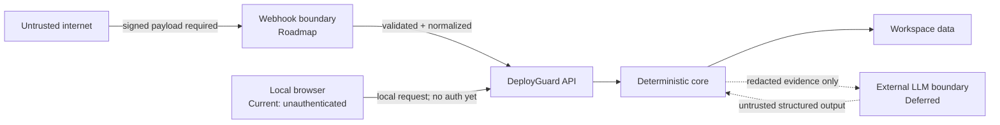
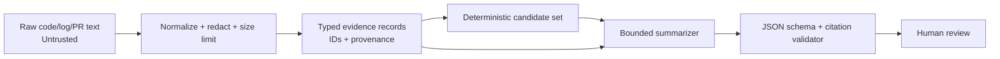

# Security model

## Current implemented access boundary

- Human workspace-management routes require a hashed bearer session.
- The development identity provider runs only in `development`, `test`, or
  `container` environments and is visibly labelled in the UI.
- `WorkspaceMembership` is the tenant boundary. Cross-workspace access returns
  `workspace_not_found`; RBAC is enforced by backend policy checks.
- Roles are `viewer`, `responder`, `admin`, and `owner`.
- Invitation tokens are random, hashed at rest, bound to normalized email,
  expiring, single-use, revocable, and omitted from list APIs.
- Workspace, repository, invitation, acceptance, and revocation mutations append
  redacted audit events.
- Alembic owns fresh database creation. Production refuses an unversioned,
  non-empty database; local legacy bootstrap refuses unexpected tables.

The synthetic investigation routes remain demo-compatible, but all legacy
change and incident reads now resolve through a per-user tenant context.
Production verifies OIDC JWTs through issuer JWKS, maps GitHub installations
and repositories to workspaces, and suppresses all development providers.
Internet exposure still requires rate limiting, PostgreSQL verification,
managed secrets, HTTPS, and configured provider credentials.

> สถานะ: **production-integratable MVP** มี OIDC verification, tenancy/RBAC, GitHub App, SMTP invitation delivery, migrations และ deterministic engines แล้ว โดยจะไม่เปิด development fallback ใน production ทั้งนี้ยังต้องตั้งค่า secret, HTTPS, rate limit และทำ deployment security review ก่อน expose ต่อ internet

## Controls ที่ตรวจแล้ว

- CORS อนุญาต local UI ที่ `http://127.0.0.1:4300` และ `http://localhost:4300`
- backend CORS tests ครอบคลุมทั้งสอง origins
- Pydantic/FastAPI validation และ stable domain error envelope
- ไม่มี shell, deploy, rollback, cluster credential หรือ autonomous remediation path
- ข้อมูล runtime เป็น 3 seeded synthetic scenarios
- npm production dependency audit รายงาน 0 vulnerabilities
- backend 13 tests และ frontend 7 tests/build ผ่าน
- Compose definition ผ่าน `docker compose config`

ข้อจำกัดของหลักฐาน: Docker image build/scan ยังไม่ยืนยันเพราะ Linux daemon ไม่พร้อม และยังไม่มี penetration, auth/tenant isolation หรือ webhook-signature tests

## Security principles

1. ไม่มี autonomous remediation
2. external content ทั้งหมดเป็น untrusted
3. least privilege และ explicit opt-in
4. connected mode ต้องทำให้ tenant/workspace isolation เป็น query และ database invariant
5. evidence provenance มาก่อน language fluency
6. secrets ไม่อยู่ใน repository, logs, telemetry หรือ model prompts
7. synthetic mode ทำงานได้โดยไม่ใช้ external credentials

## Assets

- GitHub App private key และ webhook secret ในอนาคต
- installation access tokens
- repository/change/deployment metadata
- telemetry evidence
- incident notes และ human feedback
- scoring weights, model/prompt versions
- tenant/workspace boundary
- audit trail และ evaluation artifacts

## Trust boundaries

## Threat model

| Threat | ตัวอย่าง | Control ที่ต้องมี |
|---|---|---|
| Spoofed webhook | ผู้โจมตีส่ง deployment ปลอม | HMAC SHA-256 บน raw body, constant-time compare |
| Replay/duplicate | delivery เดิมถูกส่งซ้ำ | unique delivery ID, idempotent inbox |
| Cross-tenant access | installation A อ่าน incident B | tenant key ทุก query/FK, PostgreSQL RLS, negative tests |
| Secret leakage | token อยู่ใน logs/prompt | secret manager, redaction, structured logging |
| Prompt injection | code/log บอก LLM ให้เปิดเผยข้อมูลหรือเรียก tool | treat content as data, tool allowlist, no write tools |
| Evidence poisoning | telemetry/source ปลอม | provenance, source quality, contradiction, signed source where available |
| Overconfident output | summary กล่าวเกิน evidence | schema validator, citation coverage, deterministic candidate set |
| Unsafe recommendation | ระบบเสนอ rollback แล้ว execute เอง | recommendation only, no deployment/cluster credential |
| Dependency compromise | malicious package/image | lockfiles, scanning, pinned images, provenance/SBOM |
| Denial of service | webhook flood หรือ huge logs | body limits, queue bounds, rate limits, quotas |

## Prompt-injection boundary

LLM ยังไม่ implement และถูก defer จน evidence-only contract กับ evaluation tests ผ่าน เมื่อเพิ่มแล้วต้องใช้ boundary ต่อไปนี้:

ข้อบังคับ:

- ไม่มี shell, file write, GitHub mutation, deploy หรือ rollback tool
- model เห็นเฉพาะ evidence ที่ได้รับอนุญาตของ tenant เดียว
- repository/log text อยู่ใน quoted data field ไม่ใช่ system instruction
- output เป็น typed JSON
- cause ที่ไม่มี candidate/evidence ID ถูก reject
- recommendation เป็น read-only verification step
- prompt, model, evidence bundle และ validator version ถูก audit
- provider retention/region ต้อง configurable
- failure หรือ timeout ต้อง fallback ไป deterministic template

## GitHub integration

Connected mode รองรับ GitHub App installation, short-lived installation token,
repository discovery, workspace mapping และ durable webhook deduplication:

- ใช้ GitHub App ไม่ใช้ personal access token
- permission ขั้นต่ำ: Metadata read, Pull requests read และ Deployments read
- subscribe เฉพาะ event ที่ใช้
- ตรวจ `X-Hub-Signature-256` ตาม [GitHub webhook validation](https://docs.github.com/en/webhooks/using-webhooks/validating-webhook-deliveries)
- deduplicate `X-GitHub-Delivery`
- เก็บ verified event แบบ durable; PR metadata ที่มีหลักฐานจริงสร้าง connected change record ส่วน coverage/rollback/observability ที่ไม่ทราบใช้ค่าความไม่แน่นอนแบบ conservative
- installation token อยู่ใน memory/cache ชั่วคราวและ rotate ตาม expiry
- pin GitHub API version
- เคารพ primary/secondary rate limits และ `Retry-After`
- disconnect ทำเครื่องหมาย connection/repository เป็น revoked และหยุดใช้ข้อมูลนั้น

GitHub ระบุว่า Check Run write ใช้ GitHub App และ Checks permission ตาม [Checks API](https://docs.github.com/en/rest/checks/runs)

## OpenTelemetry integration roadmap

- OTLP endpoint ต้อง authenticate และใช้ TLS ใน connected deployment
- allowlist resource attributes ที่ใช้ correlation
- จำกัด payload/body/cardinality
- redact secrets, authorization headers, cookies และ PII
- telemetry source มี tenant/workspace mapping ที่ server กำหนด ไม่เชื่อค่าจาก client เพียงอย่างเดียว
- collector retry/queue ต้องมี drop metrics และ alert
- raw telemetry retention สั้นกว่ normalized evidence
- semantic-convention version ถูก pin และ migration ได้

ไม่มี Collector configuration หรือ live OTLP endpoint ใน repository ปัจจุบัน

## Authentication and authorization roadmap

Synthetic local MVP ปัจจุบันเป็น single-user และไม่มี auth ห้ามนำไป expose ต่อ internet

Connected phase ต้องมี:

- authenticated user/session
- workspace role อย่างน้อย viewer, investigator และ admin
- authorization ที่ service layer ไม่พึ่ง UI hiding
- tenant-scoped primary/foreign/unique keys
- PostgreSQL RLS เป็น defense in depth
- audit ของ scenario activation, analysis, feedback และ integration changes
- CSRF protection สำหรับ cookie session หรือ secure token strategy ที่ชัดเจน

## Secrets

- local development ใช้ ignored `.env` หรือ developer secret store
- production ใช้ managed secret/KMS
- ห้าม commit private key, webhook secret, database password หรือ model key
- ห้ามแสดง secret ใน error response
- log redaction test ต้องครอบคลุม token patterns
- rotation runbook ต้องทดสอบได้โดยไม่หยุด synthetic mode

## Data minimization and retention

- ไม่ clone repository โดย default; ดึงเฉพาะ metadata/diff ที่จำเป็น
- ไม่ใช้ author identity เป็น performance/risk score
- raw code/log ถูกจำกัดขนาดและ retention
- feedback note อาจมีข้อมูลอ่อนไหว จึงต้อง redact/search policy
- deletion ตาม installation/workspace และสำรองข้อมูลมี retention ชัดเจน
- training/evaluation จาก private data ต้อง explicit opt-in และแยกจาก public benchmark

## Security acceptance gates

| Gate | สถานะ |
|---|---|
| Local CORS origins | ✅ Automated test ผ่าน |
| FastAPI validation/domain errors | ✅ Automated tests ผ่าน |
| npm production dependency audit | ✅ 0 vulnerabilities |
| No shell/deploy/rollback/remediation capability | ✅ ตรวจ architecture/code boundary แล้ว |
| Docker Compose parse | ✅ ผ่าน |
| Docker image build/scan | ⚠️ ยังไม่ตรวจ; Linux daemon unavailable |
| Invalid webhook signature/replay | Roadmap; ไม่มี GitHub adapter |
| Cross-tenant negative tests | Roadmap; ไม่มี auth/tenancy |
| Secret-fixture redaction | Roadmap ก่อน connected integrations |
| Prompt-injection/tool-action corpus | Roadmap; ไม่มี LLM |
| Authorization matrix | Roadmap |
| Backup/restore, migrations และ deletion workflow | Roadmap |

## Current limitations

- ไม่มี authentication/authorization และ tenant isolation
- local endpoints เปิดรับ request โดยไม่ยืนยันตัวตน
- CORS ไม่ใช่ access control
- SQLite ใช้ `create_all`; ไม่มี migration, backup/restore หรือ deletion workflow
- ไม่มี webhook receiver/signature/replay controls เพราะ GitHub integration ยังไม่ implement
- ไม่มี OTel endpoint หรือ telemetry redaction pipeline
- ไม่มี secret-store integration; Compose มี development defaults ที่ห้ามใช้ production
- ไม่มี LLM boundary/runtime หรือ prompt-injection test
- ไม่มี Docker image build/scan result
- ไม่มี full penetration test หรือ production security review

สถานะเหล่านี้ต้องอัปเดตจากหลักฐานการทดสอบเท่านั้น
