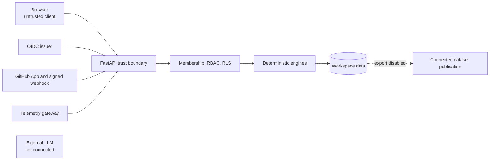

# Security model

DeployGuard is a read-mostly analysis and collaboration system. It holds no
deployment, rollback, shell, or cluster execution credential and provides no
autonomous remediation. Identity, GitHub, SMTP, and telemetry inputs are
untrusted until authenticated, scoped, validated, and normalized.

## Current posture

DeployGuard is **production-integratable**, not universally
**production-hardened**. Runtime controls exist, but each deployment must supply
managed secrets, TLS/WAF, distributed rate limits, provider configuration,
backup storage, alerts, restore exercises, and on-call ownership.

## Implemented controls

- Production requires OIDC; JWT signature, JWKS, issuer, audience, expiry,
  issued-at, and verified email are checked.
- Development identity and database reset are unavailable in production.
- Development access and invitation tokens are stored as SHA-256 digests.
- Workspace membership and role checks protect every tenant mutation.
- PostgreSQL RLS covers data-plane tables with transaction-local tenant context,
  negative CRUD tests, and a connection-pool leakage test.
- GitHub install state is hashed, expiring, and single-use; signed webhooks use
  constant-time raw-body HMAC verification and durable delivery deduplication.
- Provider jobs use a transactional outbox, allow-listed worker, bounded retry,
  stale-lease recovery, dead letters, explicit replay, and trace propagation.
- Operational events discard member-supplied trust claims and write server-owned
  provenance after workspace/resource validation.
- Request IDs, bounded bodies, structured logs, low-cardinality metrics, and
  optional redacting OpenTelemetry export are available.
- Backup, read-only validation, isolated restore rehearsal, retention legal
  holds, and append-only deletion audit helpers exist.
- Evidence synthesis is deterministic and citation-gated, with no external
  model, prompt, provider SDK, outbound model request, or tool access.

## Dataset-governance controls

- Verdict actor provenance comes from the authenticated tenant scope, never the
  request body.
- Structured verification references evidence belonging to the same incident.
- Snapshot creation requires a connected, resolved incident with an attributed,
  structured verdict.
- Postmortem snapshots are content-addressed and protected by database triggers
  that reject updates and deletes.
- Consent requires an administrator and binds an exact incident, snapshot,
  purpose, terms version, attestations, and actor.
- Consent decisions are append-only; revocation creates a later decision.
- Synthetic incidents cannot enter connected-data readiness.
- The connected-data exporter is hard-disabled even after every readiness gate
  passes.

These controls prevent accidental promotion. They do not replace deterministic
redaction, legal review, or publication approval.

## Trust boundaries

The browser never receives GitHub installation tokens, App private keys, SMTP
passwords, telemetry root credentials, or future model-provider keys.

## Threat model

| Threat | Current mitigation | Remaining work |
| --- | --- | --- |
| Spoofed/replayed provider event | Raw-body HMAC, durable unique delivery identity, tenant mapping | Rotation drill, queue-level quotas |
| Cross-tenant access/IDOR | Membership predicates, same-workspace validation, PostgreSQL RLS | Broader fuzz matrix and control-plane review |
| Secret leakage | Credentials remain server-side; sensitive response fields excluded | Managed KMS, centralized redaction tests |
| Telemetry poisoning | Workspace-derived bearer, server-owned provenance, source/resource validation | Per-source credentials, signing, quotas |
| Event flood | Typed field/body limits, process-local guards, bounded worker retry | Distributed limits and per-workspace budgets |
| Audit tampering | Append-oriented application behavior | Privilege separation and external immutable sink |
| Dataset exfiltration/consent bypass | Connected exporter disabled; exact-snapshot consent gate; immutable records | Redaction, publication service, release registry, revocation propagation |
| Prompt injection | No model/tool runtime; deterministic candidates and citation validation | Adversarial corpus before any provider activation |
| Unsafe remediation | No deployment, rollback, shell, or infrastructure execution path | Preserve the architecture boundary |

## Data minimization and retention

DeployGuard stores normalized metadata and evidence; it does not clone an entire
repository by default. Retention tooling is explicit, allow-listed, supports dry
run/apply, legal holds, and deletion audit. Scheduling, storage lifecycle,
workspace deletion orchestration, uninstall cleanup, and backup expiry remain
operator-owned.

Dataset attestations record human review but do not prove that secret/PII
redaction succeeded. Raw prompts, credentials, private source content, customer
payloads, and unredacted telemetry remain outside the public dataset contract.

## Secrets and deployment requirements

Never commit OIDC client secrets, GitHub App keys/webhook secrets, SMTP
passwords, database credentials, telemetry credentials, or future model keys.
Production must inject them from a managed secret provider and support rotation
without rebuilding the image.

Minimum deployment controls:

- HTTPS, secure headers, WAF/body limits, and distributed rate limiting;
- non-owner PostgreSQL runtime role with RLS and separate migration role;
- managed secret rotation and egress policy;
- worker supervision and dead-letter alerts;
- scheduled retention, managed backups, and tested RPO/RTO;
- dependency/image scanning, penetration testing, and incident-response drills.

Run `python scripts/production_readiness.py` as a fail-closed configuration
check. It does not provision or print secrets.

## LLM boundary

`POST /incidents/{incident_id}/synthesize` is a deterministic evidence
explanation. The deprecated `/synthesize-llm` route is only an alias. Before an
external provider can be enabled, the project requires tenant-scoped redaction,
typed citation-bound output, prompt-injection and failure tests, safe audit
metadata, cost/latency limits, and blinded improvement on a frozen benchmark.

See [AI_BOUNDARY.md](AI_BOUNDARY.md) for the complete activation gate and
[OPERATIONS.md](OPERATIONS.md) for deployment and recovery procedures.
