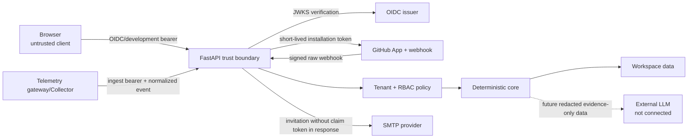

# Security model

DeployGuard AI เป็นระบบวิเคราะห์และ collaboration แบบ read-mostly ไม่มี
credential สำหรับ deploy, rollback, shell หรือ cluster และไม่มี autonomous
remediation อย่างไรก็ตามระบบรับข้อมูลจาก identity provider, GitHub, SMTP และ
telemetry source จึงต้องถือ external content ทุกชนิดเป็น untrusted

## Security posture ปัจจุบัน

### Implemented controls

- production profile บังคับ `AUTH_PROVIDER=oidc`
- OIDC ตรวจ signature ผ่าน JWKS พร้อม issuer, audience, expiry, issued-at และ
  verified email
- development identity เปิดเฉพาะ non-production
- opaque development access token และ invitation token เก็บเฉพาะ SHA-256 digest
- `WorkspaceMembership` เป็น application tenant boundary
- service layer บังคับ role `viewer`, `responder`, `admin`, `owner`
- tenant-owned read/write filter ด้วย workspace context
- GitHub App install state เป็น hashed, expiring และ single-use
- GitHub webhook ตรวจ HMAC SHA-256 บน raw body ด้วย constant-time comparison
- GitHub delivery dedupe ด้วย database unique constraint
- operational event dedupe ด้วย workspace/source/provider event identity
- service dependencies และ event foreign IDs ถูกตรวจว่าอยู่ workspace เดียวกัน
- incident assignee และ notification recipient ถูกจำกัดใน workspace
- audit event ถูกเพิ่มพร้อม tenant mutation สำคัญ
- canonical deployment upsert ใช้ provider identity + workspace uniqueness และ exact repository/commit matching; connector health เป็น read-only summary ที่ไม่คืน credential
- Alembic จัดการ schema; production ปฏิเสธ unversioned non-empty database
- provider credential ที่ไม่ configured ทำให้ capability ปิดหรือ API คืน `503`
- request ID, structured access log, bounded request body และ process-local rate
  limit บน auth/ingestion routes
- durable background job payload guard, idempotency, bounded retry, stale lease
  recovery, dead-letter และ explicit replay primitives
- private low-cardinality metrics endpoint ที่ไม่ใส่ tenant/path/payload labels
- atomic backup และ read-only restore integrity check helpers
- LLM runtime ไม่มี และ reserved endpoint คืน `501`

### Controls ที่ยังขาดหรือขึ้นกับ deployment

- PostgreSQL RLS
- distributed API rate limit และ per-workspace quota (repository มี request-body
  limit และ process-local baseline แล้ว)
- managed secret/KMS integration และ automated rotation
- worker isolation และ producer wiring (repository มี durable queue retry,
  dead-letter และ explicit replay primitives แล้ว)
- scheduled retention/deletion, legal hold และ backup/restore drill
- raw telemetry redaction pipeline
- tamper-resistant external audit sink
- penetration test, production threat review และ incident-response exercise

ดังนั้นสถานะที่ถูกต้องคือ **production-integratable** เมื่อ configure
dependencies ครบ แต่ยังไม่ควรเรียก **production-hardened** จนกว่าจะผ่าน
deployment-specific controls และ restore/incident exercises

## Trust boundaries

## Authentication

### Development

`POST /auth/development-session` ออก opaque bearer token และคืน raw token เพียง
ครั้งเดียว Token มี expiry และ database เก็บ digest เท่านั้น Endpoint ถูกปิด
เมื่อ environment เป็น production

Legacy synthetic investigation routes บางส่วนยอมใช้ configured development user
เมื่อ request ไม่มี bearer เพื่อรักษา local demo flow Fallback นี้เปิดเฉพาะเมื่อ
development auth available และถูกปิดใน production ส่วน workspace-management และ
operations routes ยังต้องมี bearer

Development auth มีไว้สำหรับ local verification ไม่ใช่ shared deployment และ
ไม่ควรเปิดผ่าน public network

### OIDC

Production verifier:

1. ดึง signing key จาก configured JWKS URL
2. จำกัด algorithm ตาม allowlist
3. ตรวจ `iss`, `aud`, `exp`, `iat`, `sub`
4. ต้องมี email ที่ valid และ `email_verified = true`
5. map stable provider subject จาก issuer + subject
6. ปฏิเสธ email collision ระหว่างคนละ identity

Browser token storage/refresh behavior ขึ้นกับ Angular OIDC client และ identity
provider deployment การ review CSP, refresh-token rotation และ XSS defense ต้อง
ทำร่วมกับ configuration จริง

## Tenant isolation และ RBAC

Application policy:

| Operation class | Minimum role |
|---|---|
| Read tenant data | `viewer` |
| Analyze/change incident/event/note | `responder` |
| Catalog, risk policy, provider, repository, invitation, audit | `admin` |
| Invite `admin` | `owner` |

เมื่อ principal ไม่เป็นสมาชิก ระบบคืน `404` แทน `403` เพื่อลด resource
enumeration Foreign IDs เช่น repository, service, incident และ assignee ต้อง
ถูก resolve พร้อม `workspace_id` ไม่ query ด้วย ID เดี่ยว

ข้อจำกัด: PostgreSQL RLS ยังไม่มี หาก application query ลืม tenant predicate
database จะไม่ป้องกันให้ การเพิ่ม composite tenant constraints, RLS policies และ
negative isolation tests เป็น production hardening ที่ยังต้องทำ

## GitHub App boundary

- ใช้ GitHub App แทน personal access token
- private key และ webhook secret มาจาก runtime secret configuration
- installation access token ถูก mint ฝั่ง server และไม่ส่งเข้า browser
- install callback state bind กับ user/workspace, มี expiry และ single-use
- installation ID unique และห้าม map ข้าม workspace
- repository sync รับเฉพาะ ID ที่ installation เข้าถึงได้จริง
- webhook HMAC ตรวจ raw body ก่อน parse/use
- `X-GitHub-Delivery` เป็น durable dedupe key
- monitored PR ใช้ processing status และ signed retry เดินเฉพาะ delivery ที่ยัง
  ไม่ processed; workflow/deployment retry ซ่อม normalized event ที่หายได้
- retry ต้องมี installation/repository identity ตรงกับ delivery ที่บันทึกไว้
- production ปฏิเสธ unmapped installation และไม่ใช้ synthetic fallback
- disconnected repository ถูก mark revoked/deselected แทนการแกล้งว่า connected
- GitHub Check write ปิดโดย default; เมื่อเปิดจะตรวจ `Checks: write`, connected
  repository/change และ responder role สำหรับ manual publish ส่วน signed PR
  webhook publish แบบ system actor ได้เฉพาะ installation/repository ที่ map แล้ว
- GitHub Check publication มี unique repository/head identity, stable external ID,
  provider Check ID, attempt/error และ next-retry metadata; retry recover/PATCH
  Check เดิมแทนการสร้าง duplicate

ข้อจำกัด: processing ยัง synchronous แม้มี durable queue/DLQ primitive แล้ว
ยังไม่มี producer wiring, supervised worker, delivery reconciliation,
backpressure หรือ persisted raw-body replay

อ้างอิงวิธีตรวจ webhook:
[Validating webhook deliveries](https://docs.github.com/en/webhooks/using-webhooks/validating-webhook-deliveries)

## Telemetry และ operational-event boundary

มี ingestion สองระดับที่ต้องไม่สับสน:

1. `/telemetry/events` รับ normalized metric/log/trace/alert ด้วย bearer ที่ derive
   จาก server credential root + workspace ID และตรวจ service/repository scope
   ไม่ใช่ native OTLP receiver Production ไม่ยอมรับ raw credential root
2. `/workspaces/{workspace_id}/events` รับ tenant-scoped operational event จาก
   authenticated responder และ dedupe ด้วย `(workspace_id, source,
   provider_event_id)`

Operational event จาก member discard client provenance ทั้ง object แล้วสร้าง
`authenticated_member` trust statement ใหม่ Reserved `_ingestion` ถูกเขียนฝั่ง
server เสมอ: `member_api` มี actor/request ID ส่วน `trusted_internal` ใช้ได้เฉพาะ
adapter ภายในหลัง map provider identity เป็น workspace/repository แล้ว Namespace
ของ GitHub/telemetry/OTel ถูกสงวนจาก member endpoint

ข้อกำหนดสำหรับ production gateway/Collector:

- ใช้ TLS และ workspace-derived collector credential แยกจาก human token
- ส่ง `X-DeployGuard-Workspace`, stable event ID และ repository scope เมื่อมี
- allowlist resource attributes ที่ใช้ correlation
- redact authorization header, cookie, secret, credential และ PII ก่อน ingest
- จำกัด body size, field size, cardinality และ event rate
- ไม่ส่ง raw log/trace ทั้งชุดเมื่อ normalized evidence เพียงพอ
- pin semantic-convention/normalization version

Repository มี [telemetry gateway contract](TELEMETRY_GATEWAY.md) แต่จงใจไม่มี
Collector config ที่ชี้ OTLP payload เข้า normalized endpoint โดยตรง FastAPI ไม่มี
OTLP protocol implementation และยังไม่มี raw telemetry retention/redaction job

## Operational collaboration controls

- Service slug unique ต่อ workspace
- Dependency ต้องอยู่ workspace เดียวกันและ graph ต้องเป็น DAG
- Risk policy update ใช้ explicit version เพื่อป้องกัน lost update
- `warn_threshold` ต้องน้อยกว่า `block_threshold`
- Operational event replay คืน row เดิมแบบ idempotent และไม่สร้าง
  row/audit/notification ซ้ำเฉพาะ canonical payload/origin เดิม ถ้า key เดิมแต่
  content/origin ต่างกันคืน `409`
- Resolved incident เป็น terminal สำหรับ lifecycle mutation แต่ยังเพิ่ม
  post-resolution note ได้
- Incident assignee ต้องเป็น active workspace member
- Incident note เป็น append-only และเก็บ author
- Notification query scope ด้วย recipient user และ workspace membership
- Notification เป็น in-app เท่านั้น ไม่มี arbitrary outgoing webhook

## Invitation และ email

- invitation token สุ่ม, hash at rest, expiring, revocable และ single-use
- token bind กับ normalized email ของ authenticated user
- list API ไม่คืน claim token
- development outbox คืน token ครั้งเดียวด้วย `Cache-Control: no-store`
- SMTP mode ไม่คืน token ใน API response และเก็บเฉพาะ delivery outcome

SMTP credential ยังอยู่ใน runtime environment; repository ไม่มี managed
secret-store adapter หรือ rotation job

## Threat model

| Threat | ตัวอย่าง | Control ปัจจุบัน | Remaining work |
|---|---|---|---|
| Spoofed webhook | ส่ง deployment ปลอม | Raw-body HMAC | Secret rotation drill |
| Replay/duplicate | delivery ถูกส่งซ้ำ | Durable unique delivery ID + Check publication identity/recovery | Background scheduler/TTL policy |
| Cross-tenant access | workspace A อ่าน incident B | Membership + tenant predicates | PostgreSQL RLS/composite constraints |
| IDOR | เปลี่ยน service/assignee เป็น ID tenant อื่น | Same-workspace validation | Fuzz/negative matrix |
| Secret leakage | key อยู่ใน log/error | ไม่คืน installation/token ใน API | Central redaction tests/KMS |
| Telemetry poisoning | source ส่ง evidence ปลอม | Workspace-HMAC bearer + server-owned source/provenance + scope validation | Per-source credential, quota, signing |
| Event flood | webhook/log จำนวนมาก | Typed size limits บาง field | Global body/rate/queue limits |
| Policy overwrite | admin สองคนแก้พร้อมกัน | Explicit monotonic version | ETag/transaction concurrency tests |
| Audit tampering | Application DB user แก้ audit row | Append-only API behavior | Privilege separation/external sink |
| XSS/token theft | untrusted event text เข้า UI | Angular escaping by default | CSP and deployment review |
| Prompt injection | log สั่ง model ให้ทำ action | ไม่มี LLM runtime/tool | Corpus + citation validator ก่อนเปิด |
| Unsafe remediation | ระบบสั่ง rollback | ไม่มี execution credential/path | Keep architecture boundary |

## Secrets

ห้าม commit:

- OIDC client secret ถ้ามี
- GitHub App private key และ webhook secret
- SMTP password
- database credential
- telemetry ingest token
- future model provider key

Local ใช้ ignored `.env` ได้ Production ต้องใช้ managed secret provider และ
inject เป็น runtime environment การ rotate ต้องไม่ต้อง rebuild image

## Data minimization และ retention

ปัจจุบันระบบเก็บ normalized metadata/evidence และไม่ clone repository โดย
default มี retention helper แบบ allow-listed ที่ต้องเรียก explicit แต่ยังไม่มี
scheduler, legal hold หรือ deletion audit:

| Data class | Current behavior |
|---|---|
| Synthetic fixtures | อยู่ตาม repository/application version |
| Webhook delivery ledger | เก็บจนกว่าจะมี external cleanup |
| Operational events | เก็บจนกว่าจะมี external cleanup |
| Incident evidence/notes/feedback | เก็บใน database ไม่มี TTL |
| Notification | เก็บแม้ mark read |
| Audit event | เก็บใน database ไม่มี archival policy |

ห้ามอ้างว่าระบบลบข้อมูลตาม 7/30/90 วันจนกว่าจะมี configuration, scheduled job,
deletion audit และ tests จริง Workspace deletion, uninstall cleanup, legal hold
และ backup expiry ยังต้องออกแบบ

## LLM boundary

LLM ไม่ได้ implement หากเพิ่มในอนาคตต้องผ่านเงื่อนไข:

- model เห็นเฉพาะ redacted evidence ของ tenant เดียว
- external text อยู่ใน data field ไม่ใช่ instruction
- deterministic candidate set เป็นขอบเขตคำตอบ
- typed output ต้องอ้าง evidence IDs
- unsupported claim ถูก reject
- ไม่มี shell/file/GitHub/deploy/rollback tool
- timeout/failure fallback เป็น deterministic template
- prompt/model/evidence bundle/validator version ถูก audit

## Security verification checklist

คำสั่งใน checklist เป็นขั้นตอนที่ต้องรันใน release pipeline ไม่ใช่คำยืนยันว่า
environment ปัจจุบันผ่านแล้ว:

- `pytest`
- `npm test -- --watch=false`
- `npm run build`
- `npm audit --omit=dev`
- `docker compose config`
- Alembic upgrade บน empty SQLite และ PostgreSQL
- invalid/expired OIDC token tests
- cross-workspace negative tests ทุก endpoint
- invalid GitHub signature และ duplicate delivery tests
- duplicate operational event และ cross-tenant foreign-ID tests
- dependency cycle, stale policy version และ illegal incident transition tests
- secret-fixture log scan
- backup/restore drill
- dependency/image scan และ production penetration test

Operations runbook อยู่ใน [OPERATIONS.md](OPERATIONS.md)
