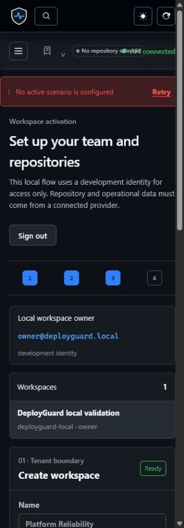

# DeployGuard AI v0.1.0 — Initial public preview

> Draft release notes. Replace the placeholders with the merged `main` commit,
> immutable image digests, and final CI links before creating the GitHub release.

DeployGuard AI is an evidence-first workspace for teams deciding whether a
change is safe to deploy and investigating incidents without losing the chain
of reasoning. It connects change risk, dependency blast radius, deployments,
runtime evidence, hypotheses, and a human verdict in one tenant-scoped flow.




The connected-mode capture intentionally contains no repository or incident
fixture. A GitHub App or another configured provider is required before the
workspace displays connected operational records.

## Included

- Explainable deterministic change-risk analysis with explicit weights and
  missing-evidence signals.
- Dependency blast-radius analysis with bounded, cycle-safe traversal.
- Incident timeline, evidence and counter-evidence ledger, ranked hypotheses,
  and human verdict capture.
- Citation-gated deterministic incident explanation. Every statement refers to
  existing incident evidence and the response carries an evidence-bundle hash.
- GitHub App foundation for signed webhooks, repository/PR sync, deployment
  lifecycle, and non-blocking Check publication.
- Tenant-scoped workspaces, roles, invitations, audit events, worker/outbox,
  PostgreSQL RLS option, OpenTelemetry/Prometheus foundations, and security CI.
- Connected mode for real provider data plus an intentionally isolated,
  visibly-labelled synthetic demo via `make demo`.

## Install

```bash
git clone https://github.com/kingggg5/deployguardai.git
cd deployguardai
docker compose up --build
```

For the isolated product tour, run `make demo`. See
[Quickstart](../QUICKSTART.md) for supported local environments and cleanup.

## Known limitations

- Connected mode starts empty until a workspace is configured with real provider
  data. Synthetic demo records are never production evidence.
- External AI providers are not configured or contacted. The shipped explanation
  is deterministic and citation-gated; see [AI boundary](../AI_BOUNDARY.md).
- Deployment-specific controls—TLS/WAF, managed secrets, distributed limits,
  alerting, durable telemetry storage, backup storage, and on-call ownership—are
  operator responsibilities.
- Native OTLP ingestion, public benchmark datasets, external notification
  adapters, and a hosted public demo are not included.

## Release evidence (complete before publishing)

```text
Tag and commit:
API image digest:
Web image digest:
Migration head:
CI run:
Security checks:
Evaluation artifact:
Restore rehearsal:
Rollback digest:
```
